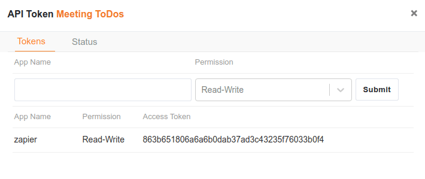

Die Abkürzung API steht für Application Programming Interface und bezeichnet typischerweise eine Programmierschnittstelle um Informationen zwischen einer Anwendung und einzelnen Programmteilen standardisiert auszutauschen. Eine API definiert die Struktur und die Syntax, die man zum Ausführen von vordefinierten Befehlen benötigt. APIs trifft man typischerweise bei Webanwendungen und sollen primär Entwicklern das Leben erleichtern. Eine etwas umfassendere Erklärung von APIs finden Sie unter dem folgenden Artikel von [howtogeek.com](https://www.howtogeek.com/343877/what-is-an-api/). Die vollständige API-Dokumentation von SeaTable finden Sie unter [diesem Link](https://docs.seatable.io/published/seatable-api/home.md).

## API-Token für zapier.com erzeugen

zapier.com ist ein Web-Dienst, der es Ihnen als Anwender erlaubt, Aktionen zwischen verschiedenen Web-Applikationen miteinander zu verbinden und alltägliche Aufgaben zu automatisieren. Eine solche Verknüpfung könnte z.B. zwischen Ihrem Google Kalender und SeaTable sinnvoll sein. Jedes Mal, wenn Sie in Ihrem Google Kalender einen neuen Eintrag anlegen, wird automatisch für Sie in SeaTable eine neuer Eintrag in einer Tabelle erzeugt. Damit zapier.com auf Ihren SeaTable Account zugreifen kann, müssen Sie für Ihre Base einen individuellen API-Token erzeugen.

Hierzu fahren Sie mit der Maus über die gewünschte Base und klicken auf die drei Punkte um das erweiterte Kontextmenü anzuzeigen. Hier befindet sich der Eintrag _API-Token_. Wenn Sie diesen Anklicken haben Sie die Möglichkeit, beliebig viele API-Token für diese Base zu erstellen. Solch einen API-Token benötigt Zapier für die Authentifizierung.

Kopieren Sie den API-Token in die Zwischenablage und fügen Sie diesen im Authentifizierungsdialog von Zapier ein. Dadurch erhält Zapier Zugriff auf Ihre Base und kann die automatisierten Aktionen durchführen.
