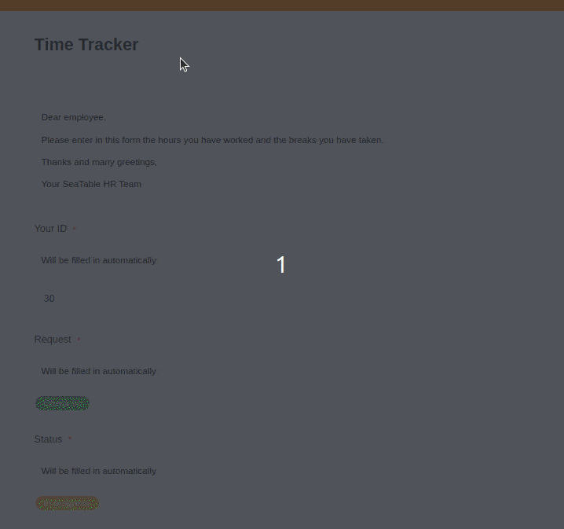

¿Conoce ya los [requisitos legales](https://seatable.io/es/zeiterfassung-mitarbeiter/) para el registro electrónico del tiempo de trabajo? Si es así, probablemente esté buscando la mejor solución de software para sus necesidades. Hay opciones para todos los gustos, pero las licencias de software para cada empleado pueden salir muy caras, ya sea con software especializado como Personio o Clockodo o con una hoja de cálculo como Microsoft Excel. De todos modos, en muchas empresas que utilizan el paquete Office de Microsoft, se utiliza Excel para registrar el tiempo de trabajo, aunque esto tiene algunas desventajas. Por lo tanto, en este artículo aprenderá qué alternativa rentable existe y cómo se compara con Excel.

## Qué opciones tiene para registrar el tiempo de trabajo

Antes del triunfo de la digitalización, los **relojes de fich** ar mecánicos eran habituales, sobre todo en las grandes empresas industriales. Es posible que aún los conozca de antaño: al introducir una tarjeta de papel, marcaban automáticamente las horas de entrada y salida. Poco tienen que ver con los "relojes de fichar" actuales: suelen referirse a los sistemas electrónicos de facturación, que a menudo se utilizan también para el control de identidad y acceso. Sin embargo, estos dispositivos son muy caros de adquirir y sólo le convienen si mantiene grandes instalaciones (por ejemplo, fábricas o edificios de oficinas) en las que trabajan muchos empleados de forma presencial.

A más tardar desde la crisis de Corona, cuando muchas empresas pasaron a un modelo de trabajo híbrido de días de oficina y oficina en casa, se han impuesto los **sistemas digitales** de registro de las horas de trabajo. Todavía son pocas las empresas que registran las horas de trabajo en partes de trabajo impresos. En el peor de los casos, las listas tienen que transferirse luego manualmente a un sistema digital, lo que lleva mucho tiempo y, por supuesto, está desfasado a la vista de las posibilidades actuales. Con el software adecuado, no sólo se ahorra tiempo, sino que también se minimiza el esfuerzo administrativo de introducir y analizar los datos manualmente.

Las innumerables **soluciones de software** que puede utilizar para el registro de tiempos difieren en su gama de funciones, su precio y su facilidad de uso. Especialmente a menudo, las empresas que utilizan el paquete Microsoft Office optan de todos modos por plantillas digitales para registrar el tiempo de trabajo en Excel. En este caso, cada empleado recibe una copia de la plantilla de Excel, que rellena con sus horas de trabajo y presenta a final de mes.

A continuación, analizaremos qué ventajas ofrece el software de base de datos colaborativa **SeaTable** en comparación con el registro del tiempo de trabajo en Excel. ¿Tiene prisa? Pruebe ahora mismo [nuestra plantilla gratuita de](https://seatable.io/es/arbeitszeiterfassung/) registro del tiempo de trabajo.

Vista administrativa de la tabla de horarios de trabajo en SeaTable

## 1\. ventaja: ahorro de costes

Una cosa es el costoso software especial para RRHH, pero las licencias de Microsoft Office para todos los empleados también pueden ser caras. Si aún no ha adquirido Excel como parte de un paquete de Office, debería pensárselo dos veces antes de comprarlo. Hay alternativas más baratas o incluso gratuitas, sobre todo para la [programación del personal](https://seatable.io/es/vorlagen/personalwesen/) y el registro del tiempo con Excel. Una de ellas es el software de base de datos colaborativa **SeaTable**.

SeaTable ofrece todas las funciones básicas de una hoja de cálculo convencional en la [suscripción](https://seatable.io/es/preise/) gratuita, pero puede hacer mucho más: permite [vincular](https://seatable.io/es/docs/verknuepfungen/wie-man-tabellen-in-seatable-miteinander-verknuepft/) registros de datos en diferentes tablas, lo que convierte a SeaTable en una base de datos relacional. Con [más de 20 tipos de columnas](https://seatable.io/es/docs/arbeiten-mit-spalten/uebersicht-alle-spaltentypen/) que cubren todos los formatos de datos habituales, puede capturar cualquier tipo de información, crear casillas de verificación, botones y columnas de selección, y guardar imágenes y archivos, lo que no es posible con Excel.

Otro aspecto que no debe ignorar: Utilizar SeaTable es comparativamente un juego de niños. En cambio, iniciarse en Excel parece sencillo, pero el programa es complejo. Para crear una plantilla de Excel con la que pueda trazar un proceso que funcione para registrar el tiempo de trabajo en su empresa, necesita mucho tiempo y conocimientos técnicos. Y si no está familiarizado con Excel, tendrá que gastar dinero en contratar a un experto.

## 2ª ventaja: adquisición de datos fácil de usar

Cuando se registra el tiempo de trabajo en Excel, sólo existe una interfaz: una tabla. Aparte de que las hojas de horario en blanco, negro y gris no son precisamente un regalo para la vista, también hacen que la introducción de datos sea propensa a errores. Es fácil que tus empleados cometan errores tipográficos inadvertidos o que se equivoquen de fila o columna al introducir los datos. Apenas se puede influir en el proceso de cumplimentación de la hoja de horario en Excel.

En SeaTable, puede hacer que la recogida de datos sea intuitiva y fácil de usar haciendo que sus empleados introduzcan las horas de trabajo en [formularios web](https://seatable.io/es/docs/webformulare/webformulare/) como si se tratara de una encuesta en línea. Puede añadir instrucciones específicas a los campos de entrada para guiar al cumplimentador de forma segura a través del proceso. Al final de la jornada, sus empleados sólo tienen que introducir el inicio del trabajo, las pausas y el final del trabajo, y opcionalmente los temas en los que han trabajado.

Registro del tiempo de trabajo mediante formulario web en SeaTable

Por cada formulario web enviado, SeaTable añade una nueva entrada a su hoja de cálculo que sólo usted y, si procede, otros gestores pueden ver y editar. Para asegurarse de que siempre tiene vigilado el cumplimiento de las horas de trabajo, SeaTable calcula el número de horas trabajadas, así como las horas extraordinarias o insuficientes en relación con las horas de trabajo diarias normales en dos [columnas de fórmulas](https://seatable.io/es/docs/formeln/grundlagen-von-seatable-formeln/). Mediante [un código de colores](https://seatable.io/es/docs/ansichtsoptionen/farbliche-markierung-von-zellen/) en las filas, puede ver directamente si el balance horario de un día está en el menos (rojo) o en el más (verde).

## 3ª ventaja: diversas opciones para visualizar los datos

A primera vista, la tabla de tiempos de trabajo SeaTable se parece al registro de tiempos de trabajo en hojas de cálculo Excel. Sin embargo, las posibilidades de visualización y preparación de los datos van mucho más allá: [filtros](https://seatable.io/es/docs/ansichtsoptionen/filtern-von-eintraegen-in-einer-ansicht/) fáciles de usar, [clasificación](https://seatable.io/es/docs/ansichtsoptionen/sortieren-von-eintraegen-in-einer-ansicht/) y [agrupación](https://seatable.io/es/docs/ansichtsoptionen/gruppieren-von-eintraegen-in-einer-ansicht/) ponen orden en los datos y [plug-ins](https://seatable.io/es/docs/seatable-nutzen/ansichten/) gráficos como calendarios, tableros Kanban o estadísticas visualizan los datos con sólo unos clics.

Con SeaTable, puede incluso crear **interfaces de usuario y aplicaciones personalizadas** para grupos específicos de personas. Por ejemplo, en la plantilla de hoja de horas, hemos creado una aplicación de gestión para que puedas controlar las horas extra, las vacaciones y las bajas por enfermedad de tus empleados en tu panel de control y aprobar o rechazar fácilmente las solicitudes enviadas.

Aplicación de gestión para registrar el tiempo de trabajo en SeaTable

## 4\. ventaja: todos los datos en un único lugar, seguros en la nube

Si utiliza Excel para registrar el tiempo de trabajo, es probable que sus empleados guarden sus propias hojas de cálculo en diferentes lugares de archivo, lo que dificulta que usted y el departamento de RR.HH. **fusionen regularmente los datos** y hagan un seguimiento de los mismos: A finales de mes, como muy tarde, te verás abrumado por una masa de hojas de horas digitales. A menudo te envían los cuadros por correo electrónico o tienes que copiarlos de un lado a otro. Además, es bastante tedioso y propenso a errores transferir manualmente los datos de Excel a los sistemas contables digitales. Todo esto cuesta mucho tiempo y es totalmente ineficaz.

Pero podría ser muy fácil si sus propios empleados se aseguraran de que sus horas de trabajo fluyeran correcta y ordenadamente en una base de datos central. Y para eso está exactamente **SeaTable Cloud**: aquí puede recopilar todos los datos en un solo lugar y controlar exactamente quién puede ver y editar qué datos mediante vistas, aprobaciones y permisos. Sus datos se almacenan de forma segura **en servidores alemanes** y están **siempre disponibles en línea**. En la nube, sus datos permanecen seguros aunque le roben el hardware o se rompa o pierda el portátil de un empleado.

No vuelva a perder datos, fusionarlos manualmente y transferirlos a otros sistemas: SeaTable le permite **minimizar** su **carga de trabajo** y agilizar el proceso en comparación con el registro de las horas de trabajo en Excel. Dado que SeaTable reúne todas las horas de trabajo de sus empleados en un lugar central, dispondrá de una amplia base de datos con la que podrá crear valiosos [análisis y estadísticas](https://seatable.io/es/docs/seatable-nutzen/statistiken/).

## 5\. ventaja: simplemente proporciona datos a terceros

Especialmente si contrata a personas por horas, también tiene que entregar los datos del tiempo de trabajo al departamento de **contabilidad** para que pueda preparar las declaraciones y pagar los salarios a tiempo. En las grandes empresas, la contabilidad es un departamento interno, mientras que las pequeñas empresas suelen subcontratar estas tareas. La **transmisión de** los datos del tiempo de trabajo suele hacerse por correo electrónico o compartiendo archivos. Antes, los responsables de RRHH tenían que copiar laboriosamente tablas de Excel, que debían crear y rellenar con los datos de cada mes individualmente. Al cabo de un tiempo, esto da lugar a un montón de archivos Excel locales.

Con SeaTable se ahorrará estos pasos: Basta con crear una aplicación (véase más arriba) o compartir los datos necesarios con contabilidad a través de un [enlace externo](https://seatable.io/es/docs/freigaben/externer-link-erklaert/). Al hacerlo, usted mismo puede elegir si concede acceso de lectura a la base completa o sólo crea y comparte una vista especial para contabilidad. Sin embargo, la liberación de vistas individuales está reservada a las suscripciones de pago de SeaTable.

De este modo, el departamento de contabilidad puede acceder a los datos del tiempo de trabajo sin rodeos y ya no es necesario transferir, abrir y visualizar archivos Excel individuales para la creación de extractos. ¡Un simple vistazo a su SeaTable Base es suficiente para conocer las horas de trabajo de todos los empleados!

## 6\. ventaja: automatizaciones que le facilitan la vida

Incluso con los puntos mencionados hasta ahora, el seguimiento del tiempo en Excel obtiene una mala puntuación, pero sólo la última ventaja pone la corona en SeaTable. Con una [suscripción Enterprise](https://seatable.io/es/preise/), SeaTable puede realizar automáticamente ciertas acciones basadas en reglas preestablecidas, por ejemplo, enviar notificaciones, editar entradas o añadir enlaces, aliviando así a los usuarios de pasos de trabajo recurrentes.

Con la ayuda de [automatizaciones](https://seatable.io/es/docs/automationen/uebersicht-ueber-automationen/), podrá, por ejemplo, hacer que SeaTable le notifique si las horas de trabajo introducidas de un empleado han superado los límites máximos legalmente definidos o si no se han respetado las pausas y los periodos de descanso prescritos. A través de un [disparador de](https://seatable.io/es/docs/automationen/automations-trigger/) automatización, esto sucede de forma totalmente automática en cuanto los valores introducidos dejan de estar dentro de los valores de las reglas especificadas, por ejemplo, por encima del tiempo máximo de trabajo de 10 horas al día.

Por cierto, los empresarios están obligados a registrar las horas de trabajo de sus empleados para detectar exactamente esto; y debe hacerlo para evitar consecuencias legales. Durante las inspecciones, puede enfrentarse a multas severas y a otras medidas de la autoridad supervisora si, como empresario, no presta atención al cumplimiento de la normativa legal sobre el tiempo de trabajo. Lea más sobre los requisitos legales para registrar el tiempo de trabajo [aquí](https://seatable.io/es/zeiterfassung-mitarbeiter/).

## Registre gratuitamente las horas de trabajo con SeaTable

Por supuesto, ya existen soluciones informáticas especiales, como [Personio](https://www.personio.de/) o [Clockodo](https://www.clockodo.com/de/), que ofrecen específicamente el registro de las horas de trabajo. Sin embargo, el uso de estos programas puede resultar bastante costoso, ya que sólo son adecuados para unas pocas aplicaciones.

Registrar el tiempo de trabajo con Excel es una solución común en las empresas que utilizan el paquete Office de Microsoft de todos modos, pero no es una buena idea por las razones mencionadas anteriormente. Excel no se acerca ni de lejos a las posibilidades que le ofrece una solución como SeaTable.

Como software de base de datos colaborativa, SeaTable es una alternativa rentable, potente y flexible a Excel y otros programas. Con SeaTable, no sólo podrá gestionar el tiempo de trabajo de sus empleados, sino también optimizar los procesos en muchas otras áreas de su empresa, desde los [recursos humanos](https://seatable.io/es/personalwesen/) hasta el [marketing](https://seatable.io/es/marketing/) y las [ventas](https://seatable.io/es/vertrieb/), pasando por la [gestión de flotas](https://seatable.io/es/fuhrpark-managen/).

Pruebe hoy mismo nuestra [plantilla de registro del tiempo de](https://seatable.io/es/arbeitszeiterfassung/) trabajo. Puede [registrarse]() inmediatamente [de forma gratuita]() y probar usted mismo las prácticas funciones. Con toda probabilidad, le encantará SeaTable y la utilizará para muchas más aplicaciones.
