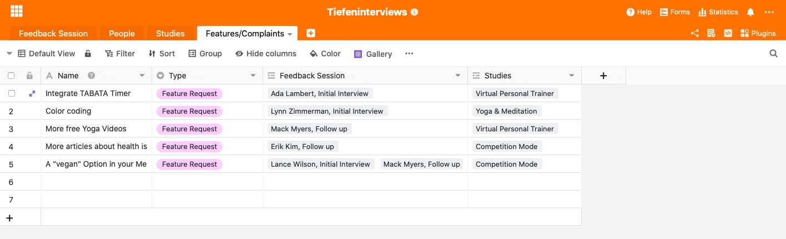

From qualitative raw data to a brand new product feature. It can take some time before a new feature emerges from a customer's comment. Nevertheless, the process is worthwhile and, with a suitable online tool, much easier than you might think.

As a company, it is important to regularly collect and evaluate customer feedback and to put the resulting knowledge into practice. We have already elaborated on how to measure and evaluate customer satisfaction in [this article](https://seatable.io/en/kundenzufriedenheit-messen-auswerten-und-steigern/). There you will find information on the various methods that can help you collect customer feedback. In particular, we have dealt with an anonymised online survey.

The following article now refers to the specific method of the [in-depth interview](https://de.wikipedia.org/wiki/Tiefeninterview). In addition, we go into more detail on how the raw data obtained can actually be converted into actions and how different teams can use the same data for themselves in different ways. The whole thing works in just 3 steps.

## Advantages of an in-depth interview

- Due to the open question structure, the respondent's **needs and response behaviour** can be spontaneously addressed
- In a trusting discussion atmosphere, respondents also address **their own emotions or unpleasant aspects** that would not be addressed within a group, for example
- Direct observation of the results is made possible
- Unconscious attitudes and opinions of the subjects can come to light

SeaTable can help you record the data that is generated in an in-depth interview: Document the contact, the recording and track the transfer of customer feedback into actual actions. In the following, we will guide you through all relevant steps and introduce you to SeaTable and its functions using a fictitious fitness app.

## Step 1: Collect data in the form of customer feedback

To get customer feedback, you need to get in touch with customers. It is best to cluster your customers into different target groups and then try to get individuals from these target groups for an in-depth interview. It is important that the people come from different target groups, so you get valuable insights into the possibly different use of your product by the different customer groups. In an in-depth interview, you use customer feedback from existing customers. In concrete terms, this means that you have to take the initiative and filter out suitable customers from your CRM data in order to contact them afterwards.

### Motivate the customer to give feedback

The customer will be more motivated to participate in a customer feedback session in the form of an in-depth interview if he sees a special incentive. This can either be a monetary incentive or you offer him a voucher for your own or someone else's product.

### Customer file for a better understanding of your target groups

Once you have found people for your interview, the following screenshot shows you how to enter them into your SeaTable Base. Entering individuals from the different target groups can help you get a better picture of your target group. [Personas](https://buffer.com/library/marketing-personas-beginners-guide/) can then be created more easily and accurately in the future. To capture the people to interview, we have created a new spreadsheet that contains the following information:

- Name of the person to be interviewed
- the target group to which the person is assigned
- the frequency of use of your product
- a picture
- The interviews the person took part in (e.g. initial interview, follow ups, usability tests).
- the study on which the interview is based (entered in the "Studies" spreadsheet)

Enter each person to be interviewed in the "People" table

## Step 2: Conduct interviews

Once you have found suitable people for your customer feedback, it is time to interview them. The results of the in-depth interviews are illustrated with quotes and summarised in a well-structured report. The more notes are taken, the more information can be processed after the interview. It makes sense to record the interview in order to create the report afterwards. This way, the natural flow of speech is not disturbed and the customer feels more comfortable in the interview and can build up a relationship of trust with the interviewer. The report then documents all the client's requirements, wishes and criticisms. The exact questions you ask in your in-depth interview naturally depend very much on your product and the underlying research study. The questionnaire is created in cooperation with several departments and serves as an orientation for the interviewer. Of course, in addition to the pre-determined questions, it is also desirable to ask spontaneous intermediate questions that arise from the conversation. In general, there are numerous types of questions that can be used in an in-depth interview; you can read more about them [here](https://wpgs.de/fachtexte/qualitative-interviews/9-mit-qualitativen-fragen-in-die-tiefe-gehen/).

### Collect all interview notes in one place

In our notes field, you have enough space and design options to create a well-structured report. The good thing about our base is that it can be viewed by everyone. This means that every department has access to relevant information at any time. Ideally, each department creates its own base within the base in which it prepares the information for itself. But more on this later.

Use the various formatting options in our long text field to make it as easy as possible for the reader to get the gist of the interview.

## Step 3: Structure your data and put insights into practice

Customer feedback alone is of little use to you. You need to prepare the raw data received in such a way that the various departments receive information on how to proceed. To do this, you create a separate spreadsheet within this base for each department and filter out relevant information for that department. In our example, we have assumed that the product team is interested in which feature needs to be improved or which new feature should be built next. For this purpose, the **Features/Complaints** spreadsheet was created. All the information relevant to this department was now filtered out from the in-depth interviews and entered into the spreadsheet as a feature. If many customers have criticised that the fitness app lacks an integrated timer, one can conclude that this feature has a high priority and your product team should tackle the timer next.

## Easily transform raw data into new product features with SeaTable

In the first step, we laid the foundation for collecting your raw data by selecting suitable people for the in-depth interview and transferring them to the "People" spreadsheet. In the next step, we conducted the in-depth interviews with the customers and wrote a detailed report in the "Feedback Session" spreadsheet under the "Notes" column. In the third step, your individual departments picked out specific information relevant to them from the detailed report and structured it in such a way that actual actions could be derived.

Regularly collecting customer feedback is becoming increasingly important. However, the vast amounts of data collected are of little use to you if they are not properly structured and translated into actions. With our template, you can structure your data so that it lasts over time and can give you ever better and more specific insights into your customers' world.
