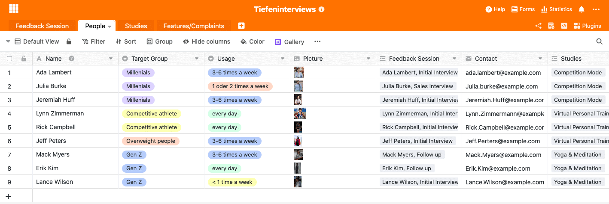
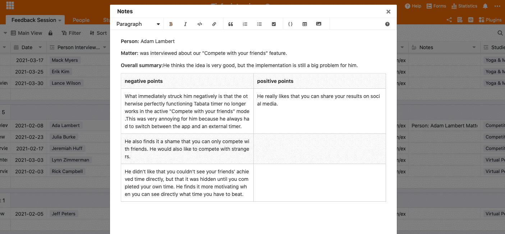
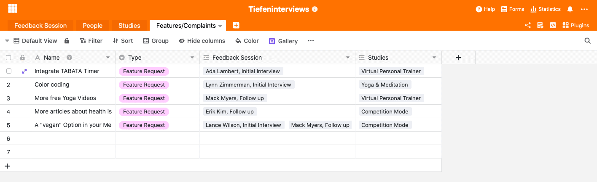

От качественных исходных данных до совершенно новой функции продукта. Может пройти некоторое время, прежде чем новая функция появится из комментария клиента. Тем не менее, этот процесс стоит того, и, при наличии подходящего онлайн-инструмента, он гораздо проще, чем вы могли бы подумать.

Для компании важно регулярно собирать и оценивать отзывы клиентов и применять полученные знания на практике. В [этой статье](https://seatable.io/ru/kundenzufriedenheit-messen-auswerten-und-steigern/) мы уже подробно рассказывали о том, как измерять и оценивать удовлетворенность клиентов. Там вы найдете информацию о различных методах, которые могут помочь вам собрать отзывы клиентов. В частности, мы имели дело с анонимным онлайн-опросом.

В следующей статье речь пойдет о конкретном методе [глубинного интервью](https://de.wikipedia.org/wiki/Tiefeninterview). Кроме того, мы более подробно рассказываем о том, как полученные необработанные данные могут быть преобразованы в действия и как разные команды могут по-разному использовать одни и те же данные для себя. Все работает всего за 3 шага.

## Преимущества глубинного интервью

- Благодаря открытой структуре вопроса можно спонтанно учитывать **потребности** респондента **и его поведение при ответе**
- В доверительной атмосфере обсуждения респонденты также затрагивают **свои эмоции или неприятные аспекты**, которые не были бы затронуты в группе, например
- Прямое наблюдение за результатами становится возможным
- Неосознанные установки и мнения испытуемых могут стать явными

SeaTable поможет вам записать данные, полученные в ходе глубинного интервью: Документируйте контакт, запись и отслеживайте перевод отзывов клиентов в реальные действия. Далее мы проведем вас через все соответствующие шаги и познакомим с SeaTable и его функциями на примере фиктивного фитнес-приложения.

## Шаг 1: Сбор данных в виде отзывов клиентов

Чтобы получить обратную связь от клиентов, необходимо установить с ними контакт. Лучше всего разделить своих клиентов на различные целевые группы, а затем попытаться получить людей из этих целевых групп для проведения углубленного интервью. Важно, чтобы люди были из разных целевых групп, так вы получите ценную информацию о возможном различном использовании вашего продукта разными группами потребителей. В глубинном интервью вы используете отзывы существующих клиентов. Конкретно это означает, что вы должны взять на себя инициативу и отфильтровать подходящих клиентов из данных CRM, чтобы потом связаться с ними.

### Мотивируйте клиента на обратную связь

Клиент будет более мотивирован к участию в сессии обратной связи в форме углубленного интервью, если увидит специальный стимул. Это может быть либо денежный стимул, либо вы предлагаете ему ваучер на свой или чужой продукт.

### Досье клиентов для лучшего понимания ваших целевых групп

После того как вы нашли людей для интервью, на следующем снимке экрана показано, как внести их в базу SeaTable. Запись людей из различных целевых групп поможет вам получить более полное представление о вашей целевой группе. В дальнейшем [персоны](https://buffer.com/library/marketing-personas-beginners-guide/) могут быть созданы более легко и точно. Чтобы записать людей, которых нужно опросить, мы создали новую электронную таблицу, содержащую следующую информацию:

- Имя лица, с которым будет проводиться интервью
- целевая группа, к которой относится данное лицо
- частота использования вашего продукта
- картина
- Интервью, в которых принимал участие человек (например, первоначальное интервью, последующие интервью, тесты на удобство использования).
- исследование, на котором основано интервью (вводится в электронную таблицу "Исследования")

Занесите в таблицу "Лица" каждого опрашиваемого.

## Шаг 2: Проведение интервью

После того как вы нашли подходящих людей для обратной связи с клиентами, настало время провести с ними интервью. Результаты глубинных интервью проиллюстрированы цитатами и обобщены в хорошо структурированном отчете. Чем больше записей будет сделано, тем больше информации можно будет обработать после интервью. Имеет смысл записать интервью, чтобы потом создать отчет. Таким образом, естественный поток речи не нарушается, а клиент чувствует себя более комфортно во время интервью и может построить доверительные отношения с интервьюером. Затем в отчете документируются все требования, пожелания и критические замечания клиента. Точные вопросы, которые вы зададите в ходе глубинного интервью, естественно, во многом зависят от вашего продукта и исследования, лежащего в его основе. Анкета создается в сотрудничестве с несколькими отделами и служит ориентиром для интервьюера. Конечно, помимо заранее подготовленных вопросов, желательно также задавать спонтанные промежуточные вопросы, возникающие в ходе беседы. В целом, существует множество типов вопросов, которые могут быть использованы в углубленном интервью; подробнее о них можно прочитать [здесь](https://wpgs.de/fachtexte/qualitative-interviews/9-mit-qualitativen-fragen-in-die-tiefe-gehen/).

### Соберите все записи интервью в одном месте

В нашем поле для заметок у вас достаточно места и вариантов оформления, чтобы создать хорошо структурированный отчет. Наша база хороша тем, что ее может просматривать каждый. Это означает, что каждый отдел имеет доступ к соответствующей информации в любое время. В идеале каждый отдел создает свою собственную базу внутри базы, в которой он готовит информацию для себя. Но об этом подробнее позже.

Используйте различные варианты форматирования в нашем длинном текстовом поле, чтобы читателю было как можно легче уловить суть интервью.

## Шаг 3: Структурируйте данные и применяйте полученные знания на практике

Одни лишь отзывы клиентов мало что дают. Вам необходимо подготовить полученные исходные данные таким образом, чтобы различные отделы получили информацию о том, как действовать дальше. Для этого вы создаете отдельную электронную таблицу в этой базе для каждого отдела и отфильтровываете соответствующую информацию для этого отдела. В нашем примере мы предположили, что команда разработчиков заинтересована в том, какую функцию необходимо улучшить или какую новую функцию следует создать следующей. Для этой цели была создана электронная таблица " **Характеристики/Жалобы** ". Теперь вся информация, относящаяся к этому отделу, была отфильтрована из глубинных интервью и внесена в электронную таблицу в качестве характеристики. Если многие клиенты критикуют фитнес-приложение за отсутствие встроенного таймера, можно сделать вывод, что эта функция имеет высокий приоритет, и ваша команда разработчиков должна заняться таймером в первую очередь.

## Легко преобразуйте необработанные данные в новые функции продукта с помощью SeaTable

На первом этапе мы заложили основу для сбора исходных данных, отобрав подходящих для глубинного интервью людей и перенеся их в электронную таблицу "Люди". На следующем этапе мы провели глубинные интервью с клиентами и составили подробный отчет в электронной таблице "Сессия обратной связи" в колонке "Примечания". На третьем этапе отдельные подразделения выбирали из подробного отчета нужную им информацию и структурировали ее таким образом, чтобы из нее можно было вывести реальные действия.

Регулярный сбор отзывов клиентов приобретает все большее значение. Однако огромное количество собранных данных не принесет вам никакой пользы, если они не будут должным образом структурированы и переведены в действия. С помощью нашего шаблона вы можете структурировать свои данные таким образом, чтобы они сохранялись в течение долгого времени и могли дать вам все более полное и конкретное представление о мире ваших клиентов.
