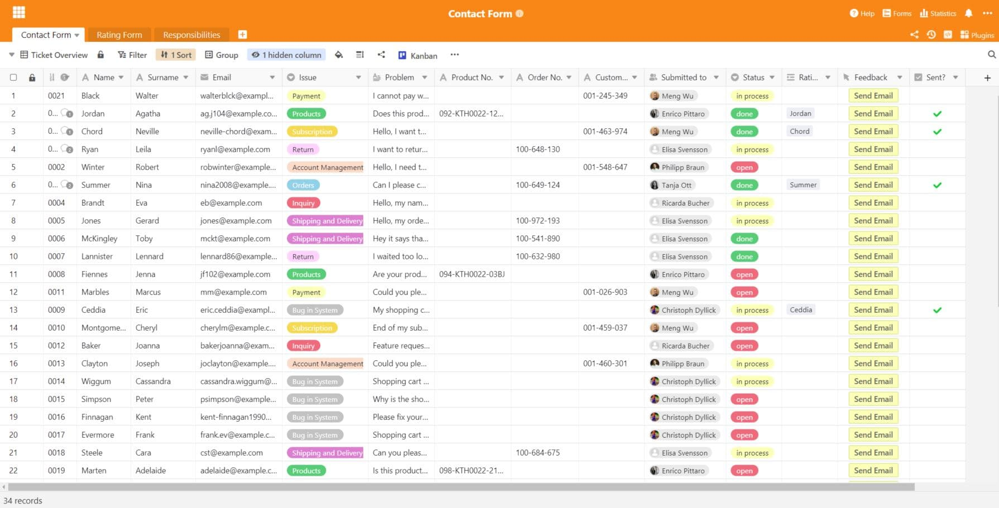
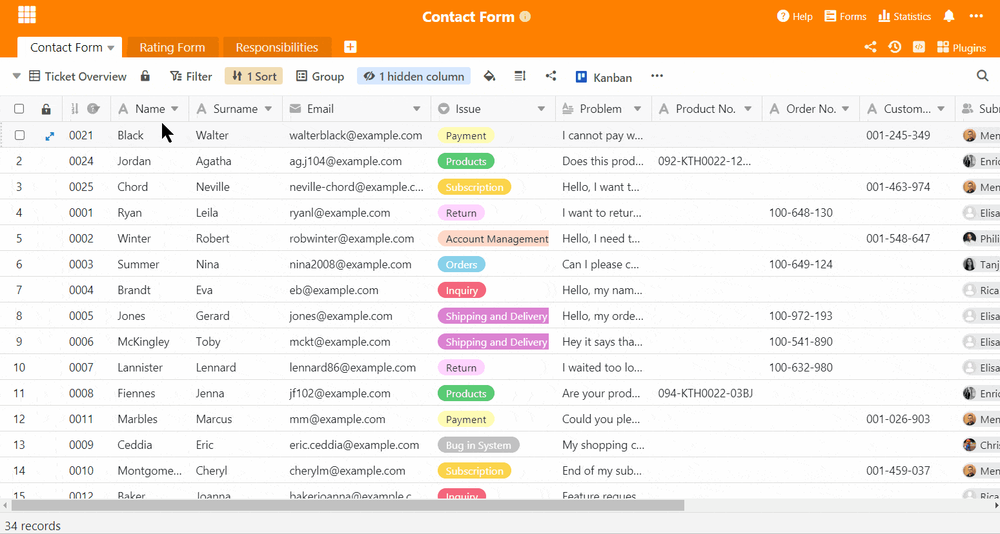
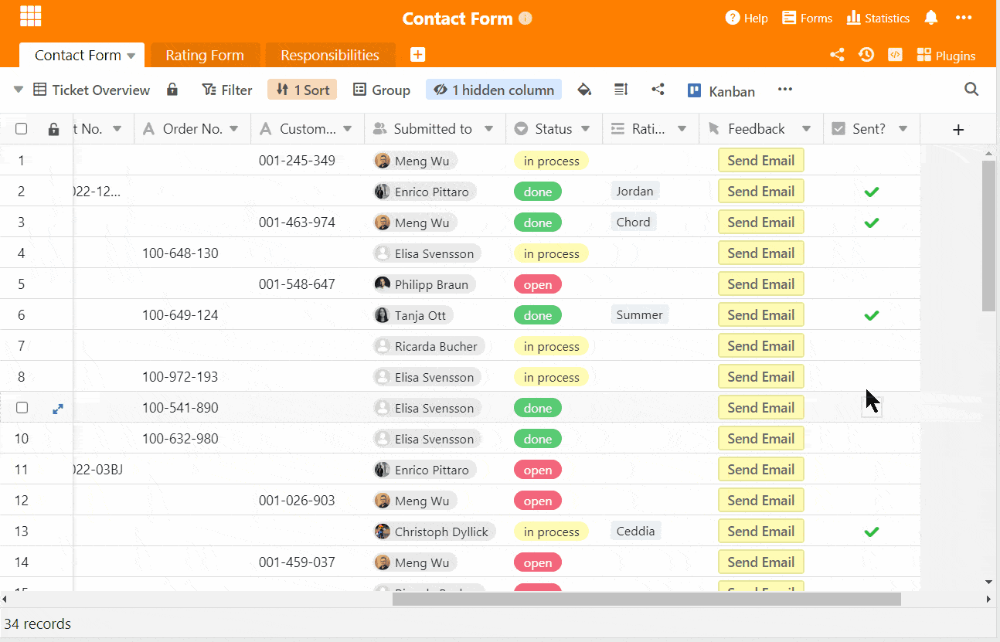
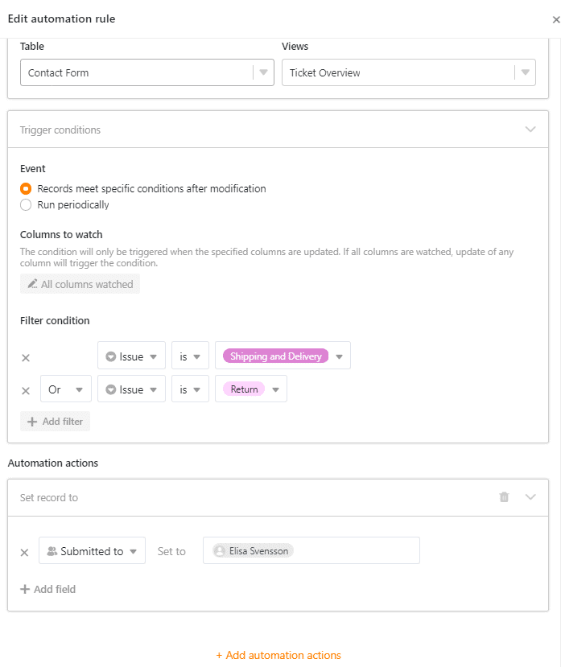
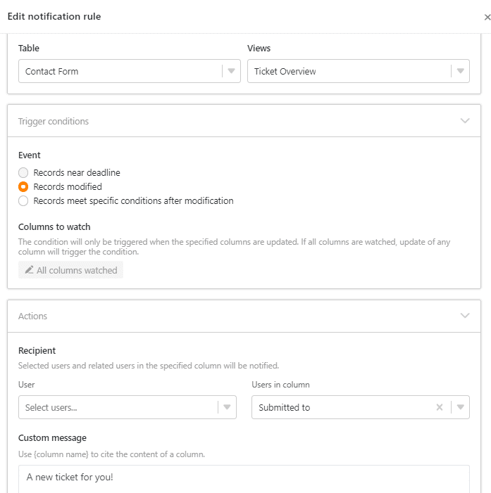
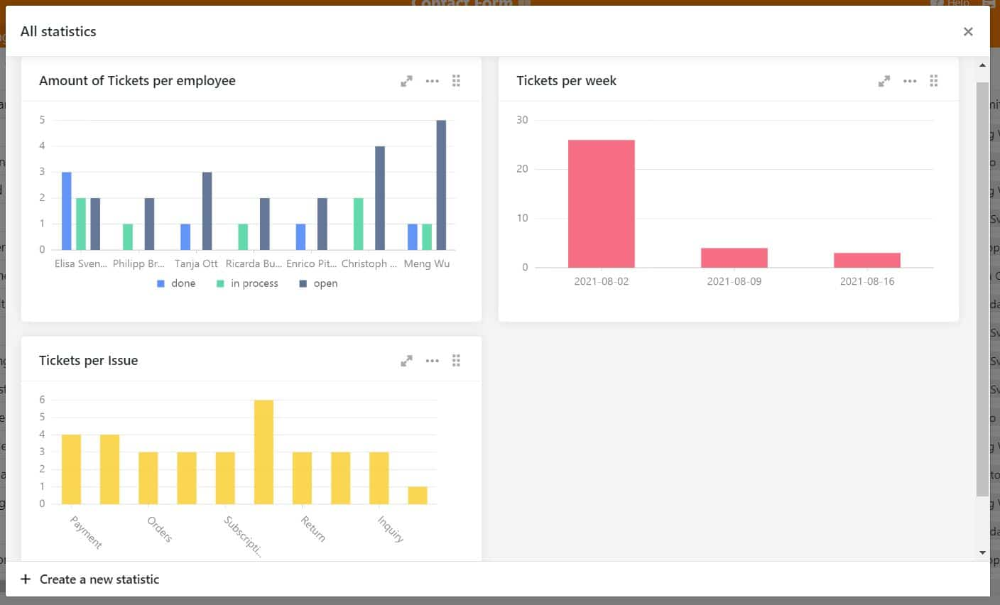

Increasing customer satisfaction is the be-all and end-all for business success these days. Without satisfied customers, there is no basis for personal recommendations and [word of mouth](https://www.sem-deutschland.de/inbound-marketing-agentur/online-marketing-glossar/was-ist-word-of-mouth-marketing/), one of the most important tools when it comes to building reach. Even worse, dissatisfied customers are much more likely to voice their opinions than satisfied customers. And bad reviews very quickly lead to longer-term image problems on the Internet.

That is why it is important to ensure the satisfaction of your customers. On the one hand, there should be good customer support, which they can contact quickly and easily in the event of a problem. Secondly, feedback should be collected, which is very valuable for improving your customer service. Because the better the customer satisfaction, the better the customer loyalty - and the likelihood that your sales figures will climb upwards.

## Increase customer satisfaction - what is most effective?

There are different ways of surveying customer satisfaction. On the one hand, there are very classic telephone interviews - but since many customers do not even give their telephone number and customers may have reservations about unexpected calls, these should be avoided. Moreover, they can be very time-consuming.

Another possibility are emails that lead to a questionnaire, such as a [Net Promoter Score](https://seatable.io/en/vorlage/wcmmq-i4qp-euwa7zh52sg/) or similar. It actively asks how satisfied the customers are and what exactly could be improved about the service or the services. Here, a problem could be a high bounce rate or that many customers do not even click on the survey link.

In order to work even more actively on customer satisfaction, a comprehensive helpdesk system should be set up so that customers can get help quickly and easily. For this purpose, the integration of a digital ticket system instead of an e-mail support system, which is not able to understand all the details of the problems, is a good idea.

## Contact form to increase customer satisfaction

For this reason, we have created SeaTable, a ticket system that can be integrated into any website in the form of a contact form. Here, customers and potential customers can easily and directly categorise their concerns or problems, specify them and send them off without any hurdles. Each submitted contact form becomes a ticket that can be processed by the staff. In this way, customer satisfaction can be positively influenced directly.

Internally, the structure of this ticket system provides enormous advantages, as the parameters make it possible to structure the table in a simple way and thus create a fluid workflow in the team. Each employee receives a notification when a ticket is received for them and can deal with it immediately. The Kanban plugin facilitates the task overview and the individual views for each employee give additional clarity about what needs to be done.

In this article, we present our template contact form as a ticket system and go into detail about each built-in feature. We explain the advantages of SeaTable in this use case and show you concretely which advantages our software can offer you in everyday life.

[Click here to go directly to our template contact form](https://seatable.io/en/vorlage/hgfag3__tz2ws_bnkaedwq/)

## Step 1: A contact form as a central ticket system

The heart of Base is the table that also forms the contact form. Almost all the information shown there can be added to the web form. But let's start from scratch! With SeaTable you can also create a web form from your tables, which you can customize individually and flexibly to your needs.

The columns in your table also form the parameters that are to be queried in your web form, such as name, e-mail address and the problem that occurs. The column types then decide in which form the information can be entered. With free-text columns, participants can submit individual answers, with single- and multi-select columns, only answers that you have specified can be submitted.

You can improve your customer satisfaction with this contact form

You see: The web form is a highly flexible and extremely powerful tool that you can use with SeaTable. We have focused on customer support in our contact form template to be able to increase customer satisfaction in the long run. So, our web form is used in the first step to improve customer satisfaction through good customer service and in the second step to query customer satisfaction directly.

## Views for all

In order not to lose the overview, each employee gets his or her own personal view in SeaTable. All tasks that are directly assigned to them through the Collaborator column are then also directly displayed to them. Each employee can then group, filter and sort their view as they wish. In this way, everyone in the team gets their own workspace in which they can work on their tickets.

The views are also important for the integrated Kanban plugin, as different views can be accessed when creating the Kanban boards. Only in this way can the plugin be individualised - the views provide the basis for many other helpful features. In this way, the traditional table view is extended by a practical Kanban view.

## Feature: The Kanban Tool

Kanban is a popular project management method that visualizes tasks, making them more tangible. You can see at a glance what all needs to be done on your Kanban board and can easily move the individual tasks to a new status on your board. This also gives a great feeling when completing tasks.

The Kanban plugin has been an integral part of our software since [SeaTable 2.0](https://seatable.io/en/seatable-release-2-0/) and is an extremely powerful tool for project and task management. In our template, it offers each staff member a structured and clear work basis for processing tickets. In order to create an individual board for each employee, the views created earlier become important: This step is necessary so that the special views can now be selected during the board creation.

With the Kanban board you always have all your tasks in view

This way, each staff member only gets to see their own tickets and does not have to work in the table view of the contact form. Within the board, tickets can be opened with one click to view all information and linked columns. When a task has been processed or completed, the ticket can be dragged and dropped into another status card - just like you know it from other Kanban tools.

## Step 2: Satisfaction survey actively and quickly

In the first step, we have created an excellent basis with the contact form as a ticket system to increase customer satisfaction and to work on a quick problem solution from the ground up. The second step should be (subsequently or generally) an active query of customer satisfaction. After all, how else are you supposed to know how satisfied customers were or are with the service?

Your customers can rate your service or products with the following information

For this purpose, we have created a second table that serves as the basis for another web form. Satisfaction can also be measured independently of contact with customer support, but it is a good idea to have your customers rate their experience with support in order to drive continuous improvement. This way you can learn a lot from the customer experience.

All entries of the form then immediately appear in the associated table

You are free to decide which variables to include in the evaluation of your contact form. In our case, we have included the time taken to contact us, the quality and friendliness of the service in the survey. With the evaluation column, customers can then rate the services in a star system, possible from 1-10.

## Sending feedback emails with one click

To ensure that this evaluation form lands quickly and easily in your customers' inboxes, SeaTable has a very versatile function up its sleeve. The button column makes it possible to trigger various actions under different conditions at the touch of a button. For example, the button can be used to run any script, send an email or copy or change rows .

In our contact form, we would like to send customers an automatic email to encourage them to fill out the [web form](https://seatable.io/en/docs/handbuch/seatable-nutzen/webformulare/). With the integration of your e-mail account, you can easily define the subject, text and recipients of the e-mail in the column. Once everything has been defined, a click on the button is all it takes for the customer to receive the e-mail in question quite automatically. An automatic notification rule reminds the employee to send the e-mail.

With automated emails, you can ask customers for feedback at the touch of a button.

As soon as customers have filled out and submitted the form, it appears in your spreadsheet and you can view the ratings. There are also automatic notification rules for new reviews that inform you of their receipt - so you don't need to do anything else except accept the feedback productively and constructively.

The star system means that negative ratings are noticed immediately and de-escalation measures can be implemented immediately to increase customer satisfaction. Dissatisfied customers can be contacted directly to speed up problem resolution or to accommodate the customer with compensation. These measures can also be logged internally in the table.

## Automatically assign tickets to the right employees

Also new with [SeaTable version 2.2](https://seatable.io/en/seatable-release-2-2/) are the extended automation rules. The automations are only available for SeaTable Enterprise customers. SeaTable should make your everyday life easier and easier with automated processes and for this we have integrated a suitable rule in our contact form. With the automation rule **"Submit to employee XY"** we have created a rule that immediately assigns an incoming ticket to the right employee. How does this work?

Quite simply, the first part of the rule uses filter conditions to specify that certain issues trigger an action. So, if the issue contains either **"Return"** or **"Shipping and Delivery"**, the action is automatically triggered to fill in the **"Submitted to"** column with the corresponding employee. You specify this when you create the rule. Or you can set a notification to yourself - it's up to you.

With this automation, you save yourself the manual assignment of tickets by hand, which can cost a lot of time, especially with a high volume. It also greatly simplifies notification rules, as we will explain in the next step.

### Automatic notifications for new tickets

Normally, you would now have to create an individual notification rule for each employee if a ticket enters the system only for him, since this would not yet be assigned to an employee. This would work the same way as with the automation rule - the **"Issues"** column and the associated issues per employee would be the decisive filter condition for the rules here.

However, the more employees and topics you have, the more rules you have to create manually in your contact form. Since each employee is responsible for different topics, 6 different rules must be created for 6 employees, as the triggers are different for each one.

However, the automation rule that has just been created provides a remedy here! It automatically assigns the responsible contact person to each new ticket. And this assignment means that only a single notification rule is required to inform the employees when a new ticket is created, since the employee assignment is now the decisive filter condition. To do this, the " **Submitted to** " column is selected in the " **Users in** column" field in the actions.

This simply has the advantage that a) tickets no longer have to be assigned manually, and b) this saves on notification rules. This turns your contact form into an absolute power tool.

### Internal communication and statistics

SeaTable has also taken care of internal communication. With the [Chat function](https://seatable.io/en/docs/handbuch/zusammenarbeit/kommentare/) can be communicated easily within the contact form and separate emails are no longer needed. Customers do not see this, by the way. When opening a row , the information appears in the form of a detailed view, in which a comment and log column are integrated on the right. In the comment column, employees can be linked with an @ and addressed directly. Problems are solved quickly this way.

The log column provides information about which employee made changes to row and when, so the processing procedure is transparent and fully traceable. If there are any problems or if the last person to process an order has to be found, the log area can be used to find out who had the last contact with a customer.

Since SeaTable is also a database, all data in the contact form can be used for continuous analyses. For this purpose, statistics can be created that show in our template, for example, how many tickets arrive per week, how many tickets each employee currently has and which issues arise particularly often.

## All-round package: How to increase customer satisfaction with SeaTable

With our [contact form template](https://seatable.io/en/vorlage/hgfag3__tz2ws_bnkaedwq/), customers have the opportunity to reach you easily and quickly and feel in good hands. For you, the form is also a ticket system that you can use internally and with which problems can be addressed immediately. SeaTable's structure and built-in [notifications](https://seatable.io/en/docs/handbuch/zusammenarbeit/benachrichtigungen/) guarantee a fast and smooth problem resolution process. This allows you to respond to customers immediately and increase customer satisfaction.

This contact form is just one of many cases where you can use SeaTable. The highly flexible structure allows it to be used in almost all areas, such as [marketing](), [human resources]() or even [sales](https://seatable.io/vertrieb/). Take a look at [our templates](https://seatable.io/en/docs/templates/) and [register to]() try SeaTable for free today!
