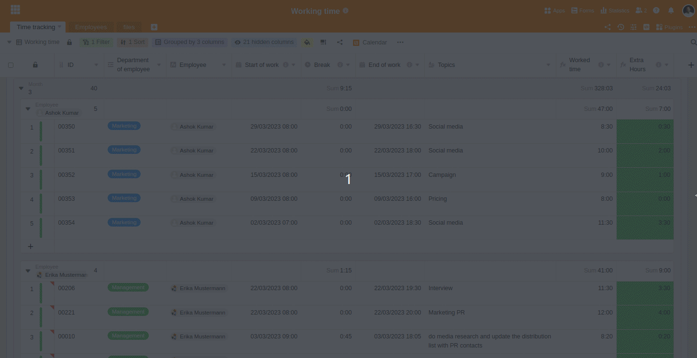
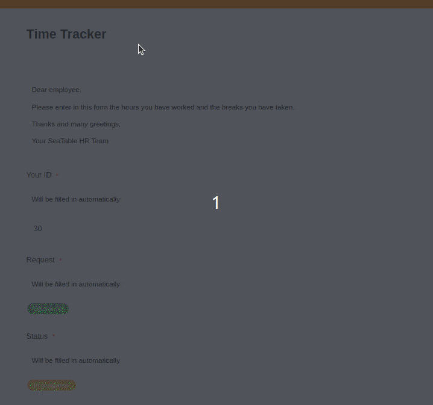

El registro electrónico de las horas de trabajo aún no es obligatorio, pero [si el Ministerio Federal de Trabajo](https://www.tagesschau.de/wirtschaft/unternehmen/arbeitszeit-erfassung-heil-101.html) se sale con la suya, pronto lo será. Una sencilla [plantilla para el](https://seatable.io/es/arbeitszeiterfassung/) registro de las horas de trabajo le ofrece aquí un remedio. Con SeaTable tendrá a mano un formulario para registrar las horas de sus empleados y, al mismo tiempo, una tabla clara en la que podrá ver todas las horas trabajadas.

## ¿Es obligatorio el registro de horas en Alemania?

Sí, los empresarios en Alemania ya están obligados a registrar las horas extraordinarias y el trabajo en domingo en virtud de la actual Ley de Tiempo de Trabajo. Además, el Tribunal de Justicia de la Unión Europea dictaminó en mayo de 2019 que las empresas de la UE deben registrar todas las horas de trabajo de sus empleados. El Tribunal Federal de Trabajo lo confirmó en su sentencia de 13 de septiembre de 2022. Por lo tanto, la cuestión de **si** los empresarios deben registrar el tiempo de trabajo está decidida.

El Ministerio Federal de Trabajo quiere responder a la pregunta de **cómo** debe ser el registro de horas en el futuro en un proyecto de ley antes de finales de 2023. Actualmente, el registro de horas **no** está sujeto a una forma específica y puede realizarse tanto electrónicamente como por escrito en papel. Esto cambiará en el futuro si el Ministerio Federal de Trabajo se sale con la suya: el comienzo, el final y la duración del tiempo de trabajo diario deberán registrarse **electrónicamente** y, por lo general, el **mismo día**.

Sin embargo, como empresario, no es aconsejable esperar hasta que la ley exija el registro electrónico de las horas. Si aún no lo ha hecho, empiece a registrar digitalmente las horas de trabajo de sus empleados. La [plantilla gratuita para el registro](https://seatable.io/es/vorlage/fyp0x2y-s-ut3m-wcbpzbq/) de las horas de trabajo de SeaTable es un sistema adecuado para registrar las horas en su empresa y está lista para su uso inmediatamente después del [registro gratuito]().

## Estructura de la plantilla SeaTable

### Información general para usted y sus directivos

La vista principal de su cuadro de horario de trabajo está agrupada por empleados individuales. Esto le permite ver rápidamente cuántas horas ha trabajado cada uno de sus empleados.

Vista administrativa de la tabla de horarios de trabajo en SeaTable

### Para sus empleados: formulario web para registrar las horas

Cada empleado presenta la hoja de horario por sí mismo a través de un formulario web. Para cada día, deben introducirse aquí el inicio y el final del tiempo de trabajo, la duración de la pausa y, opcionalmente, los temas en los que se ha trabajado. Textos de ayuda con instrucciones concretas guían a sus empleados de forma segura a través del proceso de cumplimentación.

Las horas introducidas se muestran en la vista general. Un formulario web enviado corresponde a una fila de su tabla o al tiempo de trabajo diario de un empleado.

## Prepárese ya hoy

Con nuestra plantilla para el registro de horas, estará preparado para todo, ya se trate de cambios legales o de futuros controles por parte de las autoridades. En cualquier caso, tiene sentido empezar hoy mismo a registrar con precisión las horas de trabajo de sus empleados. Con nuestra plantilla, tendrá todas las horas a la vista en todo momento y podrá demostrar el cumplimiento de la normativa legal sobre el tiempo de trabajo.

¿Le falta algo? No se preocupe. Puede adaptar fácilmente SeaTable a sus necesidades individuales. Sólo tiene que probarlo. Nuestras [plantillas](https://seatable.io/es/vorlagen/) son gratuitas y pueden utilizarse inmediatamente después de [registrarse]().
