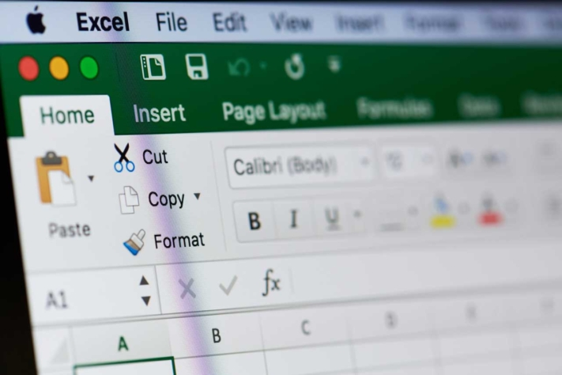

How does time tracking work **in Excel** and what alternatives are available to you? In the following, you will learn how to implement time tracking with Excel or an alternative tool. Also learn about the advantages and disadvantages of the different solutions. Which one suits your company?

Let's start with the advantages and disadvantages of the popular tool Excel.

## Time tracking in Excel: advantages and disadvantages

Excel is already used for one use case or another in many companies that use Microsoft Office.

For time tracking in Excel, the advantages are:

- **Conditionally free of charge**: If you have a usage license anyway, there are no further costs.
- **Flexible**: You can flexibly adapt the employees' timesheets to your wishes. Cell formatting and a programming with VBA (Visual Basic for Applications) open up many possibilities for you.
- **Universal**: Other scenarios than just time recording can be mapped with Excel (for example, the shift and [vacation schedule](https://seatable.io/en/urlaubs-planer/)). This means that employees only need to familiarize themselves with one tool.

Recording working time Excel © PixieMe / adobe stock

These are the disadvantages of time tracking in Excel:

- **Required know-how**: Getting started seems easy, but Excel is complex. To customize a time tracking template for your business, you need to be familiar with the program or hire an expert.
- **Long start**: Creating the template to a working process for time tracking with Excel takes a lot of time.
- **Room for error**: The programme is prone to errors. Formulas or numbers can quickly be deleted by mistake.
- **Mistrust of incorrect data**: When transferring individual employee timesheets to an overview, many steps take place manually. In the process, data can be lost and incorrect calculations can lead to a poor working atmosphere.

Let's therefore take a brief look at the alternatives to time recording with Excel. What are they and how do they differ?

## 6 alternative tools for time tracking in Excel

Learn more now about six alternative tools that can help you map working time recording easily and efficiently. We start with two apps and then move on to desktop and browser-based programmes.

Which solution is best suited for your company depends on the costs, your use case and the supported end devices.

### #1 Time clock X or XT

If your employees work with Apple devices, you should take a look at the [Time Clock X](https://www.zeiterfassung-kostenlos.de/apps/stechuhr-x-zeiterfassung-app-f%C3%BCr-iphone-und-ipad-37e9VQzL6EP90ttYtGRGwp) app. With this, employees can record the start and end of working hours. Even variable breaks or a supplement of working hours is no problem. Time clock X is free of charge.

Unfortunately, the timesheet is not very clear. You can either export the data for further processing with another tool. Or you can purchase the better version, Stechuhr XT, for 1.99 € per licence.

### #2 Time clock 2.1

What about Android users? They can familiarise themselves with the app [Stempeluhr 2.1.](https://www.data.ai/de/apps/google-play/app/de.matlen67.stempeluhr21/) Here you have the option of entering both working hours and holiday planning. The app costs nothing.

An export of the timesheet as Excel or PDF enables further processing of the data for supervisors and analyses.

### #3 Clockodo

A program that can be used for both Windows and Apple devices is [Clockodo](https://www.clockodo.com/de/). For the self-employed, time tracking is free of charge; companies pay up to €11.40 per person per month.

With Clockodo you have the possibility to assign working hours to projects. You can manage absences as well as vacations and enter [project budgets](https://seatable.io/en/budgetplanung-vorlage/). A streamlined CRM allows you to link supplier and customer contacts.

### #4 PlanMaker

If you basically like time tracking with Excel, but you are looking for an alternative for all platforms, [PlanMaker](https://www.softmaker.de/softmaker-office-planmaker) is the right choice. The Softmaker Office software series consists of the programs TextMaker, PlanMaker and Presentations, similar to the Microsoft Office products.

PlanMaker lets you create and manage timesheets. Functions for processing and analyzing the data are available, just like in Excel. Once your template is up and running (which takes some time), you're ready to go. Softmaker Office costs from €29.90 per year or a one-time €79.95 (without upgrades).

### #5 Google Sheets

Next, it is worth taking a look at the web-based tool [Google Sheets](https://www.google.com/sheets/about/). Here you will find functions for working together as a team. A complete process for working time management can thus be easily realised.

In terms of data processing and available functions, Google Sheets are in no way inferior to Excel spreadsheets. You have fewer options when it comes to visualizations. Additional functions can be purchased via add-ons from the Google Marketplace. Google Workspace starts at €9.36 per user per month.

Time tracking with Excel or Google Sheets? © sharafmaksumov / adobe stock

### #6 SeaTable

SeaTable is a browser-based tool that lets you implement your [time tracking](https://seatable.io/en/vorlage/fyp0x2y-s-ut3m-wcbpzbq/) very simply, compared to Excel. In addition to data collection and processing, you can attach files and images to entries. The various web forms and views allow supervisors and employees to collaborate smoothly.

A calendar plugin helps with the hours overview. Interfaces and export functions simplify the further processing of data for accounting. You can use SeaTable in the free version for an unlimited time. Extended functions are available from 7 € per user and month.

But what does the [working time recording](https://seatable.io/en/arbeitszeiterfassung/) look like in concrete terms? Now that you know various alternatives, let's take a close look at the use case.

## How do you create a timesheet in Excel?

Time recording in Excel starts with the creation of a new table. You open an empty spreadsheet. In the first row you enter the headings Date, Start, End, Break and Hours.

Type the first date into the next row . Format the display (for example, DD.MM.YYYY) by right-clicking on "Format cells".

After you have returned to the overview, click on the cell with the date. Move your cursor to the lower right end of the cell. A black plus will appear. Drag the black plus down until you reach the desired listing of working days.

Now click on the first cell under the Hours heading (E2). In the field for formulas enter "=C2-B2-D2" (End-Start-Pause). Then drag the cell down using the small black cross. Your first timesheet is ready.

To make the timesheet more workable, you could additionally:

- Colour-code the weekends with a formatting rule.
- Convert hours to decimal numbers if negative times are to be possible. Excel can only display positive hours.
- Display the total number of hours via the sum formula.

Of course, it is also necessary to coordinate how the Excel timesheets are later sent to the supervisors. A self-programmed macro could collate the data of different employees to get an overview per department.

Let's now take a look at working time recording with an alternative.

## How working time recording works with SeaTable

Your employees record their hours in a web form with just a few clicks. They enter the start and end of working hours as well as the length of breaks.

Subsequently, responsible persons view the working times in the time sheet. Here they can group and filter according to individual employees or time periods.

It is especially easy to get started with a [free template](https://seatable.io/en/vorlage/fyp0x2y-s-ut3m-wcbpzbq/) that you can use immediately after [free registration](). You can learn more about working time recording in SeaTable [here](https://seatable.io/en/arbeitszeiterfassung/).

## Conclusion: Alternatives to time tracking in Excel

There are many alternatives to time recording in Excel. While Excel is often used, it is not the easiest option and makes it difficult to keep track of all employees' working hours. Better suited are web-based tools such as SeaTable, which bundle all data in one place and map the complete process of recording working hours.

_Image source Cover image: © Quality Stock Arts/Adobe Stock_
