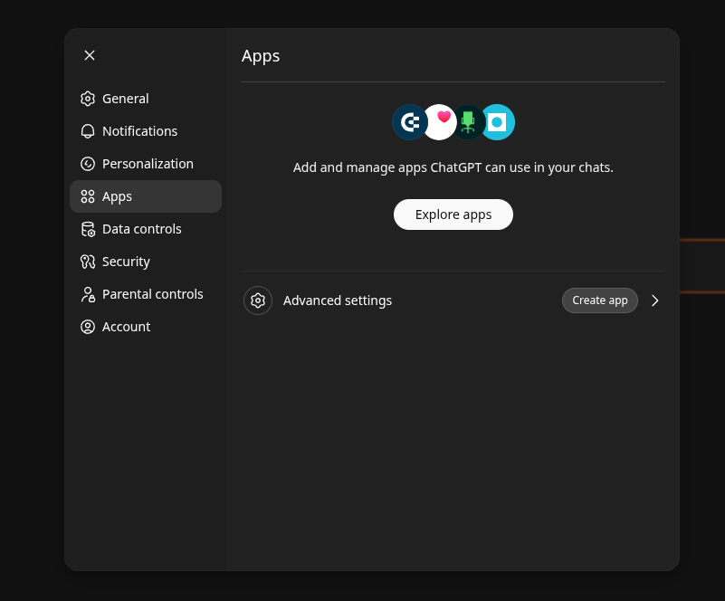
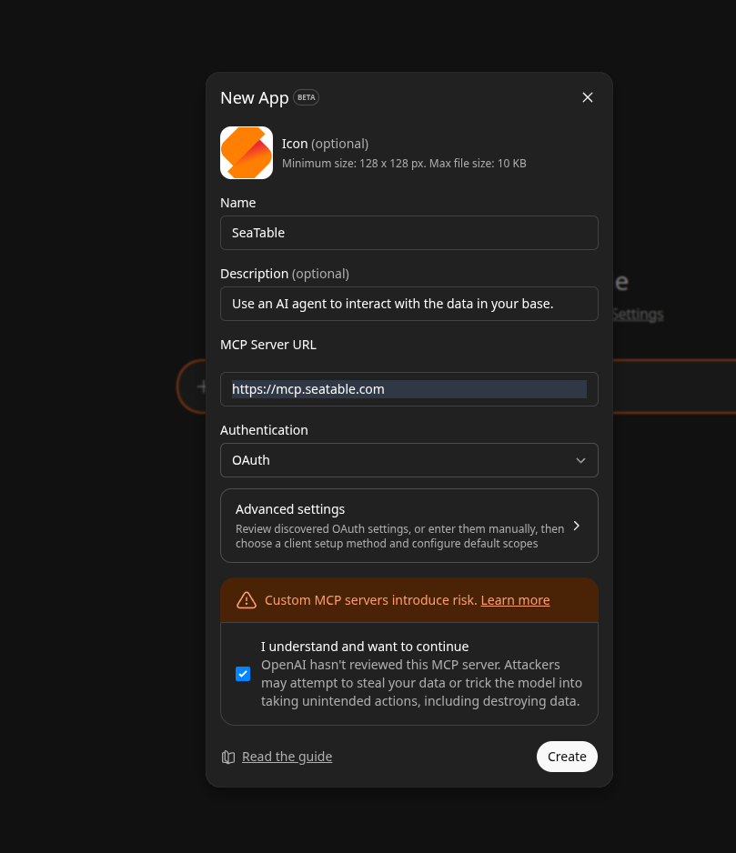
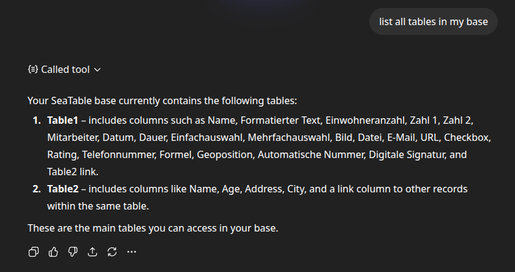

En esta guía, conectará ChatGPT con su base de SeaTable. Una vez configurado, podrá hacer preguntas a ChatGPT sobre sus datos y hacer que edite entradas directamente desde el chat. La configuración tarda unos cinco minutos.

A diferencia de otros clientes como Claude Desktop o Cursor, la autenticación con ChatGPT se realiza mediante **OAuth**. No necesita copiar manualmente un token API — en su lugar, inicia sesión directamente en SeaTable durante la configuración y autoriza el acceso.

## Requisitos previos

- Una cuenta de SeaTable Cloud con al menos una base
- Una cuenta de ChatGPT (disponible en [chatgpt.com](https://chatgpt.com) — el plan gratuito es suficiente)

## Paso 1: Crear una app en ChatGPT

ChatGPT gestiona las conexiones MCP a través de las llamadas apps. Para crear una nueva app, proceda de la siguiente manera:

1. Abra ChatGPT y vaya a **Settings** → **Apps**.
2. Haga clic en **Advanced settings** en la parte inferior y luego en **Create app**.

3. Rellene el formulario de la siguiente manera:

| Campo | Valor |
|---|---|
| **Name** | `SeaTable` (o cualquier nombre como `SeaTable CRM`) |
| **Description** | p. ej. `Use an AI agent to interact with the data in your base.` |
| **MCP Server URL** | `https://mcp.seatable.com/mcp` |
| **Authentication** | `OAuth` |

4. Active la casilla **I understand and want to continue** para confirmar que confía en el servidor MCP.
5. Haga clic en **Create**.

## Paso 2: Autorizar con SeaTable

Después de crear la app, ChatGPT inicia el proceso OAuth. Será redirigido a SeaTable, donde inicia sesión con su cuenta de SeaTable y autoriza el acceso a una base específica. Usted decide si ChatGPT solo puede leer o también escribir datos.

Tras la autorización exitosa, será redirigido automáticamente de vuelta a ChatGPT. La conexión queda establecida.

## Paso 3: Verificar la conexión

Haga una primera pregunta de prueba:

> *«¿Qué tablas hay en mi base?»*

ChatGPT consultará entonces la estructura de las tablas a través del servidor MCP y listará todas las tablas con sus columnas. Si esto funciona, la conexión está establecida.

## Hacer sus primeras preguntas

Ahora puede hacer preguntas a ChatGPT sobre sus datos como si estuviera hablando con un colega. Aquí tiene algunos ejemplos para probar:

- *«¿Cuántas entradas tiene la tabla Contactos?»*
- *«Muéstrame todas las entradas donde el estado sea "Abierto".»*
- *«Resume los datos de la tabla Ingresos por mes.»*

Sus preguntas deben referirse a tablas y columnas que realmente existan en su base. Si no está seguro, simplemente pregunte primero a ChatGPT sobre la estructura de la base. Conoce sus tablas y columnas y puede indicarle lo que está disponible.

No necesita escribir los nombres de tablas y columnas de forma exacta. ChatGPT reconoce pequeños errores tipográficos y los corrige automáticamente. Escriba tranquilamente «Contactos» en lugar de «contactos» o «Proyectos» en lugar de «projects». ChatGPT encontrará la tabla correcta.

## Próximos pasos

- [Ejemplos de uso de agentes de IA]()
- [Hacer buenas preguntas: cómo obtener las mejores respuestas]()
- [Solución de problemas de agentes de IA]()
- [Permisos y protección de datos para agentes de IA]()
