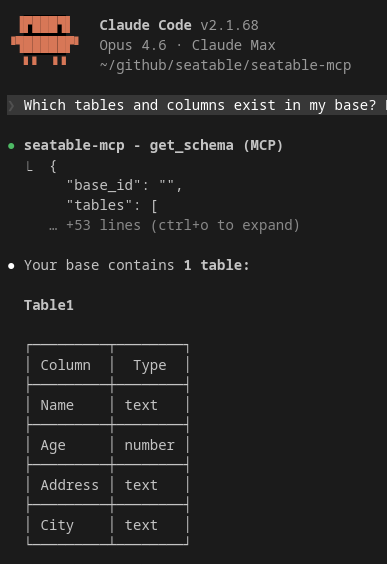

Um agente de IA consegue fazer notavelmente muito com os seus dados do SeaTable — desde que compreenda o que pretende. Neste artigo, vai aprender como formular as suas perguntas para que o agente forneça os melhores resultados. A boa notícia: não precisa de aprender nenhuma sintaxe especial. A linguagem natural é perfeitamente suficiente. Algumas regras simples ajudam, contudo, a evitar mal-entendidos.

## O agente conhece a sua base

Antes de fazer a sua primeira pergunta, o agente de IA já leu a estrutura da sua base. Sabe que tabelas existem, como se chamam as colunas e que tipos de dados contêm. Não precisa de lhe explicar isto. Comece simplesmente a perguntar — o agente sabe com o que está a trabalhar.

Um bom ponto de partida é frequentemente:

> *"Que tabelas e colunas existem na minha base?"*

Assim pode ver como o agente compreende a sua base e adaptar as suas perguntas em conformidade.

## O específico vence o vago

Quanto mais precisa for a sua pergunta, melhor o resultado. Isto não se deve ao facto de o agente não compreender perguntas vagas — mas porque perguntas vagas têm múltiplas respostas corretas e o agente tem de adivinhar qual pretende.

| Vago | Específico |
|---|---|
| *"Mostra-me os clientes."* | *"Mostra-me todos os clientes da tabela Contactos que estão em Berlim."* |
| *"Como vão as vendas?"* | *"Qual foi a faturação total em fevereiro? Agrupar por comercial."* |
| *"O que há de novo?"* | *"Que entradas na tabela Tarefas foram criadas nos últimos 7 dias?"* |

Não precisa de usar o nome exato da coluna. Se a sua coluna se chama "Data de criação" e pergunta sobre "criadas nos últimos 7 dias", o agente compreende a ligação. Os erros de digitação nos nomes de tabelas ou colunas também são corrigidos automaticamente na maioria dos casos.

## Passo a passo em vez de tudo de uma vez

Para tarefas complexas, muitas vezes atinge o seu objetivo mais rapidamente dividindo-as em várias perguntas. O agente lembra-se do contexto da conversa — portanto pode basear-se nas respostas anteriores.

Em vez de:

> *"Mostra-me todas as tarefas atrasadas, agrupa-as por responsável e cria um lembrete para cada uma na tabela Atividades com o texto 'Por favor, verificar estado'."*

Melhor em três passos:

> *"Que tarefas na tabela Tarefas estão atrasadas?"*
>
> *"Agrupa estas pela coluna Responsável."*
>
> *"Cria uma entrada na tabela Atividades para cada tarefa atrasada com a nota 'Por favor, verificar estado'."*

Assim pode verificar o resultado intermédio após cada passo antes de o agente continuar. Isto é especialmente útil para operações de escrita.

## Utilizar nomes de tabelas e colunas

O agente funciona de forma mais fiável quando utiliza os nomes que realmente existem na sua base. Não precisa de corresponder à ortografia exata — "contactos" em vez de "Contactos" ou "Projetos" em vez de "projetos" geralmente funciona sem problemas. Mas ajuda o agente se utilizar os termos da sua base em vez de paráfrases.

Se não tem a certeza de como se chama uma coluna, pergunte simplesmente:

> *"Que colunas tem a tabela Projetos?"*

## O que não funciona

O agente só pode trabalhar com dados que realmente existem na sua base. Algumas situações típicas em que não consegue ajudar:

**Dados que não existem.** Se perguntar sobre um campo que não existe — como "Mostra-me os números de telefone" numa base sem coluna de número de telefone — o agente informá-lo-á. Não inventa dados.

**Cálculos sobre valores inexistentes.** Se perguntar sobre a faturação por cliente mas a sua base contém apenas itens individuais sem atribuição de clientes, o agente não consegue estabelecer essa relação.

**Ações fora do SeaTable.** O agente não pode enviar e-mails, aceder a sistemas externos ou abrir ficheiros no seu computador. Trabalha exclusivamente com os dados na sua base SeaTable.

## Dicas para o dia a dia

**Comece com consultas de leitura.** Antes de o agente modificar dados, execute primeiro uma consulta para se certificar de que encontra as entradas corretas. Pergunte primeiro *"Que tarefas da Lisa ainda estão abertas?"* antes de dizer *"Altera o estado para Concluído."*

**Utilize o contexto.** O agente lembra-se da conversa. Após uma consulta, pode referir-se aos resultados anteriores com "estes", "desses" ou "os mesmos" sem repetir tudo.

**Peça que lhe expliquem a estrutura.** Se herdou uma base ou não tem a certeza de como está configurada, o agente é um excelente ponto de partida. Pergunte-lhe sobre tabelas, colunas, ligações — dá-lhe uma visão geral em segundos que de outra forma exigiria clicar em cada tabela manualmente.

**Seja direto com as alterações.** Quando o agente deve criar ou modificar algo, indique claramente o que deve acontecer exatamente: que tabela, que colunas, que valores. Quanto mais clara a instrução, menos perguntas de seguimento.

> *"Cria uma nova entrada na tabela Contactos: Nome 'Müller GmbH', Cidade 'Hamburgo', Estado 'Novo'."*