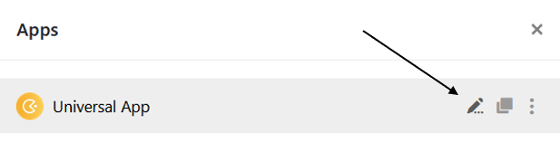

Приложения, которые вы уже добавили в одну из своих баз, можно редактировать в любое время на одноименной вкладке в шапке базы.



## Редактирование приложения

1. Откройте **базу**, в которой вы хотите отредактировать приложение.
2. Нажмите **Приложения** в заголовке База.

4. Наведите курсор мыши на нужное приложение и нажмите на появившийся **значок карандаша** .

6. Выбранное приложение откроется в режиме редактирования, где можно выполнить определенные **настройки** .


