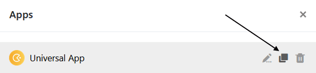

Sie haben eine ausgefeilte **App** gebaut, die Sie in ähnlicher Form für eine weitere Nutzergruppe verwenden möchten? Dann **kopieren** Sie einfach die bestehende App und passen Sie die Kopie nach Belieben an.



## Eine App kopieren

1. Öffnen Sie die **Base**, in der Sie eine bestehende App kopieren möchten.
2. Klicken Sie im Base-Header auf **Apps**.

 4. Fahren Sie mit der Maus über die App und klicken Sie auf das erscheinende **Kopie-Symbol** .

 6. Die Kopie der App öffnet sich im Bearbeitungsmodus, in dem Sie die **Einstellungen** direkt anpassen können.
