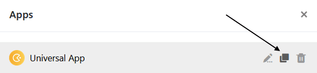

Vous avez construit une **app** sophistiquée que vous souhaitez utiliser sous une forme similaire pour un autre groupe d'utilisateurs ? Il vous suffit alors de **copier** l'application existante et d'adapter la copie à votre guise.



## Copier une application

1. Ouvrez la **base** dans laquelle vous souhaitez copier une application existante.
2. Cliquez sur **Apps** dans l'en-tête de la base.

4. Passez la souris sur l'application et cliquez sur l'**icône de copie** qui apparaît .

6. La copie de l'application s'ouvre en mode édition, dans lequel vous pouvez directement adapter les **paramètres**.
