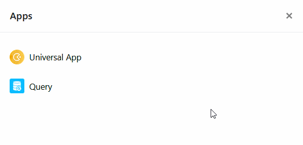

Vous souhaitez supprimer de votre base une application dont vous n’avez plus besoin ? Aucun problème! Cela peut être fait à tout moment en quelques clics.



## Supprimer une application d'une base

1. Ouvrez la **base** dans laquelle vous souhaitez supprimer une application.
2. Cliquez sur **Apps** dans l'en-tête de la base.

4. Passez votre souris sur l’application souhaitée et cliquez sur les **trois points** à droite.
5. Sélectionnez **Supprimer** .
6. Confirmez en cliquant sur **Supprimer**.



## Conséquences de la suppression

Commençons par le plus important : **la suppression d'une application ne fait jamais perdre de données dans la base sous-jacente**. Techniquement, vous ne supprimez donc qu'une interface utilisateur et _non_ la base de données en arrière-plan.

Veuillez noter, cependant, que lorsque vous supprimez une application universelle, toutes les pages et tous les dossiers qui se trouvent dans **l’application** sont également **définitivement supprimés** et ne peuvent pas _être restaurés_.

Lors de la suppression d'une **application de galerie**, _seules_ les **galeries** présentées dans l'application sont supprimées, les **images** restent en revanche conservées dans [les colonnes d'images](https://seatable.io/fr/docs/dateien-und-bilder/die-bild-spalte/) de vos tableaux.

De même, la suppression d'une **application de consultation de données** ne supprime **aucune donnée**, mais uniquement le **masque de recherche**.
