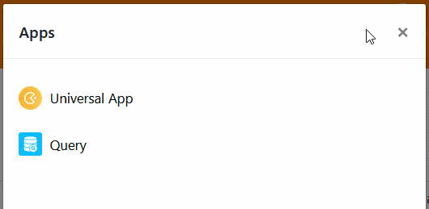

Es kann vorkommen, dass Sie die **Nutzung einer App vorübergehend unterbinden** möchten, weil Sie zum Beispiel gerade umfangreiche Änderungen an der zugrundeliegenden Base vornehmen. In diesem Fall können Sie Apps jederzeit mit nur wenigen Klicks deaktivieren.



## Eine App deaktivieren

1. Öffnen Sie die **Base**, in der Sie eine App deaktivieren möchten.
2. Klicken Sie im Base-Header auf **Apps**.
   4. Fahren Sie mit der Maus über die gewünschte App und klicken Sie rechts auf die **drei Punkte**.
3. Wählen Sie **Anhalten** aus.
   



Eine deaktivierte App erkennen Sie am Hinweis **(inaktiv)** hinter dem Namen der App.

## Folgen der Deaktivierung

Indem Sie eine App deaktivieren, **entziehen Sie allen bisherigen Nutzern den Zugriff**. Diese bekommen die App nicht mehr angezeigt und können sie nicht mehr nutzen, bis Sie die App wieder aktivieren. Beachten Sie bitte, dass Sie eine inaktive App weder [bearbeiten](https://seatable.io/docs/apps/apps-bearbeiten/) noch [kopieren](https://seatable.io/docs/apps/apps-kopieren/) können.
