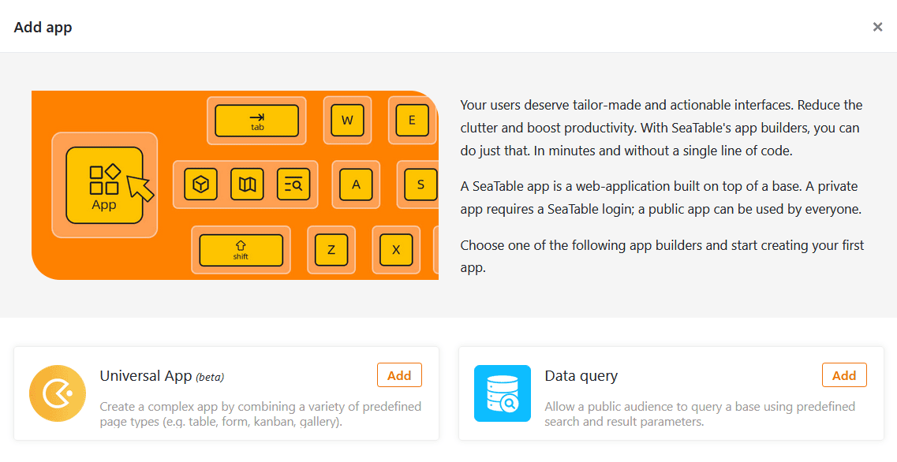

Sie möchten eine App zu Ihrer Base hinzufügen, um die Arbeit in SeaTable noch individueller auf bestimmte Nutzergruppen und Anwendungsfälle zuschneiden zu können? Kein Problem! Dies ist in nur wenigen Schritten erledigt.



## Eine App zu einer Base hinzufügen

1. Öffnen Sie eine beliebige **Base**, in der Sie eine neue App hinzufügen möchten.
2. Klicken Sie im Base-Header auf **Apps**.
   4. Ein neues Fenster erscheint. Klicken Sie auf **App hinzufügen**.
3. Entscheiden Sie sich, welche Art von App Sie erstellen möchten, und klicken Sie auf **Hinzufügen**.
   7. Geben Sie der App einen **Namen**.
4. Bestätigen Sie mit **Abschicken**.
   

Sobald Sie die App hinzugefügt haben, können Sie die [App bearbeiten]() und nach Ihren Vorstellungen gestalten.
