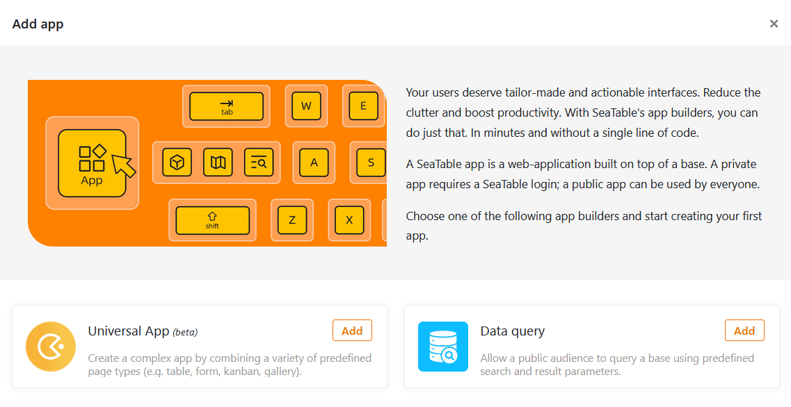

¿Le gustaría añadir una aplicación a su base para poder adaptar el trabajo en SeaTable aún más individualmente a grupos de usuarios y casos de uso específicos? No se preocupe. Esto se hace en unos pocos pasos.



## Añadir una aplicación a una base

1. Abra cualquier **base** en la que desee añadir una nueva aplicación.
2. Haga clic en **Aplicaciones** en la cabecera Base.

4. Aparecerá una nueva ventana. Haga clic en **Añadir App**.
5. Decida qué tipo de aplicación desea crear y haga clic en **Añadir.**

7. Dale un **nombre** a la aplicación.
8. Confirme con **Enviar**.

Una vez añadida la [aplicación]() y diseñarla a tu gusto.
