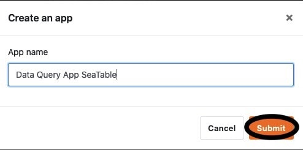

Vous souhaitez ajouter une application à votre base afin de personnaliser davantage votre travail dans SeaTable pour des groupes d'utilisateurs et des cas d'utilisation spécifiques ? Pas de problème ! Cela se fait en quelques étapes.



## Ajouter une application à une base

1. Ouvrez n'importe quelle **base** dans laquelle vous souhaitez ajouter une nouvelle application.
2. Cliquez sur **Apps** dans l'en-tête de la base.

4. Une nouvelle fenêtre apparaît. Cliquez sur **Ajouter une application**.
5. Décidez du type d'application que vous souhaitez créer et cliquez sur **Ajouter**.

7. Donnez un **nom** à l'application.
8. Confirmez en cliquant sur **Envoyer**.

Une fois que vous avez ajouté l'application, vous pouvez la [modifier]() et la personnaliser à votre guise.
