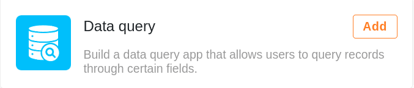
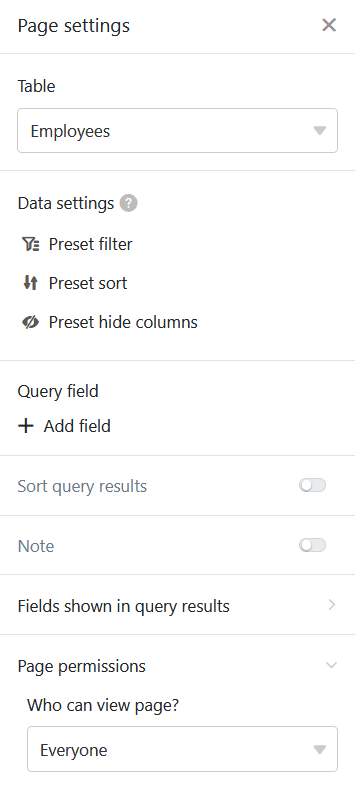
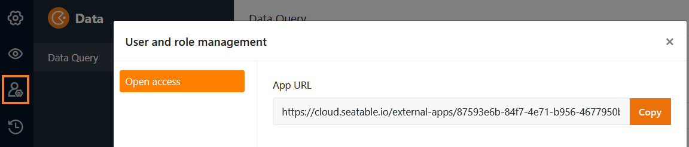
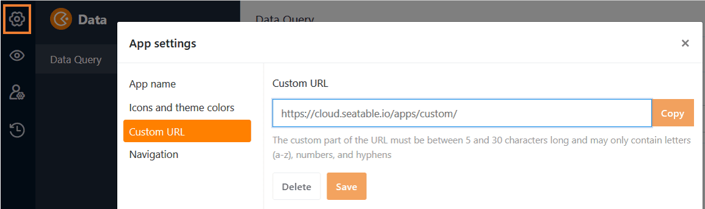
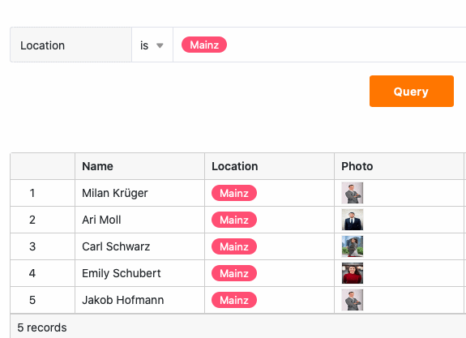
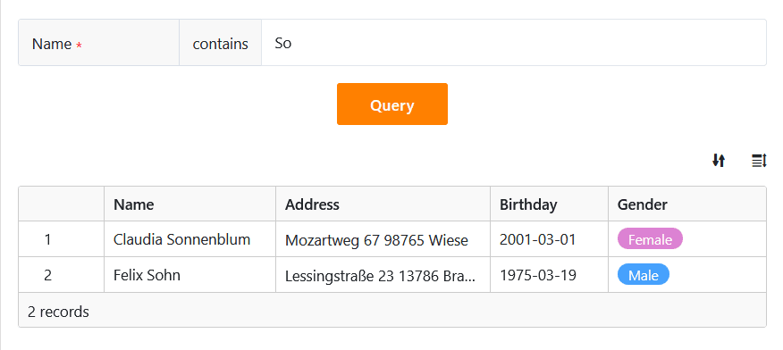

Mithilfe einer **Datenabfrage-App** können Sie anderen Nutzern ermöglichen, Ihre Datensätze über bestimmte **Felder** hinweg nach spezifischen **Werten** zu durchsuchen. Eine solche **Suchmaske** erweist sich besonders bei umfangreichen Datensätzen wie Produktkatalogen oder Bibliotheken als hilfreich.

## Anlegen der Datenabfrage-App

Um eine Datenabfrage-App in Ihrer Base nutzen zu können, müssen Sie diese zunächst zu Ihrer Base **hinzufügen**.

[Erfahren Sie hier, wie Sie eine App zu Ihrer Base hinzufügen.](https://seatable.io/docs/apps/apps-zu-einer-base-hinzufuegen/)

## Einstellungen einer Datenabfrage-App bearbeiten

Nachdem Sie Ihre Datenabfrage-App erfolgreich angelegt haben, können Sie in den Einstellungen der App die **Tabelle** und die **Spalten** auswählen, die nach gewissen **Werten** durchsucht werden können. Öffnen Sie die App dazu einfach über das **Stift-Symbol**  im [Bearbeitungsmodus]().

Da die Datenabfrage-App auf dem Universal App Builder basiert, sind die folgenden Einstellungsmöglichkeiten identisch mit den **Abfrageseiten in der Universellen App**:

[Erfahren Sie mehr zu den Einstellungsmöglichkeiten von Abfrageseiten.](https://seatable.io/docs/seitentypen-in-universellen-apps/abfrageseiten-in-universellen-apps/)

## Namen, Farbe und Icon einer Datenabfrage-App bearbeiten

Eine Datenabfrage-App können Sie jederzeit **umbenennen**. Öffnen Sie die App dazu einfach über das Stift-Symbol  im **Bearbeitungsmodus**. Wenn Sie dort in der oberen linken Ecke auf das **Zahnrad-Symbol** klicken, können Sie den Namen, die Farbe und das Icon der App ändern.

[Erfahren Sie hier mehr zu den globalen App-Einstellungen.]()

## Eine Datenabfrage-App teilen

Ihre Datenabfrage-Apps können Sie mit nur wenigen Klicks mit anderen Nutzern **teilen**. Gehen Sie dafür in die [Benutzer- und Rollenverwaltung]() der App fest.

\[caption id="attachment_31027" align="alignnone" width="1152"\] Von SeaTable generierter App-Link\[/caption\]

\[caption id="attachment_31028" align="alignnone" width="1155"\] Benutzerdefinierter App-Link\[/caption\]



## Nach einem Wert in der Datenabfrage-App suchen

Nachdem Sie Ihre Datenabfrage-App erfolgreich geteilt haben, können andere Nutzer mit der Abfrage beginnen und auf die freigegebenen Daten zugreifen. Um Ihre Datensätze nach bestimmten **Werten** zu durchsuchen, gibt man diese einfach in die **Abfragefelder** ein und klickt auf **Abfrage**.

## Darstellung der gefundenen Datensätze

Nachdem die Nutzer auf **Abfrage** geklickt haben, werden ihnen die gefundenen Datensätze sofort in einer Tabelle angezeigt. Die Nutzer der App können nur die Spaltenwerte eines Datensatzes sehen, die Sie **nicht ausgeblendet** haben. Zudem können sie keine von Ihnen **voreingestellten Filter** löschen, mit denen Sie die Menge der suchbaren Zeilen eingrenzen können.

Allerdings können die Nutzer die abgefragte Ergebnisliste selbst **sortieren** und die **Zeilenhöhe anpassen**, um sich einen besseren Überblick zu verschaffen.

## Eine Datenabfrage-App kopieren

Sie haben eine Datenabfrage-App erstellt, die Sie in ähnlicher Form für eine weitere Nutzergruppe verwenden möchten? Dann kopieren Sie einfach die bestehende App und passen Sie die Kopie nach Belieben an. Wie Sie eine App kopieren, erfahren Sie [hier](https://seatable.io/docs/apps/apps-kopieren/).

## Eine Datenabfrage-App deaktivieren

Wenn Sie eine Datenabfrage-App erstellt haben, deren Nutzung Sie zeitweise unterbinden möchten, können Sie diese mit nur wenigen Klicks deaktivieren, um allen Nutzergruppen den Zugriff zu entziehen. Wie das geht, erfahren Sie [hier](https://seatable.io/docs/apps/apps-zeitweise-deaktivieren/).

## Eine Datenabfrage-App löschen

Eine Datenabfrage-App, die Sie nicht mehr benötigen, können Sie jederzeit **löschen**. Keine Sorge: Beim Löschen einer Datenabfrage-App werden **keinerlei Daten in der Base gelöscht**. [Erfahren Sie hier mehr zur Löschung von Apps.](https://seatable.io/docs/apps/apps-loeschen/)
