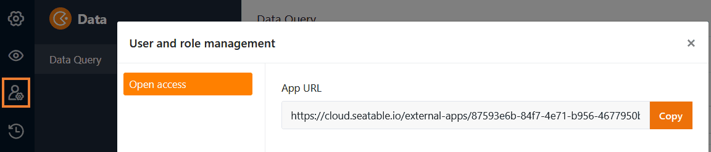

Using a **data query app**, you can enable other users to search your records across specific **fields** for specific **values**. Such a **search screen** proves especially helpful for large data sets such as product catalogs or libraries.

## Creating the data query app

To use a data query app in your Base, you must first **add** it to your Base.

[Learn how to add an app to your Base here.](https://seatable.io/en/docs/apps/apps-zu-einer-base-hinzufuegen/)

## Edit settings of a data query app

Once you have successfully created your data query app, you can select the **table** and **columns** that can be searched for certain **values** in the app settings. To do this, simply open the app in [edit mode]() using the **pencil icon** .

As the data query app is based on the Universal App Builder, the following setting options are identical to the **query pages in the Universal App**:

[Find out more about the setting options for query pages.](https://seatable.io/en/docs/seitentypen-in-universellen-apps/abfrageseiten-in-universellen-apps/)

## Edit the name, color and icon of a data query app

You can **rename** a data query app at any time. Simply open the app via the pencil icon  in **edit mode**. If you click on the **cogwheel icon** in the top left-hand corner, you can change the name, color and icon of the app.

[Find out more about the global app settings here.]()

## Share a data query app

You can **share** your data query apps with other users with just a few clicks. To do this, go to [user and role management]().

App link generated by SeaTable

User-defined app link



## Search for a value in the data query app

After you have successfully shared your data query app, other users can start querying and access the shared data. To search your records for specific **values**, you simply enter them in the **query fields** and click **Query**.

## Display of the found records

After users have clicked on **Query**, the data records found are immediately displayed in a table. The app users can only see the column values of a data record that you have **not hidden**. In addition, they cannot delete any **filters** you have **preset** to limit the number of searchable rows records.

However, users can **sort** the queried results list themselves and **adjust** the **row height** to get a better overview.

## Copy a data query app

You have created a data query app that you want to use in a similar form for another user group? Then simply copy the existing app and customize the copy as you see fit. You can learn how to copy an app [here](https://seatable.io/en/docs/apps/apps-kopieren/).

## Disable a data query app

If you've created a data retrieval app that you want to temporarily disable, you can disable it with just a few clicks to revoke access to all groups of users. You can find out how to do this [here](https://seatable.io/en/docs/apps/apps-zeitweise-deaktivieren/).

## Delete a data query app

You can **delete** a data query app that you no longer need. Don't worry: Deleting a data query app **doesn't delete any data in the base**. [Learn more about app deletion here.](https://seatable.io/en/docs/apps/apps-loeschen/)
