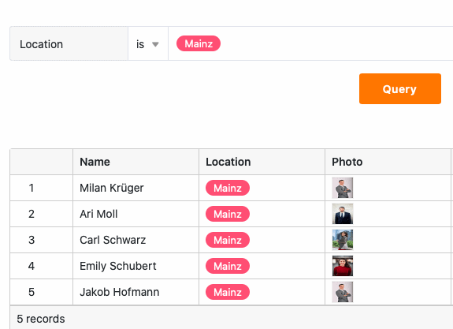

Com a ajuda de uma **aplicação de consulta de dados**, pode permitir que outros utilizadores pesquisem os seus registos em **campos** específicos para **valores** específicos. Este **ecrã de pesquisa** é particularmente útil para grandes conjuntos de dados, como catálogos de produtos ou bibliotecas.

## Criar a aplicação Data Query

Para utilizar uma aplicação de recuperação de dados na sua base, deve primeiro **adicioná-la** à sua base.

[Saiba como adicionar uma aplicação à sua base aqui.]()

## Editar definições de uma aplicação de recuperação de dados

Depois de ter criado com êxito a sua aplicação de consulta de dados, pode selecionar a **tabela** e as **colunas** que podem ser pesquisadas para determinados **valores** nas definições da aplicação.  Para o fazer, basta abrir a aplicação no [modo de edição]() utilizando o **ícone de lápis**.

Como a aplicação de consulta de dados se baseia no Universal App Builder, as seguintes opções de definição são idênticas às **páginas de consulta na Universal App**:

[Saiba mais sobre as opções de definição das páginas de consulta.]()

## Editar o nome, a cor e o ícone de uma aplicação de consulta de dados

Pode **mudar o nome de** uma aplicação de recuperação de dados em qualquer altura.  Basta abrir a aplicação através do ícone do lápis no **modo de edição**. Se clicar no **ícone da roda dentada** no canto superior esquerdo, pode alterar o nome, a cor e o ícone da aplicação.

[Saiba mais sobre as definições globais da aplicação aqui.]()

## Partilhar uma aplicação de consulta de dados

Pode **partilhar** as suas aplicações de consulta de dados com outros utilizadores com apenas alguns cliques. Para tal, aceda à [administração de utilizadores e funções]() da aplicação.

Ligação da aplicação gerada pelo SeaTable

Ligação personalizada à aplicação



## Procurar um valor na aplicação Data Query

Depois de ter partilhado com êxito a sua aplicação de consulta de dados, os outros utilizadores podem começar a consultar e a aceder aos dados partilhados. Para procurar **valores** específicos nos seus registos, basta introduzi-los nos **campos de consulta** e clicar em **Consultar**.

## Visualização dos registos de dados encontrados

Depois de os utilizadores terem clicado em **Query (Consultar** ), os registos de dados encontrados são imediatamente apresentados numa tabela. Os utilizadores da aplicação só podem ver os valores das colunas de um registo de dados que **não tenha** sido **ocultado**. Além disso, não podem eliminar quaisquer **filtros** que tenha **predefinido** para limitar o número de linhas pesquisáveis.

No entanto, os próprios utilizadores podem **ordenar** a lista de resultados consultados e **ajustar** a **altura da linha** para obter uma melhor visão geral.

## Copiar uma aplicação de recuperação de dados

Criou uma aplicação de consulta de dados que gostaria de utilizar de forma semelhante para outro grupo de utilizadores? Então, basta copiar a aplicação existente e adaptar a cópia como desejar. Pode descobrir como copiar uma aplicação [aqui]().

## Desative um aplicativo de consulta de dados

Se você criou um aplicativo de consulta de dados que gostaria de impedir temporariamente de ser usado, você pode desativá-lo com apenas alguns cliques para revogar o acesso de todos os grupos de usuários. Você pode descobrir como fazer isso [aqui]() .

## Eliminar uma aplicação de recuperação de dados

Você pode **excluir** um aplicativo de consulta de dados desnecessário a qualquer momento. Não se preocupe: excluir um aplicativo de consulta de dados **não excluirá nenhum dado da base** . [Saiba mais sobre como excluir aplicativos aqui.]()
