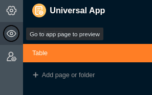

Zur optimalen Gestaltung Ihrer Apps sollten Sie diese vor der Veröffentlichung natürlich **testen**. Um Ihre Apps so zu sehen, wie die Nutzer es tun, können Sie sich den aktuellen Bearbeitungsstand jederzeit in einer **Vorschau** anzeigen lassen oder die Apps einfach im normalen Modus **öffnen**.

## Eine App öffnen

Grundsätzlich können Sie Ihre Apps jederzeit testen, indem Sie sie im normalen Modus öffnen.

1. Öffnen Sie die **Base**, in der Sie eine App testen möchten.
2. Klicken Sie im Base-Header auf **Apps**.
   4. Klicken Sie auf den **Namen** der App, um sie zu öffnen.
   

## Die Vorschau im Universal App Builder öffnen

Auch im **Bearbeitungsmodus** des App Builders können Sie sich den aktuellen Stand Ihrer App jederzeit anschauen.

1. Fahren Sie mit der Maus über die Universelle App und klicken Sie auf das erscheinende **Stift-Symbol** , um diese im Bearbeitungsmodus zu öffnen.
   3. Klicken Sie am oberen linken Seitenrand auf das **Augen-Symbol**.

 5. Die **App-Vorschau** öffnet sich daraufhin in einem neuen Fenster.
