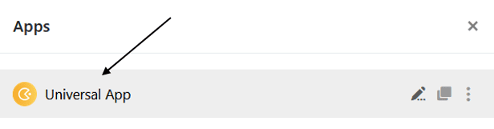
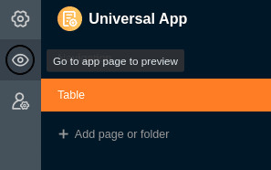

Para que el diseño de tus aplicaciones sea óptimo, por supuesto debes **probarlas** antes de publicarlas. Para ver tus apps como las ven los usuarios, puedes **previsualizar** el estado de edición actual en cualquier momento o simplemente **abrir** las apps en modo normal.

## Abrir una aplicación

Básicamente, puedes probar tus aplicaciones en cualquier momento abriéndolas en modo normal.

1. Abra la **base** en la que desea probar una aplicación.
2. Haga clic en **Aplicaciones** en la cabecera Base.

4. Haz clic en el **nombre de** la aplicación para abrirla.

## Abra la vista previa en Universal App Builder

También puede ver el estado actual de su aplicación en cualquier momento en el **modo de edición** del App Builder.

1. Pase el ratón por encima de la aplicación universal y haga clic en el **icono del lápiz que** aparece  para abrirla en modo de edición.

3. Haga clic en el **símbolo del ojo** en la parte superior izquierda de la página.

5. La **vista previa de la aplicación** se abrirá en una nueva ventana.
