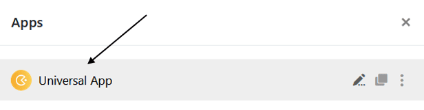

Для оптимального дизайна ваших приложений вы, конечно же, должны **протестировать** их перед публикацией. Чтобы увидеть свои приложения так, как это делают пользователи, вы можете в любой момент **просмотреть** текущее состояние редактирования или просто **открыть** приложения в обычном режиме.

## Откройте приложение

В принципе, вы можете тестировать свои приложения в любое время, открывая их в обычном режиме.

1. Откройте **базу**, в которой вы хотите протестировать приложение.
2. Нажмите **Приложения** в заголовке База.

4. Нажмите на **название** приложения, чтобы открыть его.

## Откройте предварительный просмотр в Universal App Builder

Вы также можете в любой момент просмотреть текущий статус вашего приложения в **режиме редактирования** App Builder.

1. Наведите курсор мыши на универсальное приложение и нажмите на появившийся **значок карандаша** , чтобы открыть его в режиме редактирования.

3. Нажмите на **символ глаза** в левом верхнем углу страницы.

5. После этого **предварительный просмотр приложения** откроется в новом окне.
