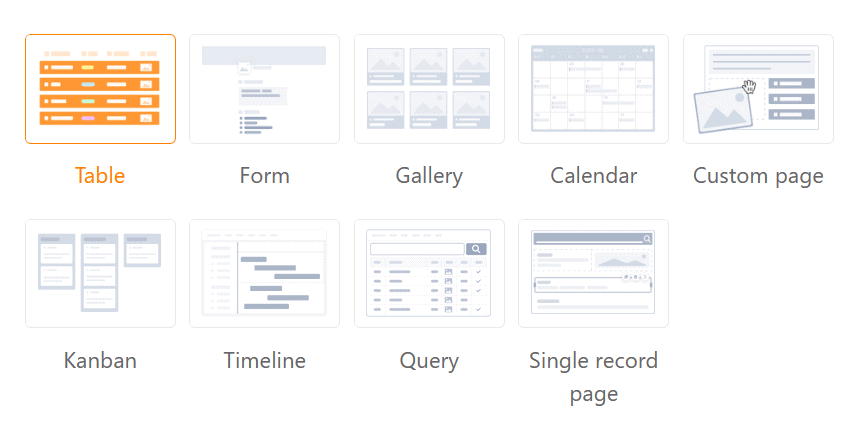

Beim Bauen einer **Universellen App** können Sie Ihrer Kreativität freien Lauf lassen. Die App verfügt über eine Reihe von [Seitentypen](), können Sie Dashboards mit aussagekräftigen **Statistiken** aus Ihren Daten erstellen, die Sie mit anderen (externen) Nutzern teilen können.



## Anlegen der Universellen App

Um eine Universelle App in Ihrer Base nutzen zu können, müssen Sie diese zunächst zu Ihrer Base **hinzufügen**.

[Erfahren Sie hier, wie Sie eine Universelle App zu Ihrer Base hinzufügen.]()

## Gestaltung der Universellen App

Nachdem Sie Ihre Universelle App erfolgreich angelegt haben, können Sie mit der Gestaltung beginnen. Achten Sie dabei darauf, stets das **Stift-Symbol**  zu nutzen, um in den [Bearbeitungsmodus]() der App zu gelangen.

Eine Universelle App besteht aus mehreren **Seiten**, die Sie in **Ordnern** zusammenfassen können.

[Erfahren Sie hier, wie Sie neue Seiten und Ordner zu Ihrer Universellen App hinzufügen]().

Um die Daten in Ihrer Base ansprechend aufzubereiten, bietet die Universelle App eine Vielzahl an [Seitentypen]() mit unterschiedlichen Gestaltungselementen.

## Vorschau einer Universellen App

Bei der Gestaltung einer Universellen App wollen Sie sicher zwischendurch testen, wie die App für die Nutzer aussieht. Dazu können Sie sich im Bearbeitungsmodus einfach die [App-Vorschau anzeigen lassen]().

## Einstellungen einer Universellen App ändern

Innerhalb einer Universellen App können Sie verschiedene **globale Einstellungen** vornehmen. Sie können beispielsweise den **Namen**, die **Farbe** und die **URL** Ihrer App ändern. Die gewünschten Anpassungen können Sie mit nur wenigen Klicks über die **App-Einstellungen** vornehmen.

[Erfahren Sie hier mehr zu den globalen Einstellungen der Universellen App.]()

## Versionen einer Universellen App speichern

Die **Versionsverwaltung** jeder App bietet Ihnen die Möglichkeit, Momentaufnahmen von der Struktur einer App zu speichern. Wie Sie einen **App Snapshot** anlegen können, erfahren Sie [hier](). Beachten Sie dabei, was ein App Snapshot speichert – und was nicht.

## Seitenberechtigungen in einer Universellen App

Um den Zugriff auf Ihre Daten genau zu steuern, können Sie für **jede Seite**, die Sie zu einer Universellen App hinzugefügt haben, **individuelle Seitenberechtigungen** festlegen. Die Bearbeitung der Seitenberechtigungen erfolgt stets über die **Seiteneinstellungen**, die Sie über das Zahnrad-Symbol  erreichen.

[Erfahren Sie hier mehr zu den verschiedenen Seitenberechtigungen in der Universellen App.]()

## Benutzer- und Rollenverwaltung einer Universellen App

Neue Benutzer hinzufügen, Rollen anlegen und zuweisen – in der **Benutzer- und Rollenverwaltung** einer Universellen App können Sie diverse administrative Tätigkeiten durchführen.

[Erfahren Sie hier mehr zur Benutzer- und Rollenverwaltung der Universellen App.]()

## Eine Universelle App teilen

Eine Universelle App können Sie ebenfalls über die [Benutzer- und Rollenverwaltung]() mit anderen Nutzern teilen. Generieren Sie hierzu einfach einen individuellen **Einladungslink** oder nutzen Sie einen **QR-Code**.

## Eine Universelle App kopieren

Sie haben eine Universelle App gebaut, die Sie in ähnlicher Form für eine weitere Nutzergruppe verwenden möchten? Dann kopieren Sie einfach die bestehende App und passen Sie die Kopie nach Belieben an. Wie Sie eine Universelle App kopieren, erfahren Sie [hier]().

## Eine Universelle App deaktivieren

Wenn Sie eine Universelle App erstellt haben, deren Nutzung Sie zeitweise unterbinden möchten, können Sie diese mit wenigen Klicks deaktivieren, um allen Nutzergruppen den Zugriff zu entziehen. Wie das geht, erfahren Sie [hier]().

## Eine Universelle App löschen

Eine Universelle App, die Sie nicht mehr benötigen, können Sie jederzeit **löschen**. Beachten Sie dabei, welche Konsequenzen die Löschung hat.

[Erfahren Sie hier mehr zur Löschung einer Universellen App.](https://seatable.io/?post_type=docs&p=24860)

## Kein kollaboratives Arbeiten in Universellen Apps

Während die Universelle App viele Vorteile gegenüber der [Arbeit in der Base](https://seatable.io/docs/arbeiten-mit-bases/bases/) hat, gibt es einen großen Unterschied, wenn Sie gemeinsam im Team an den Daten arbeiten wollen. In einer Base wird Ihnen jede Änderung, die von anderen Anwendern ausgeführt wird, unmittelbar angezeigt. Die Einträge verändern sich in Echtzeit. Bei der Universellen App wird diese Art der kollaborativen Zusammenarbeit nicht unterstützt.

## Kommentare in Universellen Apps

Dennoch haben Sie die Möglichkeit, auch in einer App mit anderen Teammitgliedern zu kommunizieren. Nutzen Sie dazu die [Kommentarfunktion](), die Sie bereits in gleicher Form aus der Base kennen. Halten Sie Ihr Feedback oder zusätzliche Informationen zu den Datensätzen für die anderen App-Nutzer fest und führen Sie Diskussionen an Ort und Stelle.


