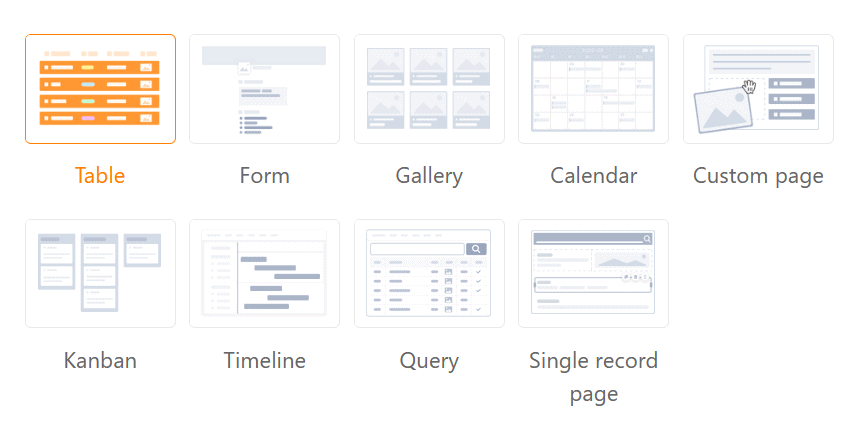
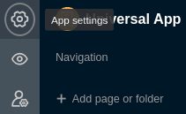
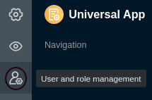
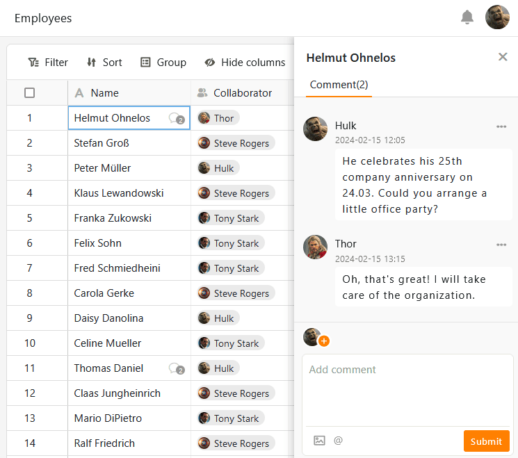

Al crear una **Universal** App, puedes dar rienda suelta a tu creatividad. La app dispone de varios [tipos de página]() una página **individual**, puedes crear cuadros de mando con **estadísticas** significativas a partir de tus datos que puedes compartir con otros usuarios (externos).



## Creación de la aplicación universal

Para utilizar una aplicación universal en su Base, primero debe **añadirla** a su Base.

[Aprenda a añadir una aplicación universal a su Base aquí.]()

## Diseño de la aplicación universal

Una vez que haya creado correctamente su aplicación universal, puede empezar a diseñarla. Asegúrese de utilizar siempre el **icono del lápiz**  para entrar en el [modo de edición de]() la aplicación.

Una aplicación universal consta de varias **páginas** que se pueden agrupar en **carpetas**.

[Aprenda a añadir nuevas páginas y carpetas a su Universal App aquí]().

Para preparar los datos de su base de forma atractiva, Universal App ofrece una variedad de [tipos de página]() con distintos elementos de diseño.

## Vista previa de una aplicación universal

Cuando diseñes una aplicación universal, seguramente querrás probar cómo se ve la aplicación para los usuarios intermedios. Para ello, basta con [mostrar]() la aplicación en el modo de edición.

## Cambiar la configuración de una aplicación universal

Dentro de una aplicación universal, puede realizar varios **ajustes globales**. Por ejemplo, puedes cambiar el **nombre**, el **color** y **la URL de** tu app. Puedes realizar los ajustes deseados con solo unos clics a través de los **ajustes de** la app.

[Obtenga más información sobre la configuración global de la aplicación universal aquí.]()

## Guardar versiones de una aplicación universal

La **gestión de versiones** de cada app te ofrece la opción de guardar instantáneas de la estructura de una app. [Aquí]() puedes ver cómo crear **una** instantánea de una aplicación. Ten en cuenta lo que guarda una instantánea de aplicación y lo que no.

## Permisos de página en una aplicación universal

Para controlar con precisión el acceso a sus datos, puede establecer **permisos de página individuales para** **cada página** que haya añadido a una aplicación universal. Los permisos de página se editan siempre a través de los **ajustes de página**, a los que puede acceder a través del icono de rueda dentada .

[Obtenga más información sobre los diferentes permisos de página en la Universal App aquí.]()

## Administración de usuarios y funciones de una aplicación universal

Añadir nuevos usuarios, crear y asignar roles: en la **administración de usuarios y roles de** una Universal App, puede realizar varias actividades administrativas.

[Obtenga más información sobre la administración de usuarios y funciones de Universal App aquí.]()

## Compartir una aplicación universal

También puedes compartir una aplicación universal con otros usuarios a través de la [administración de usuarios y roles](). Para ello, basta con generar un **enlace de invitación** individual o utilizar un **código QR**.

## Copiar una aplicación universal

¿Ha creado una aplicación universal que le gustaría usar de forma similar para otro grupo de usuarios? A continuación, sólo tienes que copiar la aplicación existente y personalizarla como quieras. Puede obtener información sobre cómo copiar una aplicación universal [aquí]().

## Deshabilitar una aplicación universal

Si ha creado una aplicación universal que desea deshabilitar temporalmente, puede deshabilitarla con solo unos pocos clics para revocar el acceso a todos los grupos de usuarios. Puedes averiguar cómo hacerlo [aquí]().

## Eliminar una aplicación universal

Puede **eliminar** una aplicación universal que ya no necesite en cualquier momento. Tenga en cuenta las consecuencias de la eliminación.

[Más información sobre cómo eliminar una aplicación universal aquí.]()

## No hay trabajo colaborativo en las aplicaciones universales

Aunque la aplicación universal tiene muchas ventajas sobre el [trabajo en la]() base, hay una gran diferencia si quieres trabajar con los datos en equipo. En una base, cada cambio realizado por otros usuarios se muestra inmediatamente. Las entradas cambian en tiempo real. Este tipo de trabajo colaborativo no está soportado en la app universal.

## Comentarios en aplicaciones universales

No obstante, también tienes la opción de comunicarte con otros miembros del equipo en una app. Para ello, utilice la [función de comentarios]() que ya conoce de la misma forma de Base. Anota tus comentarios o información adicional en los registros de datos de los demás usuarios de la app y mantén conversaciones sobre la marcha.


