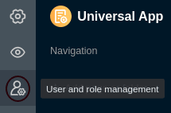

Ao criar uma **aplicação universal**, pode dar asas à sua criatividade. A aplicação tem uma série de [tipos de páginas](https://seatable.io/pt/docs/apps/seitentypen-in-der-universellen-app/) que lhe permitem apresentar os seus dados sob a forma de **tabelas**, **formulários Web**, **galerias** ou **quadros Kanban**, entre outros. Ao [criar](https://seatable.io/pt/docs/apps/seiten-und-ordner-in-einer-universellen-app-anlegen-und-verwalten/) uma **página individual**, pode criar dashboards com **estatísticas** significativas dos seus dados que pode partilhar com outros utilizadores (externos).



## Criar a aplicação universal

Para utilizar uma aplicação universal na sua base, deve primeiro **adicioná-la** à sua base.

[Saiba como adicionar uma aplicação universal à sua base aqui.](https://seatable.io/pt/docs/apps/apps-zu-einer-base-hinzufuegen/)

## Concepção da aplicação universal

Depois de ter criado com êxito a sua aplicação universal, pode começar a desenhá-la. Certifique-se de que utiliza sempre o **ícone de lápis**  para entrar no [modo de edição da]() aplicação.

Uma aplicação universal é composta por várias **páginas** que pode agrupar em **pastas**.

[Saiba como adicionar novas páginas e pastas à sua Universal App aqui](https://seatable.io/pt/docs/apps/seiten-und-ordner-in-einer-universellen-app-anlegen-und-verwalten/).

Para preparar os dados da sua base de uma forma apelativa, a aplicação universal oferece uma variedade de [tipos de páginas](https://seatable.io/pt/docs/apps/seitentypen-in-der-universellen-app/) com diferentes elementos de design.

## Pré-visualização de uma aplicação universal

Ao conceber uma aplicação universal, irá certamente querer testar o aspecto da aplicação para os utilizadores intermédios. Para o fazer, basta [apresentar](https://seatable.io/pt/docs/apps/die-vorschau-einer-app-anzeigen-lassen/) a [pré-visualização da aplicação](https://seatable.io/pt/docs/apps/die-vorschau-einer-app-anzeigen-lassen/) no modo de edição.

## Alterar as definições de uma aplicação universal

Numa aplicação universal, pode efectuar várias **definições globais**. Por exemplo, pode alterar o **nome**, **a cor** e o **URL da** sua aplicação. Pode fazer os ajustes desejados com apenas alguns cliques através das **definições da aplicação**.

[Saiba mais sobre as definições globais da Aplicação Universal aqui.](https://seatable.io/pt/docs/apps/einstellungen-einer-universellen-app-aendern/)

## Guardar versões de uma aplicação universal

A **gestão de versões** de cada aplicação oferece-lhe a opção de guardar instantâneos da estrutura de uma aplicação. Pode descobrir como criar um **instantâneo** da aplicação [aqui](https://seatable.io/pt/docs/universelle-apps/versionsverwaltung-und-snapshots-einer-universellen-app/). Tenha em atenção o que é que um instantâneo de aplicação guarda - e o que não guarda.

## Permissões de página numa aplicação universal

Para controlar com precisão o acesso aos seus dados, pode definir **permissões de página individuais para** **cada página** que adicionou a uma aplicação universal. As permissões de página são sempre editadas através das **definições de página**, às quais pode aceder através do ícone de roda dentada .

[Saiba mais sobre as diferentes permissões de página na Universal App aqui.](https://seatable.io/pt/docs/apps/seitenberechtigungen-in-einer-universellen-app/)

## Administração de utilizadores e funções de uma aplicação universal

Adicionar novos utilizadores, criar e atribuir funções - na **administração de utilizadores e funções de** uma aplicação universal, pode realizar várias actividades administrativas.

[Saiba mais sobre a administração de utilizadores e funções da Aplicação Universal aqui.](https://seatable.io/pt/docs/apps/benutzer-und-rollenverwaltung-einer-universellen-app/)

## Partilhar uma aplicação universal

Também é possível partilhar uma aplicação universal com outros utilizadores através da [administração de utilizadores e funções](https://seatable.io/pt/docs/apps/benutzer-und-rollenverwaltung-einer-universellen-app/). Para o fazer, basta gerar uma **ligação de convite** individual ou utilizar um **código QR**.

## Copiar uma aplicação universal

Você criou um aplicativo universal que gostaria de usar de forma semelhante para outro grupo de usuários? Em seguida, basta copiar o aplicativo existente e personalizar a cópia como desejar. Você pode descobrir como copiar um aplicativo universal [aqui](https://seatable.io/pt/docs/apps/apps-kopieren/) .

## Desative um aplicativo universal

Se você criou um aplicativo universal que deseja impedir temporariamente de ser usado, você pode desativá-lo com apenas alguns cliques para revogar o acesso a todos os grupos de usuários. Você pode descobrir como fazer isso [aqui](https://seatable.io/pt/docs/apps/apps-zeitweise-deaktivieren/) .

## Eliminar uma aplicação universal

Você pode **excluir** um aplicativo universal que não precisa mais a qualquer momento. Observe as consequências da exclusão.

[Saiba mais sobre a eliminação de uma aplicação universal aqui.](https://seatable.io/pt/?post_type=docs&p=24860)

## Sem trabalho colaborativo em aplicações universais

Embora a aplicação universal tenha muitas vantagens em relação ao [trabalho na](https://seatable.io/pt/docs/arbeiten-mit-bases/bases/) base, existe uma grande diferença se quiser trabalhar com os dados em conjunto numa equipa. Numa base, todas as alterações feitas por outros utilizadores são apresentadas imediatamente. As entradas mudam em tempo real. Este tipo de trabalho colaborativo não é suportado na aplicação Universal.

## Comentários em aplicações universais

No entanto, também tem a opção de comunicar com outros membros da equipa numa aplicação. Para o fazer, utilize a [função de comentário]() que já conhece da mesma forma do Base. Registe os seus comentários ou informações adicionais nos registos de dados para os outros utilizadores da aplicação e realize discussões no local.


