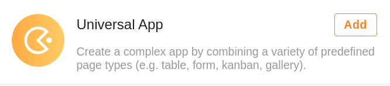

**Les Apps** de SeaTable sont des **frontaux** personnalisés destinés à des groupes d'utilisateurs spécifiques qui ont des besoins d'information différents (par ex. employés, chefs de service, directeurs). L'accès ouvert aux Apps vous permet de rendre vos données utilisables par **des tiers externes** (par ex. clients, partenaires commerciaux) **sans compte SeaTable**.

Pour construire ces applications, il existe ce que l'on appelle des **App Builders**, dans lesquels on peut créer différentes interfaces utilisateur et effectuer toute une série de réglages. Le **backend** d'une app constitue toujours une [base](). Pour chaque base, vous pouvez créer autant d'apps que vous le souhaitez. La règle générale est la suivante : une app par groupe d'utilisateurs et par cas d'application.

## Les apps en un coup d'œil

Actuellement, **deux** types d'applications sont disponibles dans SeaTable.

### L'application universelle (Universal App)

Avec l'**application universelle**, vous pouvez laisser libre cours à votre créativité. L'appli dispose d'une série de [types de pages]() qui vous permettent de présenter vos données sous forme de **tableaux**, de **formulaires web**, de **calendriers** ou de **tableaux Kanban**, entre autres. En créant une **page individuelle**, vous pouvez en outre construire des tableaux de bord avec des **statistiques** pertinentes à partir de vos données et les partager avec d'autres utilisateurs (externes).

[En savoir plus sur l'application universelle]().

### L'application de recherche de données (Data Query App)

Une **app de recherche de données** est un **masque de recherche** spécifique à l'utilisateur. Créez une telle application si vous souhaitez que d'autres utilisateurs puissent rechercher des entrées spécifiques dans vos **ensembles de données** en vue Tableau. Sélectionnez les **valeurs des colonnes** à afficher dans les résultats de la requête afin de déterminer individuellement les données auxquelles un groupe d'utilisateurs peut accéder.

[En savoir plus sur l'application de consultation des données](https://seatable.io/fr/docs/apps/datenabfrage-app/).
