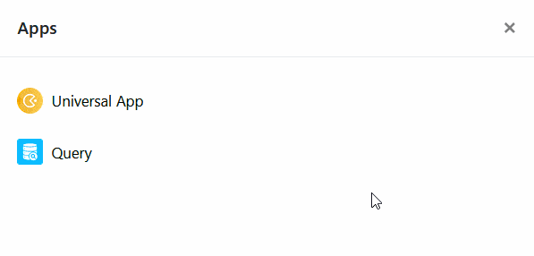

¿Quieres eliminar una aplicación de tu base que ya no necesitas? ¡No hay problema! Esto se puede hacer en cualquier momento con solo unos pocos clics.



## Eliminar una aplicación de una base

1. Abra la **base** donde desea eliminar una aplicación.
2. Haga clic en **Aplicaciones** en la cabecera Base.

4. Pasa el ratón por encima de la aplicación deseada y haz clic en los **tres puntos de** la derecha.
5. Seleccione **Eliminar** .
6. Confirme con **Borrar**.



## Consecuencias de la supresión

Lo primero es lo primero: al borrar una **aplicación nunca se pierden los datos de la base subyacente**. Así que técnicamente solo estás borrando una interfaz de usuario y _no_ la base de datos en segundo plano.

Sin embargo, tenga en cuenta que cuando elimina una aplicación universal, todas las [páginas y carpetas](https://seatable.io/es/docs/apps/seiten-und-ordner-in-einer-universellen-app-anlegen-und-verwalten/) que se encuentran en la **aplicación** también **se eliminan de forma permanente** y _no se pueden restaurar_.

Cuando eliminas una **aplicación de galería**, _sólo_ se eliminan las **galerías** mostradas en la aplicación, pero las **imágenes** permanecen en las [columnas de imágenes](https://seatable.io/es/docs/dateien-und-bilder/die-bild-spalte/) de tus tablas.

Incluso cuando se elimina una **aplicación de consulta de datos**, **no** se elimina ningún **dato**, sólo la **máscara de búsqueda**.
