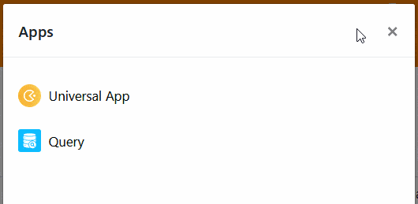

Pode acontecer que você queira **impedir temporariamente o uso de um aplicativo** porque, por exemplo, você está fazendo alterações extensas na base subjacente. Nesse caso, você pode desativar aplicativos a qualquer momento com apenas alguns cliques.



## Desabilitar um aplicativo

1. Abra a **base** onde você deseja desabilitar um aplicativo.
2. Clique em **Apps** no cabeçalho Base.

4. Passe o mouse sobre o aplicativo desejado e clique nos **três pontos** à direita.
5. Selecione **Pausar** .



Você pode reconhecer um aplicativo desativado pela nota **(inativo)** após o nome do aplicativo.

## Consequências da desativação

Ao desativar um aplicativo, **você revoga o acesso a todos os usuários anteriores**. Eles não poderão mais ver o aplicativo e não poderão mais usá-lo até que você reative o aplicativo. Observe que você não pode [editar](https://seatable.io/pt/docs/apps/apps-bearbeiten/) ou [copiar](https://seatable.io/pt/docs/apps/apps-kopieren/) um aplicativo inativo.
