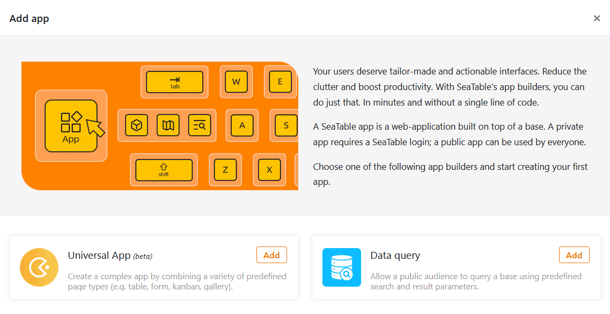
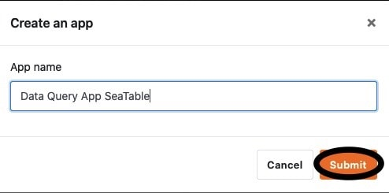

Gostaria de adicionar uma aplicação à sua base para poder adaptar o trabalho no SeaTable ainda mais individualmente a grupos de utilizadores e casos de utilização específicos? Não há problema! Isto é feito em apenas alguns passos.



## Adicionar uma aplicação a uma base

1. Abra qualquer **base** onde pretenda adicionar uma nova aplicação.
2. Clique em **Apps** no cabeçalho Base.

4. Aparece uma nova janela. Clique em **Adicionar aplicação**.
5. Decida o tipo de aplicação que pretende criar e clique em **Adicionar.**

7. Dê um **nome** à aplicação.
8. Confirmar com **Submeter**.

Depois de adicionar a aplicação, pode [editá-la](https://seatable.io/pt/docs/apps/apps-bearbeiten/) e concebê-la a seu gosto.
