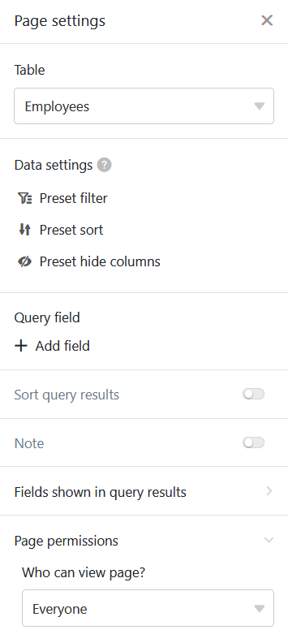
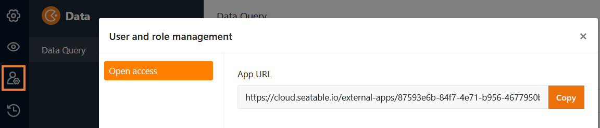
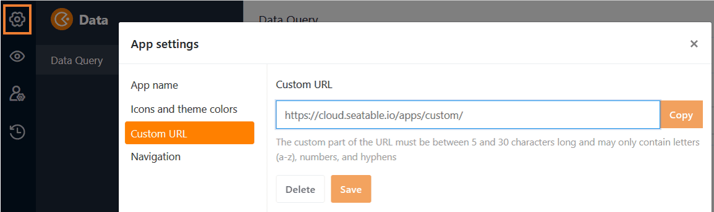
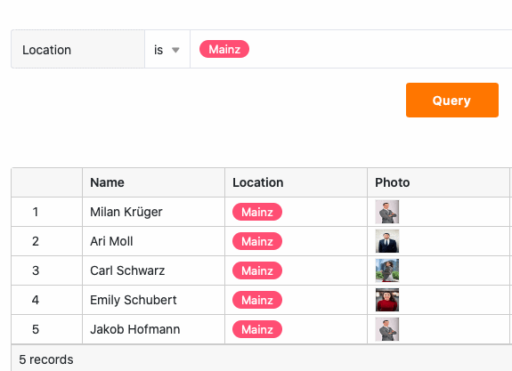

Con la ayuda de una **aplicación de consulta de datos**, puede permitir que otros usuarios busquen sus registros en **campos** específicos para **valores** concretos. Esta **pantalla de búsqueda** es especialmente útil para grandes conjuntos de datos, como catálogos de productos o bibliotecas.

## Creación de la aplicación de consulta de datos

Para utilizar una aplicación de recuperación de datos en tu base, primero debes **añadirla** a tu base.

[Aprende a añadir una aplicación a tu base aquí.](https://seatable.io/es/docs/apps/apps-zu-einer-base-hinzufuegen/)

## Editar la configuración de una app de recuperación de datos

Una vez que haya creado correctamente su aplicación de consulta de datos, puede seleccionar la **tabla** y las **columnas** en las que se pueden buscar determinados **valores** en la configuración de la aplicación.  Para ello, basta con abrir la aplicación en [modo de edición](https://seatable.io/es/docs/apps/apps-bearbeiten/) con el **icono del lápiz**.

Como la aplicación de consulta de datos se basa en Universal App Builder, las siguientes opciones de configuración son idénticas a las **páginas de consulta de Universal App**:

[Más información sobre las opciones de configuración de las páginas de consulta.](https://seatable.io/es/docs/seitentypen-in-universellen-apps/abfrageseiten-in-universellen-apps/)

## Editar el nombre, el color y el icono de una app de consulta de datos

Puedes **cambiar el nombre de** una app de recuperación de datos en cualquier momento.  Sólo tienes que abrir la aplicación con el icono del lápiz en **modo de edición**. Si haces clic en el **icono de rueda dentada** de la esquina superior izquierda, podrás cambiar el nombre, el color y el icono de la app.

[Más información sobre la configuración global de la aplicación aquí.](https://seatable.io/es/docs/universelle-apps/einstellungen-einer-universellen-app-aendern/)

## Compartir una aplicación de consulta de datos

Puede **compartir** sus aplicaciones de consulta de datos con otros usuarios con sólo unos clics. Para ello, vaya a la [administración de usuarios y funciones](https://seatable.io/es/docs/universelle-apps/benutzer-und-rollenverwaltung-einer-universellen-app/) y copie el **enlace de la aplicación generado por SeaTable** o defina un **enlace personalizado** en la [configuración global](https://seatable.io/es/docs/universelle-apps/einstellungen-einer-universellen-app-aendern/) de la aplicación.

Enlace a la aplicación generado por SeaTable

Enlace personalizado a la aplicación



## Buscar un valor en la aplicación de consulta de datos

Una vez que haya compartido correctamente su aplicación de consulta de datos, otros usuarios podrán empezar a realizar consultas y acceder a los datos compartidos. Para buscar **valores** específicos en los registros, basta con introducirlos en los **campos de consulta** y hacer clic en **Consultar**.

## Visualización de los registros de datos encontrados

Después de que los usuarios hayan hecho clic en **Consultar**, los registros de datos encontrados se muestran inmediatamente en una tabla. Los usuarios de la aplicación sólo pueden ver los valores de columna de un registro de datos que usted **no haya ocultado**. Además, no pueden eliminar ningún **filtro** que usted haya **preestablecido** para limitar el número de filas en las que se puede buscar.

Sin embargo, los usuarios pueden **ordenar** ellos mismos la lista de resultados consultados y **ajustar** la **altura de las filas** para obtener una mejor visión de conjunto.

## Copiar una aplicación de recuperación de datos

¿Ha creado una aplicación de consulta de datos que desea utilizar de forma similar para otro grupo de usuarios? Entonces sólo tiene que copiar la aplicación existente y adaptar la copia como desee. [Aquí](https://seatable.io/es/docs/apps/apps-kopieren/) encontrará información sobre cómo copiar una aplicación.

## Deshabilitar una aplicación de consulta de datos

Si ha creado una aplicación de recuperación de datos que desea deshabilitar temporalmente, puede deshabilitarla con solo unos pocos clics para revocar el acceso a todos los grupos de usuarios. Puedes averiguar cómo hacerlo [aquí](https://seatable.io/es/docs/apps/apps-zeitweise-deaktivieren/).

## Eliminar una app de recuperación de datos

Puede **eliminar** una aplicación de consulta de datos que ya no necesite. No te preocupes: al eliminar una aplicación de consulta de datos **, no se elimina ningún dato de la base**. [Obtén más información sobre la eliminación de aplicaciones aquí.](https://seatable.io/es/docs/apps/apps-loeschen/)
