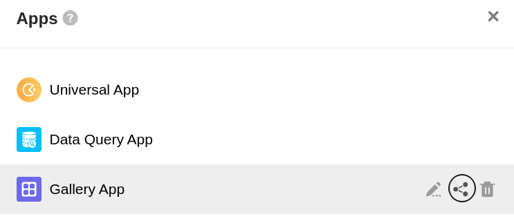
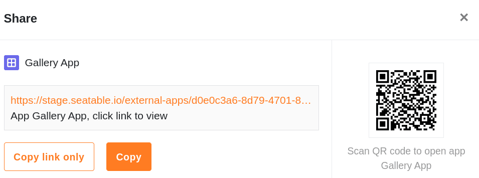

Sie haben eine Datenabfrage-App oder eine Galerie-App zu einer Ihrer Bases hinzugefügt und möchten diese mit anderen Nutzern teilen? Kein Problem! Für beide Apps gibt es zwei Wege, um dies in nur wenigen Schritten zu erledigen.

## Datenabfrage- oder Galerie-App in der App-Übersicht teilen

1. Öffnen Sie eine **Base**, der Sie eine Datenabfrage- oder Galerie-App hinzugefügt haben.
2. Klicken Sie im Base-Header auf **Apps**.
4. Fahren Sie mit der Maus über die gewünschte App und klicken Sie auf das **Teilen-Icon** .
6. Kopieren Sie den **App-Link** oder speichern Sie den **QR-Code**, um die App mit Anderen zu teilen.

## Datenabfrage- oder Galerie-App im Bearbeitungsmodus teilen

Alternativ haben Sie bei beiden Apps die Möglichkeit, diese im [Bearbeitungsmodus](https://seatable.io/docs/apps/apps-bearbeiten/) zu teilen. Klicken Sie hierzu einfach auf das **Stift-Symbol**  und anschließend auf den **Teilen-Button** oben rechts über den Einstellungen.

Den kopierten **Link** können Sie beispielsweise per E-Mail oder Chat an die vorgesehenen Nutzer verschicken oder den **QR-Code** auf Printmedien drucken. Die Nutzer müssen dann nur auf den Link klicken oder den QR-Code scannen, um zur App zu gelangen.

## Keine Zugangsberechtigung einstellbar

Im Gegensatz zur Universellen App können Sie für Datenabfrage- und Galerie-Apps keine individuellen Zugangsberechtigungen festlegen. **Jeder**, der Zugriff auf den Link oder QR-Code hat, kann sich die in den Apps freigegebenen Daten ansehen – **mit oder ohne SeaTable Konto**. Daher eignen sich Apps auch, um Daten mit externen Dritten zu teilen.
