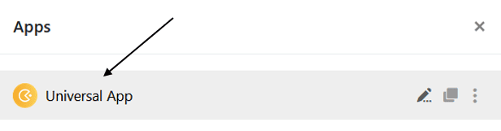

Para optimizar o design das suas aplicações, deve, naturalmente, **testá-las** antes de as publicar. Para ver as suas aplicações como os utilizadores as vêem, pode **pré-visualizar** o estado de edição actual em qualquer altura ou simplesmente **abrir** as aplicações no modo normal.

## Abrir uma aplicação

Basicamente, pode testar as suas aplicações em qualquer altura, abrindo-as no modo normal.

1. Abra a **base** na qual pretende testar uma aplicação.
2. Clique em **Apps** no cabeçalho Base.

4. Clique no **nome da** aplicação para a abrir.

## Abrir a pré-visualização no Universal App Builder

Também pode ver o estado atual da sua aplicação em qualquer altura no **modo de edição** do App Builder.

1. Passe o rato sobre a aplicação universal e clique no **ícone de lápis que** aparece  para a abrir no modo de edição.

3. Clique no **símbolo do olho** no canto superior esquerdo da página.

5. A **pré-visualização da aplicação** abre-se numa nova janela.
