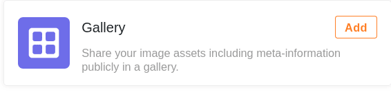
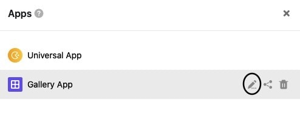
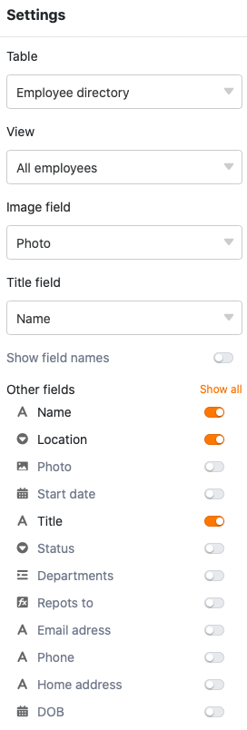
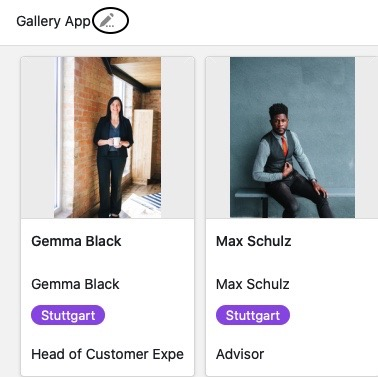
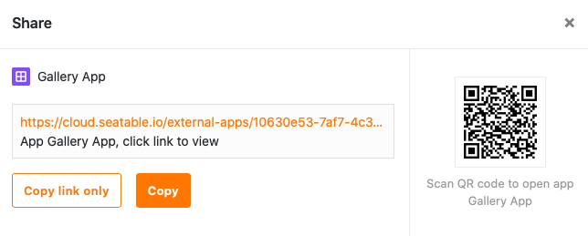

Die **Galerie-App** erinnert in Ihrer Funktionsweise stark an das [Galerie-Plugin](https://seatable.io/docs/plugins/anleitung-zum-galerie-plugin/), welches Sie eventuell schon einmal für die Darstellung von bebilderten Datensätzen verwendet haben. Die Galerie-App können Sie dafür nutzen, Ihre [Bilder](https://seatable.io/docs/dateien-und-bilder/die-bild-spalte/) inklusive Metadaten übersichtlich in einer Galerie zu veröffentlichen.

## Anlegen der Galerie-App

Um eine Galerie-App in Ihrer **Base** nutzen zu können, müssen Sie diese zunächst zu Ihrer Base **hinzufügen**.

[Erfahren Sie hier, wie Sie eine Galerie-App zu Ihrer Base hinzufügen.](https://seatable.io/docs/apps/apps-zu-einer-base-hinzufuegen/)

## Einstellungen einer Galerie-App bearbeiten



1. Öffnen Sie eine **Base**, der Sie eine Galerie-App hinzugefügt haben
2. Klicken Sie im Base-Header auf **Apps**.
   4. Fahren Sie mit der Maus über die Galerie-App und klicken Sie auf das **Stift-Symbol** .
   6. Nehmen Sie die gewünschten Anpassungen in den **Einstellungen** am rechten Seitenrand vor.

In den Einstellungen einer Galerie-App können Sie unter anderem die **Tabelle**, die **Ansicht** und die [Bild-Spalte](https://seatable.io/docs/dateien-und-bilder/die-bild-spalte/) auswählen, deren Bilder in der **Galerie** dargestellt werden. Zusätzlich können Sie auch die **Titel-Spalte** auswählen und **weitere Spalten**, deren Einträge unter den Bildern angezeigt werden sollen.

## Den Namen einer Galerie-App bearbeiten

Eine Galerie-App, die Sie zu einer Ihrer Bases hinzugefügt haben, können Sie jederzeit **umbenennen**. Öffnen Sie die App dazu einfach über das Stift-Symbol  im **Bearbeitungsmodus**. Wenn Sie dort neben dem Namen in der linken oberen Ecke auf das **Stift-Symbol**  klicken, können Sie den Namen der App ändern.

## Eine Galerie-App teilen

Ihre Galerie-App können Sie mit nur wenigen Klicks mit anderen Nutzern teilen. Kopieren Sie dafür den individuell generierten **App-Link** und/oder speichern Sie den **QR-Code**. Beide Zugangsoptionen können Sie beliebig vielen Personen (mit oder ohne SeaTable Konto) schicken bzw. zur Verfügung stellen. Die Nutzer müssen nur auf den Link klicken oder den QR-Code scannen, um zur App zu gelangen.

[Erfahren Sie hier mehr zum Teilen einer Galerie-App.](https://seatable.io/docs/apps/datenabfrage-und-galerie-app-teilen/)

## Eine Galerie-App kopieren

Sie haben eine Galerie-App erstellt, die Sie in ähnlicher Form für eine weitere Nutzergruppe verwenden möchten? Dann kopieren Sie einfach die bestehende App und passen Sie die Kopie nach Belieben an. Wie Sie eine App kopieren, erfahren Sie [hier](https://seatable.io/docs/apps/apps-kopieren/).

## Eine Galerie-App deaktivieren

Wenn Sie eine Galerie-App erstellt haben, deren Nutzung Sie zeitweise unterbinden möchten, können Sie diese mit nur wenigen Klicks deaktivieren, um allen Nutzergruppen den Zugriff zu entziehen. Wie das geht, erfahren Sie [hier](https://seatable.io/docs/apps/apps-zeitweise-deaktivieren/).

## Eine Galerie-App löschen

Eine Galerie-App, die Sie nicht mehr benötigen, können Sie jederzeit **löschen**. Beachten Sie dabei jedoch, dass die gelöschte Galerie **nicht** wiederhergestellt werden kann. Die in der Galerie dargestellten **Bilder** bleiben jedoch weiterhin in der Base **gespeichert**. [Erfahren Sie mehr zur Löschung von Apps.](https://seatable.io/docs/apps/apps-loeschen/)
