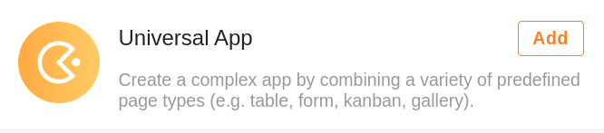
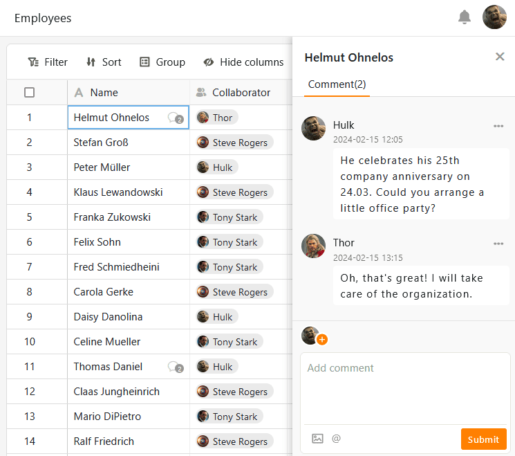

При создании **универсального приложения** вы можете дать волю своему творчеству. Приложение имеет ряд [типов страниц](https://seatable.io/ru/docs/apps/seitentypen-in-der-universellen-app/), которые позволяют вам представлять данные в виде **таблиц**, **веб-форм**, **галерей** или **досок Kanban**, среди прочих. [Создавая](https://seatable.io/ru/docs/apps/seiten-und-ordner-in-einer-universellen-app-anlegen-und-verwalten/) **отдельную страницу**, вы можете создавать приборные панели с содержательной **статистикой** ваших данных, которыми вы можете поделиться с другими (внешними) пользователями.



## Создание универсального приложения

Чтобы использовать универсальное приложение в вашей базе, вы должны сначала **добавить** его в базу.

[Узнайте, как добавить универсальное приложение в базу здесь.](https://seatable.io/ru/docs/apps/apps-zu-einer-base-hinzufuegen/)

## Дизайн универсального приложения

После успешного создания универсального приложения вы можете приступить к его оформлению. Убедитесь, что вы всегда используете **значок карандаша**  для входа в [режим редактирования](https://seatable.io/ru/docs/apps/apps-bearbeiten/) приложения.

Универсальное приложение состоит из нескольких **страниц**, которые можно объединить в **папки**.

О том[, как добавлять новые страницы и папки в универсальное приложение, читайте здесь](https://seatable.io/ru/docs/apps/seiten-und-ordner-in-einer-universellen-app-anlegen-und-verwalten/).

Для того чтобы оформить данные вашей базы в привлекательном виде, Universal App предлагает множество [типов страниц](https://seatable.io/ru/docs/apps/seitentypen-in-der-universellen-app/) с различными элементами дизайна.

## Предварительный просмотр универсального приложения

При разработке универсального приложения вы обязательно захотите проверить, как оно выглядит для пользователей между приложениями. Для этого можно просто [отобразить предварительный просмотр приложения](https://seatable.io/ru/docs/apps/die-vorschau-einer-app-anzeigen-lassen/) в режиме редактирования.

## Изменение настроек универсального приложения

В универсальном приложении можно выполнять различные **глобальные настройки**. Например, вы можете изменить **название**, **цвет** и **URL** вашего приложения. Вы можете внести необходимые изменения всего несколькими щелчками мыши через **настройки приложения**.

[Подробнее о глобальных настройках универсального приложения можно узнать здесь.](https://seatable.io/ru/docs/apps/einstellungen-einer-universellen-app-aendern/)

## Сохранение версий универсального приложения

В **управлении версиями** каждого приложения есть возможность сохранять снимки структуры приложения. О том, как создать **снимок** приложения, вы можете узнать [здесь](https://seatable.io/ru/docs/universelle-apps/versionsverwaltung-und-snapshots-einer-universellen-app/). Обратите внимание на то, что сохраняет и чего не сохраняет снимок приложения.

## Авторизация страниц в универсальном приложении

Чтобы точно контролировать доступ к вашим данным, вы можете установить **индивидуальные разрешения страниц для** **каждой страницы**, которую вы добавили в универсальное приложение. Разрешения страницы всегда редактируются через **настройки страницы**, которые можно открыть с помощью значка шестеренки .

[Подробнее о различных разрешениях страниц в Универсальном приложении можно узнать здесь.](https://seatable.io/ru/docs/apps/seitenberechtigungen-in-einer-universellen-app/)

## Управление пользователями и ролями в универсальном приложении

Добавление новых пользователей, создание и назначение ролей - в **администрировании пользователей и ролей** универсального приложения вы можете выполнять различные административные действия.

[Подробнее об администрировании пользователей и ролей в Universal App можно узнать здесь.](https://seatable.io/ru/docs/apps/benutzer-und-rollenverwaltung-einer-universellen-app/)

## Совместное использование универсального приложения

Вы также можете поделиться универсальным приложением с другими пользователями через [администрирование пользователей и ролей](https://seatable.io/ru/docs/apps/benutzer-und-rollenverwaltung-einer-universellen-app/). Для этого просто сгенерируйте индивидуальную **пригласительную ссылку** или используйте **QR-код**.

## Копирование универсального приложения

Создали ли вы универсальное приложение, которое хотели бы использовать в аналогичной форме для другой группы пользователей? Затем просто скопируйте существующее приложение и настройте его по своему усмотрению. Вы можете узнать, как скопировать универсальное приложение, [здесь](https://seatable.io/ru/docs/apps/apps-kopieren/).

## Отключение универсального приложения

Если вы создали универсальное приложение, которое хотите временно отключить, вы можете отключить его всего несколькими щелчками мыши, чтобы отозвать доступ ко всем группам пользователей. О том, как это сделать, можно узнать [здесь](https://seatable.io/ru/docs/apps/apps-zeitweise-deaktivieren/).

## Удаление универсального приложения

Вы можете **в** любой момент удалить универсальное приложение, которое вам больше не нужно. Обратите внимание на последствия удаления.

[Подробнее об удалении универсального приложения можно узнать здесь.](https://seatable.io/ru/?post_type=docs&p=24860)

## Отсутствие совместной работы в универсальных приложениях

Хотя универсальное приложение имеет множество преимуществ по сравнению с [работой в](https://seatable.io/ru/docs/arbeiten-mit-bases/bases/) базе, есть большая разница, если вы хотите работать над данными вместе в команде. В базе каждое изменение, сделанное другими пользователями, отображается немедленно. Записи меняются в режиме реального времени. В универсальном приложении такой тип совместной работы не поддерживается.

## Комментарии в универсальных приложениях

Тем не менее, у вас также есть возможность общаться с другими членами команды в приложении. Для этого воспользуйтесь [функцией комментариев](https://seatable.io/ru/docs/arbeiten-mit-zeilen/zeilen-kommentieren/), которая уже знакома вам по Base в том же виде. Записывайте свои отзывы или дополнительную информацию в записи данных для других пользователей приложения и проводите обсуждения на месте.


