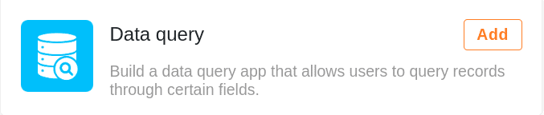

**As aplicações** no SeaTable são **interfaces** individuais para grupos de utilizadores específicos que têm diferentes necessidades de informação (por exemplo, funcionários, gestores de departamento, directores). O acesso aberto às aplicações permite-lhe disponibilizar os seus dados a **terceiros externos** (por exemplo, clientes, parceiros comerciais) **sem uma conta SeaTable**.

Para construir estas aplicações, existem os chamados **construtores de aplicações**, nos quais é possível criar diferentes interfaces de utilizador e fazer toda uma série de configurações. O **backend de** uma aplicação é sempre uma [base](https://seatable.io/pt/docs/arbeiten-mit-bases/bases/). Pode criar tantas aplicações quantas quiser para cada base. A regra geral é: uma aplicação por grupo de utilizadores e caso de utilização.

## As aplicações num relance

Existem atualmente **dois** tipos diferentes de aplicações disponíveis no SeaTable.

### A aplicação universal (Universal App)

Com a **aplicação universal**, pode dar asas à sua criatividade. A aplicação tem uma série de [tipos de páginas](https://seatable.io/pt/docs/apps/seitentypen-in-der-universellen-app/) com as quais pode apresentar os seus dados sob a forma de **tabelas**, **formulários Web**, **calendários** ou **quadros Kanban**, entre outras coisas. Ao criar uma **página individual**, pode também criar painéis de controlo com **estatísticas** significativas a partir dos seus dados e partilhá-los com outros utilizadores (externos).

[Saiba mais sobre a aplicação universal](https://seatable.io/pt/docs/apps/universelle-app/).

### A aplicação Data Query

Uma **aplicação de consulta de dados** é um **ecrã de pesquisa** específico do utilizador. Crie uma aplicação deste tipo se pretender que outros utilizadores possam pesquisar os seus **registos** numa vista de tabela para entradas específicas. Seleccione quais os **valores de coluna** que devem ser apresentados nos resultados da consulta para definir individualmente quais os dados a que um grupo de utilizadores pode aceder.

[Saiba mais sobre a aplicação de consulta de dados](https://seatable.io/pt/docs/apps/datenabfrage-app/).
