Sei es das Hinzufügen von **neuen Benutzern**, die Vergabe von **Rollen** oder das Erstellen von **Einladungslinks** – in der Benutzer- und Rollenverwaltung einer Universellen App können Sie diverse administrative Tätigkeiten durchführen. Sie erreichen die **Benutzer- und Rollenverwaltung** über den Bearbeitungsmodus Ihrer Universellen App.



## Benutzer- und Rollenverwaltung der Universellen App

1. Öffnen Sie eine **Base**, der Sie bereits eine Universelle App hinzugefügt haben.
2. Klicken Sie im Base-Header auf **Apps**.
   4. Fahren Sie mit der Maus über die App und klicken Sie auf das **Stift-Symbol** .
   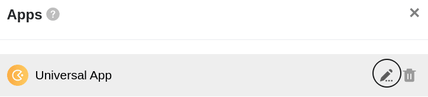6. Öffnen Sie die **Benutzer- und Rollenverwaltung** am oberen linken Seitenrand.

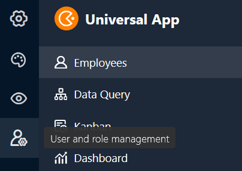 8. Nehmen Sie die gewünschten **Einstellungen** vor.

## Die Einstellungen im Detail

### Benutzer

Im ersten Abschnitt finden Sie eine Übersicht aller **Benutzer**, die Zugriff auf Ihre Universelle App besitzen. Zusätzlich finden Sie hier auch die **Rolle** und den **Status** des jeweiligen Benutzers.

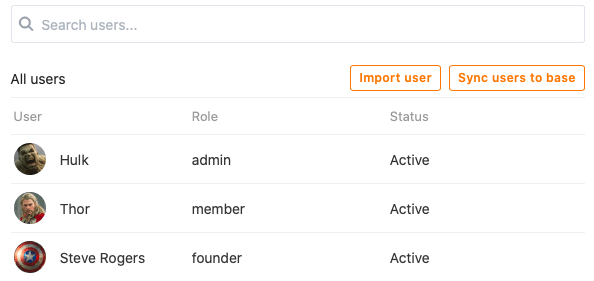

In diesem Abschnitt stehen Ihnen zudem diverse Möglichkeiten zur **Verwaltung der aktuellen Benutzer** Ihrer universellen App zur Verfügung.

Nutzen Sie die **Suchfunktion**, um einen bestimmten Benutzer zu finden. Diese Funktion kann vor allem bei einer großen Zahl an App-Benutzern hilfreich sein.

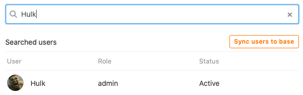

Um einen Benutzer zur App hinzuzufügen, klicken Sie auf **Benutzer importieren**, suchen ihn über das Eingabefeld und weisen ihm im Anschluss eine Rolle zu.

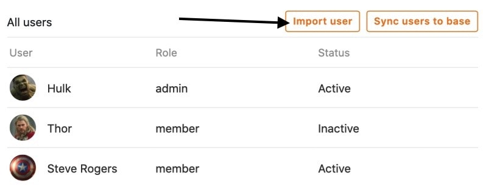

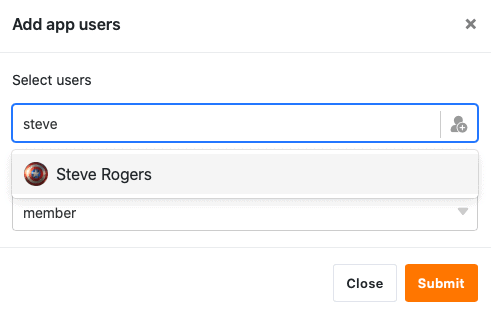

Klicken Sie auf **Benutzer mit der Base synchronisieren**, um die **App-Benutzer** automatisch in einer Tabelle Ihrer Base zu erheben.

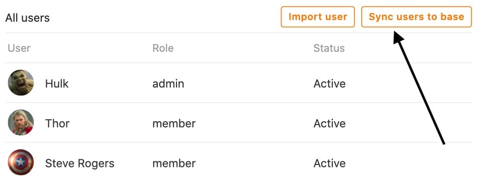 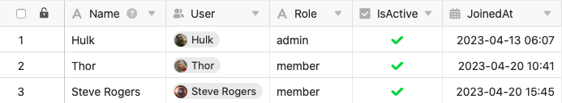

Wenn Sie zukünftig weitere Benutzer auf diese Weise hinzufügen, können Sie stets erneut auf **Benutzer mit der Base synchronisieren** klicken, um die **neuen Benutzer** der Tabelle hinzuzufügen.

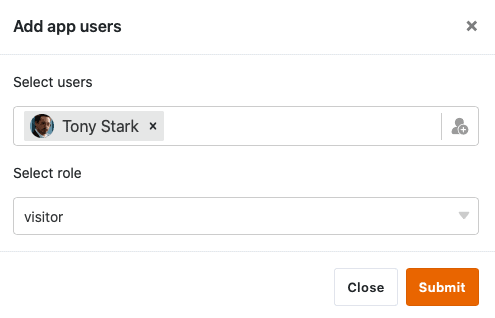

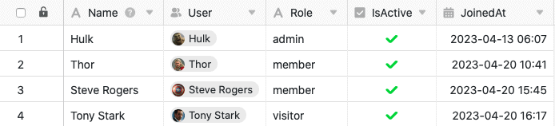

Um einen Benutzer aus der App zu **löschen**, klicken Sie einfach auf das **X-Symbol**, welches Sie rechts neben dem Status des jeweiligen Benutzers finden.

Durch Klick auf die **Stift-Symbole** , die Sie für jeden Benutzer finden, können Sie dessen **Rolle** und **Status** bearbeiten.



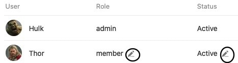

Für die **Rolle eines Benutzers** stehen Ihnen im Drop-down-Menü alle Rollen zur Auswahl, die Sie im nächsten Abschnitt der Benutzer- und Rollenverwaltung definieren können.

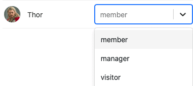

Der **Status** eines Benutzers kann jeweils auf **Aktiv** oder **Inaktiv** gesetzt werden. Während **aktive** Nutzer Zugriff auf die App und deren Inhalte besitzen, verlieren diesen **inaktive** Nutzer.

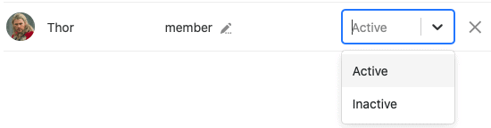

Nutzer, die keinen Zugriff auf Ihre Universelle App haben, sehen diese Meldung:

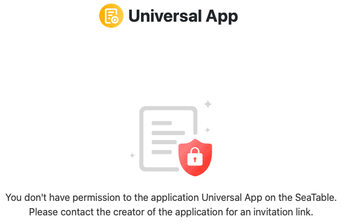

### Rollen

In diesem Abschnitt können Sie eine beliebige Anzahl an **Rollen** definieren, die Sie im Abschnitt darüber den verschiedenen App-Nutzern zuweisen können.

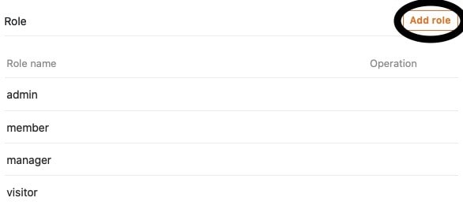

Hier legen Sie zunächst nur die **Namen** der Rollen fest. Welche **Berechtigungen** Nutzer mit den verschiedenen Rollen haben, können Sie individuell für jede Seite der App definieren.

[Erfahren Sie hier mehr über die Seitenberechtigungen.]()

### Einladungslink

Im dritten Abschnitt der Benutzer- und Rollenverwaltung können Sie einen individuellen **Einladungslink** für die Universelle App generieren.

Legen Sie dabei zunächst die **Rolle** der Benutzer fest, welche mithilfe des Einladungslinks auf die App zugreifen.

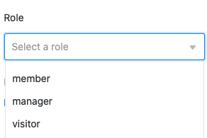

Im Anschluss haben Sie die Möglichkeit, ein **Passwort** festzulegen, das nach dem Öffnen des Einladungslinks eingegeben werden muss, um Zugriff auf die App zu erhalten.

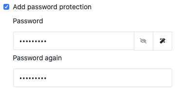

Optional können Sie dem Einladungslink auch noch eine automatische **Ablaufzeit** hinzufügen, wie lange dieser gültig ist.

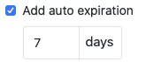

Mit einem Klick auf **Generieren** können Sie den Einladungslink erstellen lassen. Der Link wird Ihnen im Anschluss unten angezeigt und Sie haben die Möglichkeit, diesen zu **kopieren** oder zu **löschen**.

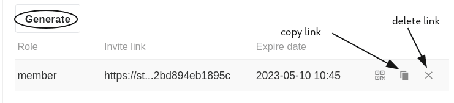

Alternativ haben Sie die Möglichkeit, sich einen **QR-Code** zum Öffnen und Teilen der Universellen App generieren zu lassen.

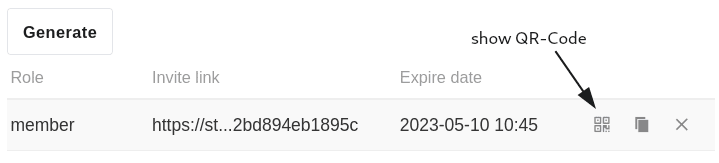

Scannen Sie den angezeigten **QR-Code**, um Ihre Universelle App zu öffnen, oder teilen Sie ihn mit anderen Nutzern, um ihnen **Zugriff** auf Ihre App zu gewähren.

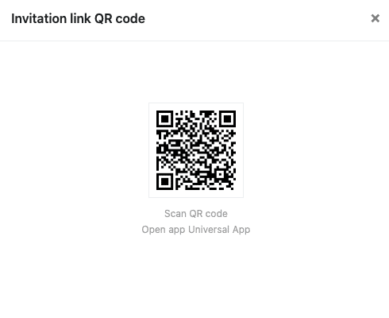
