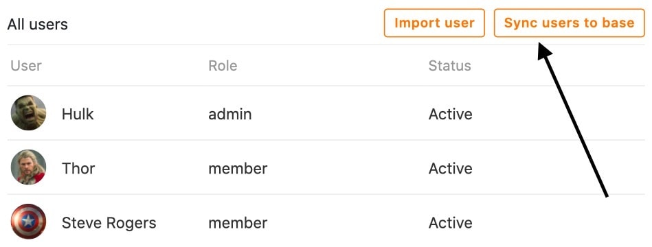
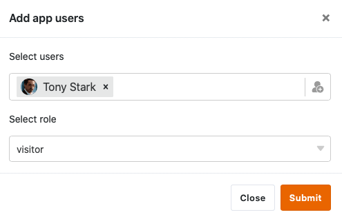

Qu'il s'agisse d'ajouter **de nouveaux utilisateurs**, d'attribuer **des rôles** ou de créer des **liens d'invitation**, vous pouvez effectuer diverses activités administratives dans la gestion des utilisateurs et des rôles d'une application universelle. Vous accédez à la **gestion des utilisateurs et des rôles** via le mode d'édition de votre application universelle.



## Gestion des utilisateurs et des rôles de l'application universelle

1. Ouvrez une **base** à laquelle vous avez déjà ajouté une application universelle.
2. Cliquez sur **Apps** dans l'en-tête de la base.

4. Passez la souris sur l'application et cliquez sur l'**icône du crayon** .

6. Ouvrez la **gestion des utilisateurs et des rôles** en haut à gauche de la page.

8. Effectuez les **réglages** souhaités.

## Les réglages en détail

### Utilisateur

Dans la première section, vous trouverez un aperçu de tous les **utilisateurs** qui ont accès à votre application universelle. Vous y trouverez également le **rôle** et le **statut** de chaque utilisateur.

Dans cette section, vous disposez en outre de diverses possibilités pour **gérer les utilisateurs actuels** de votre application universelle.

Utilisez la **fonction de recherche** pour trouver un utilisateur spécifique. Cette fonction peut être particulièrement utile si le nombre d'utilisateurs de l'application est élevé.

Pour ajouter un utilisateur à l'application, cliquez sur **Importer un utilisateur**, recherchez-le dans le champ de saisie et attribuez-lui un rôle.

Cliquez sur **Synchroniser les utilisateurs avec la base** pour relever automatiquement les **utilisateurs de l'app** dans un tableau de votre base.

  

Si vous ajoutez d'autres utilisateurs de cette manière à l'avenir, vous pouvez toujours cliquer à nouveau sur **Synchroniser les utilisateurs avec la base** pour ajouter les **nouveaux utilisateurs** au tableau.

Pour **supprimer** un utilisateur de l'application, il suffit de cliquer sur le **symbole X** qui se trouve à droite du statut de l'utilisateur concerné.

En cliquant sur les **icônes en forme de crayon** , que vous trouverez pour chaque utilisateur, vous pouvez modifier son **rôle** et **son statut**.



Pour le **rôle d'un utilisateur**, vous pouvez choisir dans le menu déroulant tous les rôles que vous pouvez définir dans la section suivante de la gestion des utilisateurs et des rôles.

Le **statut** d'un utilisateur peut être défini comme **actif** ou **inactif**. Alors que les utilisateurs **actifs** ont accès à l'application et à son contenu, les utilisateurs **inactifs** perdent cet accès.

Les utilisateurs qui n'ont pas accès à votre application universelle verront ce message :

### Rouleaux

Dans cette section, vous pouvez définir un nombre quelconque de **rôles** que vous pourrez attribuer aux différents utilisateurs de l'app dans la section à ce sujet.

Ici, vous définissez d'abord uniquement les **noms** des rôles. Vous pouvez définir individuellement pour chaque page de l'application les **autorisations** dont disposent les utilisateurs avec les différents rôles.

[Apprenez-en plus sur les autorisations de pages ici.]()

### Lien d'invitation

Dans la troisième section de la gestion des utilisateurs et des rôles, vous pouvez générer un **lien d'invitation** individuel pour l'application universelle.

Définissez d'abord le **rôle** des utilisateurs qui accèdent à l'application à l'aide du lien d'invitation.

Ensuite, vous avez la possibilité de définir un **mot de passe** qui doit être saisi après l'ouverture du lien d'invitation pour avoir accès à l'application.

En option, vous pouvez également ajouter un **délai d'expiration** automatique au lien d'invitation pour indiquer sa durée de validité.

En cliquant sur **Générer**, vous pouvez créer le lien d'invitation. Le lien s'affiche ensuite en bas et vous avez la possibilité de le **copier** ou de le **supprimer**.

Vous avez également la possibilité de vous faire générer un **code QR** pour ouvrir et partager l'application universelle.

Scannez le **code QR** affiché pour ouvrir votre application universelle ou partagez-le avec d'autres utilisateurs pour leur donner **accès** à votre application.

