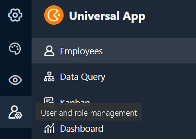
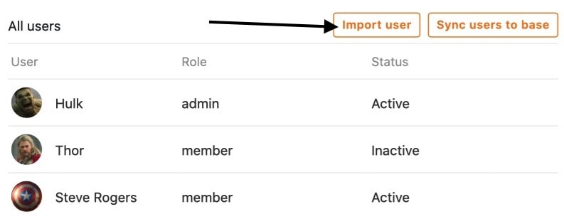

Quer seja para adicionar **novos utilizadores**, atribuir **funções** ou criar **ligações de convite** - pode realizar várias actividades administrativas na administração de utilizadores e funções de uma aplicação universal. Pode aceder à administração de **utilizadores e funções** através do modo de edição da sua aplicação universal.



## Administração de utilizadores e funções da Aplicação Universal

1. Abra uma **Base** à qual já tenha adicionado uma aplicação universal.
2. Clique em **Apps** no cabeçalho Base.

4. Passe o rato sobre a aplicação e clique no **ícone do lápis** .

6. Abra a **administração de utilizadores e funções** no canto superior esquerdo da página.

8. Efectuar as **definições** pretendidas.

## As definições em pormenor

### Utilizador

Na primeira secção, encontrará uma visão geral de todos os **utilizadores** que têm acesso à sua aplicação universal. Além disso, encontrará também a **função** e o **estado do** respectivo utilizador.

Esta secção também lhe fornece várias opções para **gerir os utilizadores actuais da** sua aplicação universal.

Utilize a **função de pesquisa para** encontrar um utilizador específico. Esta função pode ser especialmente útil se tiver um grande número de utilizadores de aplicações.

Para adicionar um utilizador à aplicação, clique em **Importar utilizador**, procure o **utilizador** no campo de entrada e, em seguida, atribua uma função ao utilizador.

Clique em **Sincronizar utilizadores com a Base** para recolher automaticamente os **utilizadores da aplicação** numa tabela na sua Base.

  

Se, no futuro, adicionar mais utilizadores desta forma, pode sempre clicar novamente em **Sincronizar utilizadores com a Base** para adicionar os **novos utilizadores** à tabela.

Para **eliminar** um utilizador da aplicação, basta clicar no **símbolo X**, que se encontra à direita do estado do respectivo utilizador.

Ao clicar nos **ícones de lápis** , que encontrará para cada utilizador, pode editar a sua **função** e o seu **estado**.



Para a **função de um utilizador,** todas as funções estão disponíveis para selecção no menu pendente, que pode ser definido na secção seguinte da administração de utilizadores e funções.

O **estado de** um utilizador pode ser definido como **Activo** ou **Inactivo**. Enquanto os utilizadores **activos** têm acesso à aplicação e ao seu conteúdo, os utilizadores **inactivos** perdem esse acesso.

Os utilizadores que não têm acesso à sua aplicação universal verão esta mensagem:

### Rolos

Nesta secção, pode definir qualquer número de **funções**, que pode atribuir aos vários utilizadores da aplicação na secção acima.

Aqui, inicialmente, apenas define os **nomes das** funções. Pode definir quais as **permissões** que os utilizadores com as diferentes funções têm individualmente para cada página da aplicação.

[Saiba mais sobre as permissões de página aqui.]()

### Ligação do convite

Na terceira secção da administração de utilizadores e funções, é possível gerar uma **ligação de convite** individual para a aplicação universal.

Primeiro, defina a **função dos** utilizadores que acedem à aplicação utilizando a ligação de convite.

Tem então a opção de definir uma **palavra-passe** que deve ser introduzida depois de abrir a ligação de convite para obter acesso à aplicação.

Opcionalmente, pode também adicionar um **tempo de expiração** automático **à** ligação de convite para indicar o período de validade da mesma.

Clique em **Gerar** para criar a ligação de convite. A ligação é então apresentada abaixo e tem a opção de a **copiar** ou **eliminar**.

Em alternativa, tem a opção de gerar um **código QR** para abrir e partilhar a aplicação universal.

Digitalize o **código QR** apresentado para abrir a sua Universal App ou partilhe-o com outros utilizadores para lhes dar **acesso à** sua aplicação.

