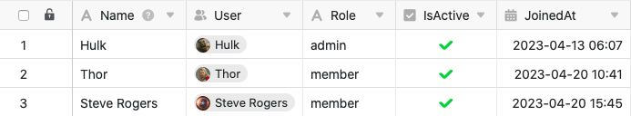
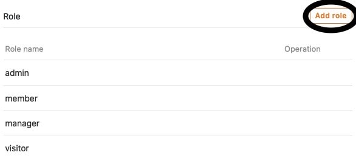
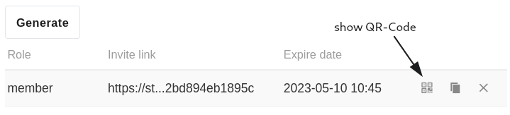

Добавление **новых пользователей**, назначение **ролей** или создание **пригласительных ссылок** - вы можете выполнять различные административные действия в администрировании пользователей и ролей универсального приложения. Вы можете получить доступ к **администрированию пользователей и ролей** через режим редактирования универсального приложения.



## Администрирование пользователей и ролей универсального приложения

1. Откройте **базу**, в которую вы уже добавили универсальное приложение.
2. Нажмите **Приложения** в заголовке База.

4. Наведите курсор мыши на приложение и нажмите на **значок карандаша** .

6. Откройте **администрирование пользователей и ролей** в верхней левой части страницы.

8. Выполните необходимые **настройки**.

## Настройки в деталях

### Пользователь

В первом разделе вы найдете обзор всех **пользователей**, имеющих доступ к вашему универсальному приложению. Кроме того, вы также найдете **роль** и **статус** соответствующего пользователя.

Этот раздел также предоставляет вам различные опции для **управления текущими пользователями** вашего универсального приложения.

Используйте **функцию поиска**, чтобы найти конкретного пользователя. Эта функция может быть особенно полезна при большом количестве пользователей приложения.

Чтобы добавить пользователя в приложение, нажмите на **Импорт пользователя**, найдите **пользователя** в поле ввода, а затем назначьте ему роль.

Нажмите **Синхронизировать пользователей с базой**, чтобы автоматически собрать **пользователей приложения** в таблицу в вашей базе.

  

Если в будущем вы добавите больше пользователей таким образом, вы всегда можете снова нажать **Синхронизировать пользователей с базой**, чтобы добавить **новых пользователей** в таблицу.

Чтобы **удалить** пользователя из приложения, просто нажмите на **символ X**, который вы найдете справа от статуса соответствующего пользователя.

Нажав на **значки карандаша** , которые вы найдете для каждого пользователя, вы можете редактировать его **роль** и **статус**.



Для **роли пользователя** в выпадающем меню доступны для выбора все роли, которые вы можете определить в следующем разделе администрирования пользователей и ролей.

**Статус** пользователя может быть установлен на **Активный** или **Неактивный**. Если **активные** пользователи имеют доступ к приложению и его содержимому, то **неактивные** пользователи теряют этот доступ.

Пользователи, не имеющие доступа к своему универсальному приложению, увидят это сообщение:

### Ролики

В этом разделе вы можете определить любое количество **ролей**, которые вы можете назначить различным пользователям приложения в разделе выше.

Здесь вы изначально определяете только **имена** ролей. Вы можете определить, какие **разрешения** имеют пользователи с различными ролями для каждой страницы приложения.

[Подробнее о разрешениях страниц можно узнать здесь.]()

### Ссылка на приглашение

В третьем разделе администрирования пользователей и ролей вы можете создать индивидуальную **пригласительную ссылку** для универсального приложения.

Сначала определите **роль** пользователей, которые получат доступ к приложению по пригласительной ссылке.

Затем у вас есть возможность установить **пароль**, который необходимо ввести после открытия пригласительной ссылки, чтобы получить доступ к приложению.

По желанию можно также добавить автоматическое **время истечения срока действия** пригласительной ссылки, в течение которого она будет действительна.

Нажмите на кнопку **Generate**, чтобы создать ссылку приглашения. Ссылка отобразится ниже, и у вас будет возможность **скопировать** или **удалить** ее.

Кроме того, вы можете сгенерировать **QR-код**, чтобы открыть универсальное приложение и поделиться им.

Отсканируйте отображаемый **QR-код**, чтобы открыть свое универсальное приложение, или поделитесь им с другими пользователями, чтобы дать им **доступ** к вашему приложению.

