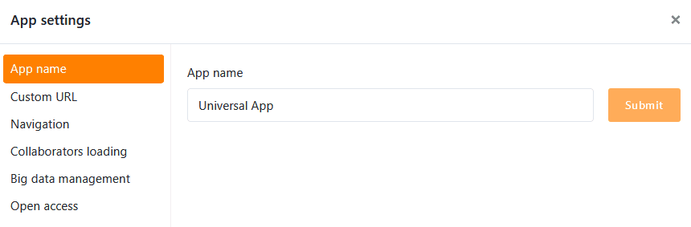
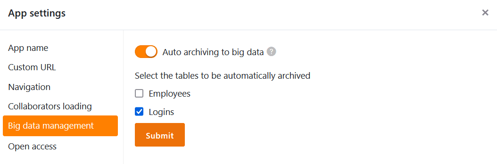

Innerhalb einer **Universellen App** können Sie mit nur wenigen Klicks verschiedene **globale Einstellungen** vornehmen, welche die Konfiguration und das Erscheinungsbild der gesamten App betreffen.

## Die Einstellungen einer Universellen App ändern

1. Öffnen Sie eine **Base**, in der Sie eine bestehende App bearbeiten möchten.
2. Klicken Sie im Base-Header auf **Apps**.
   4. Fahren Sie mit der Maus über die App und klicken Sie auf das **Stift-Symbol** .
   6. Klicken Sie auf das **Zahnrad-Symbol** am oberen linken Seitenrand.

 8. Nehmen Sie die gewünschten Anpassungen an den **Einstellungen** der Universellen App vor.



## Den Namen der Universellen App bearbeiten

Im ersten Abschnitt der App-Einstellungen können Sie den **Namen** der Universellen App anpassen und ihn mit einem Klick auf **Absenden** speichern.

## Benutzerdefinierte URL

Im zweiten Abschnitt können Sie einen Teil der **URL** anpassen, mit der Sie Ihre Universelle App aufrufen und verlinken können. Geben Sie einfach Ihre Wunsch-URL in das **Textfeld** ein und beachten Sie bei der Eingabe die unten stehenden **Anforderungen**. Im Anschluss können Sie die eingegebene URL **speichern** und **kopieren**.

**Anforderungen:** Der benutzerdefinierte Teil der URL muss zwischen 5 und 30 Zeichen lang sein und darf nur **Buchstaben (a-z), Zahlen (0-9) und Bindestriche** enthalten.

## Navigation ein- und ausblenden

Im dritten Abschnitt können Sie entscheiden, ob die **Navigationsleiste** beim Öffnen der App standardmäßig ein- oder ausgeblendet sein soll. Die Navigationsleiste ist der Bereich am linken Rand, über den alle Nutzer die [Seiten und Ordner]() der App ansteuern.

Es handelt sich dabei nur um eine Voreinstellung beim erstmaligen Öffnen der App. Über die entsprechenden **Symbole** oder **Tastenkombinationen** kann jeder App-Nutzer die Navigationsleiste nach Belieben ein- und ausblenden.

## Mitarbeiter-Liste laden

Im vierten Abschnitt können Sie entscheiden, ob Ihre **Mitarbeiter-Liste** in der App für alle Nutzer sichtbar sein soll. Sie können dann Personen in [Mitarbeiter-Spalten]() eintragen oder zu [Kommentaren]() hinzufügen.

## Big Data Management

Dieser Abschnitt ist nur relevant, wenn Sie den [Big-Data-Speicher]() in Ihrer Base aktiviert haben. Apps können dann auf Daten im Big-Data-Speicher zugreifen und Einträge, die über die App erstellt werden, direkt dort speichern. Standardmäßig werden neue Einträge aber in der Base gespeichert. Um den Big-Data-Speicher als **Speicherort für neue Einträge** festzulegen, aktivieren Sie einfach den Regler. Wie der Screenshot zeigt, können Sie für jede Tabelle genau festlegen, ob neue Zeilen in die Base (leeres Kästchen) oder in den Big-Data-Speicher (abgehaktes Kästchen) geschrieben werden sollen.

## Uneingeschränkter Zugriff

Im letzten Abschnitt können Sie einen **offenen Zugang** für Ihre Universelle App einstellen. Zum einen können Sie den **Zugriff unangemeldeter Benutzer** auf Ihre App erlauben, sodass jeder, der den Link aufruft, die Daten sehen (jedoch nicht verändern) kann.

Sie können aber auch aktivieren, dass **jeder eingeloggte Benutzer**, der Ihre App verwendet, **automatisch als App-Benutzer registriert** wird. Dabei legen Sie fest, welche **Rolle** den Benutzern bei der Registrierung zugewiesen wird. Je nach [Berechtigung]() auf den einzelnen Seiten können Benutzer mit dieser Rolle auch Zeilen hinzufügen, bearbeiten oder löschen.

## Einstellungen einzelner Seiten bearbeiten

Die bisher genannten Einstellungen betreffen eine **gesamte Universelle App**. Wenn Sie die Einstellungen einer **einzelnen Seite** ändern möchten, klicken Sie in der Navigation auf das **Zahnrad-Symbol**  der entsprechenden Seite.

