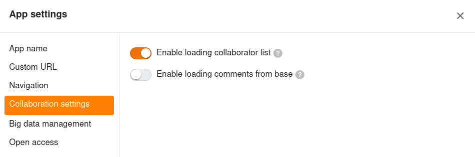

Within a **universal app**, you can make various **global settings** that affect the configuration and appearance of the entire app with just a few clicks.

## Change the settings of a universal app

1. Open a **base** in which you want to edit an existing app.
2. Click **Apps** in the Base header.

4. Hover your mouse over the app and click the **pencil icon** .

6. Click the **gear icon** at the top left of the page.

8. Make the desired adjustments to the Universal App **settings**.



## Edit the name of the Universal App

In the first section of the app settings you can customize the **name of** the Universal App and save it by clicking **Submit**.

## User-defined URL

In the second section, you can customize part of the **URL** that you can use to access and link to your Universal App. Simply enter your desired URL in the **text field** and note the **requirements** below when entering it. You can then **save** and **copy** the URL you have entered.

**Requirements:** The user-defined part of the URL must be between 5 and 30 characters long and may only contain **letters (a-z), numbers (0-9) and hyphens**.

## Show and hide navigation

In the third section, you can decide whether the **navigation bar** should be shown or hidden by default when the app is opened. The navigation bar is the area on the left-hand side that all users use to navigate to the app's [pages and folders](https://seatable.io/en/docs/universelle-apps/seiten-und-ordner-in-einer-universellen-app-anlegen-und-verwalten/).

This is only a default setting when the app is opened for the first time. Every app user can show and hide the navigation bar as required using the corresponding **icons** or **key combinations**.

## Load employee list

In the fourth section, you can decide whether your **employee list** should be visible to all users in the app. You can then enter people in [employee columns]() or add them to [comments]().

## Big Data Management

This section is only relevant if you have activated the [big data storage](https://seatable.io/en/docs/big-data/aktivieren-des-big-data-backends-in-einer-base/) in your Base. Apps can then access data in the big data storage and save entries created via the app directly there. However, new entries are saved in the base by default. To set the Big Data storage as the **storage location for new entries**, simply activate the slider. As the screenshot shows, you can specify for each table whether new rows should be written to the base (empty box) or to the big data storage (checked box).

## Unrestricted access

In the last section, you can set **open access** for your universal app. On the one hand, you can allow **unregistered users to access** your app so that anyone who calls up the link can see (but not change) the data.

However, you can also activate that **every logged-in user** who uses your app is **automatically registered as an app user**. In doing so, you determine which **role** is assigned to the users during registration. Depending on their [authorization](https://seatable.io/en/docs/universelle-apps/seitenberechtigungen-in-einer-universellen-app/) on the individual pages, users with this role can also add, edit or delete rows .

## Edit settings of individual pages

The settings mentioned so far affect an **entire Universal App**. If you want to change the settings of a **single page**, click the **gear icon**  of the corresponding page in the navigation.

