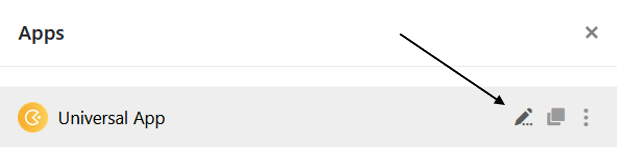
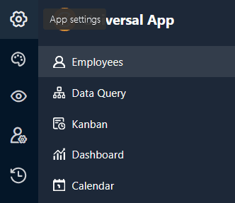
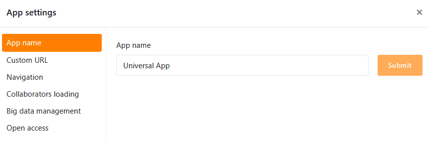
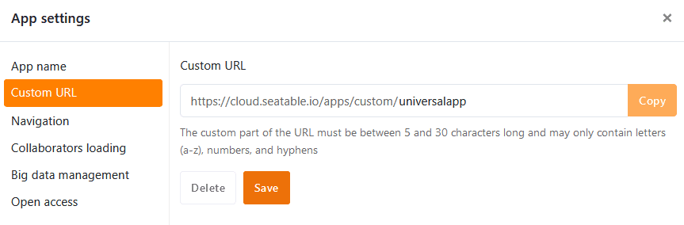
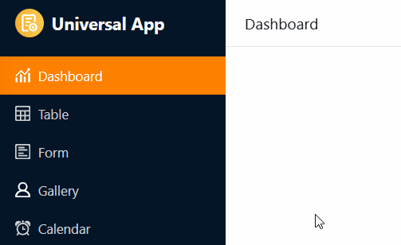
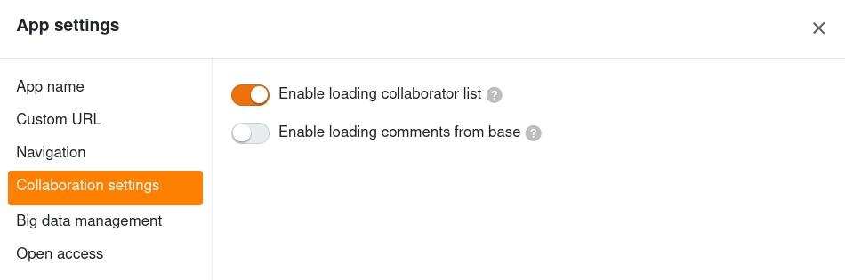
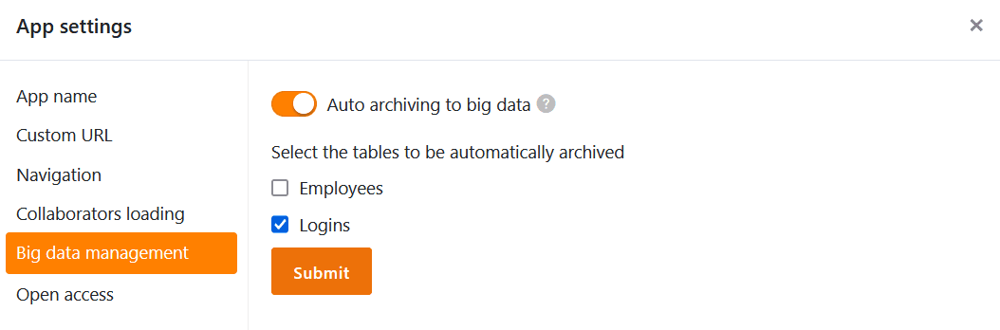
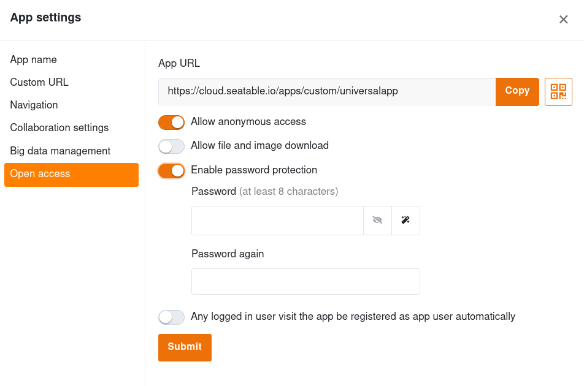
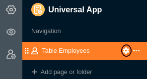

Au sein d'une **application universelle**, il est possible de procéder en quelques clics à différents **réglages globaux** qui concernent la configuration et l'apparence de l'ensemble de l'application.

## Modifier les paramètres d'une application universelle

1. Ouvrez une **base** dans laquelle vous souhaitez modifier une application existante.
2. Cliquez sur **Apps** dans l'en-tête de la base.

3. Passez la souris sur l'application et cliquez sur l'**icône du crayon** .

4. Cliquez sur l'**icône en forme d'engrenage** en haut à gauche de la page.

5. Effectuez les ajustements souhaités dans les **paramètres** de l'application universelle.



## Modifier le nom de l'application universelle

Dans la première section des paramètres de l'application, vous pouvez adapter le **nom** de l'application universelle et l'enregistrer en cliquant sur **Envoyer**.

## URL personnalisée

Dans la deuxième section, vous pouvez personnaliser une partie de l'**URL** qui vous permettra d'accéder à votre application universelle et d'y créer un lien. Il vous suffit de saisir l'URL de votre choix dans le **champ de texte** et de respecter les **exigences** ci-dessous. Vous pouvez ensuite **enregistrer** et **copier** l'URL saisie.

**Exigences :** La partie personnalisée de l'URL doit comporter entre 5 et 30 caractères et ne peut contenir que **des lettres (a-z), des chiffres (0-9) et des traits d'union**.

## Afficher ou masquer la navigation

Dans la troisième section, vous pouvez décider si la **barre de navigation** doit être affichée ou masquée par défaut à l'ouverture de l'application. La barre de navigation est la zone située sur le bord gauche par laquelle tous les utilisateurs accèdent aux [pages et aux dossiers]() de l'application.

Il s'agit uniquement d'un réglage par défaut lors de la première ouverture de l'application. Chaque utilisateur de l'application peut afficher ou masquer la barre de navigation à sa guise à l'aide des **icônes** ou **des combinaisons de touches** correspondantes.

## Paramètres de collaboration

Dans la quatrième section, vous pouvez **activer le chargement de tous collaborateurs** si votre liste de collaborateurs doit être visible dans l'application pour tous les utilisateurs. Vous pouvez alors ajouter des personnes dans [les colonnes des collaborateurs]() ou les ajouter aux [commentaires](). Si vous souhaitez que vos collaborateurs restent invisibles aux autres, vous devez désactiver cette fonction.

En outre, vous pouvez définir si vous souhaitez **charger les commentaires de la base sous-jacente**. Par défaut, seuls les commentaires rédigés dans l'application sont visibles dans l'application. Si vous ne souhaitez pas que les utilisateurs de l'application voient les commentaires de la base, vous devez désactiver cette fonction.



## Gestion des données volumineuses

Cette section n'est pertinente que si vous avez activé la [mémoire Big Data]() dans votre base. Les applications peuvent alors accéder aux données dans la mémoire Big Data et y enregistrer directement les entrées créées via l'application. Par défaut, les nouvelles entrées sont toutefois enregistrées dans la base. Pour définir la mémoire Big Data comme **emplacement de stockage des nouvelles entrées**, il suffit d'activer le curseur. Comme le montre la capture d'écran, vous pouvez définir précisément pour chaque tableau si les nouvelles lignes doivent être écrites dans la base (case vide) ou dans la mémoire Big Data (case cochée).

## Accès ouvert

Dans la dernière section, vous pouvez définir un accès ouvert pour votre application universelle. Donc, vous pouvez **autoriser les utilisateurs non connectés** à votre application. Ensuite, toute personne qui consulte le lien puisse voir les données (mais pas les modifier).

Vous pouvez également **autoriser le téléchargement de fichiers et d'images**. Si vous ne souhaitez pas que tout le monde puisse utiliser votre application sans restriction, vous pouvez **activer la protection par mot de passe**. Lorsque les utilisateurs accèdent à l'URL de l'application, ils doivent alors saisir le mot de passe correct pour pouvoir voir les données.

Vous pouvez également activer que **chaque utilisateur connecté qui utilise l'application est automatiquement enregistré en tant qu'utilisateur d'application**. Pour ce faire, vous définissez le **rôle** qui est attribué aux utilisateurs lors de l'enregistrement. En fonction des [autorisations]() sur les différentes pages, les utilisateurs ayant ce rôle peuvent également ajouter, modifier ou supprimer des lignes.

## Modifier les paramètres des pages individuelles

Les paramètres mentionnés jusqu'ici concernent l'**ensemble** d'une **application universelle**. Si vous souhaitez modifier les paramètres d'une **seule page**, cliquez dans la navigation sur le **symbole de la roue dentée**  de la page correspondante.

