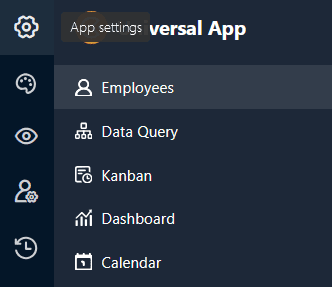

Numa **aplicação universal**, pode fazer várias **definições globais** que afectam a configuração e o aspeto de toda a aplicação com apenas alguns cliques.

## Alterar as definições de uma aplicação universal

1. Abra uma **base** na qual pretende editar uma aplicação existente.
2. Clique em **Apps** no cabeçalho Base.

4. Passe o rato sobre a aplicação e clique no **ícone do lápis** .

6. Clique no **símbolo da roda dentada** no canto superior esquerdo da página.

8. Efectuar os ajustes desejados nas **definições da** aplicação universal.



## Editar o nome da aplicação universal

Na primeira secção das definições da aplicação, pode personalizar o **nome da** aplicação universal e guardá-lo clicando em **Submeter**.

## URL definido pelo utilizador

Na segunda secção, pode personalizar parte do **URL** com o qual pode chamar e ligar à sua aplicação universal. Basta introduzir o URL pretendido no **campo de texto** e ter em atenção os **requisitos** abaixo indicados ao introduzi-lo. Em seguida, pode **guardar** e **copiar** o URL introduzido.

**Requisitos:** A parte do URL definida pelo utilizador deve ter entre 5 e 30 caracteres e só pode conter **letras (a-z), números (0-9) e hífenes**.

## Mostrar e ocultar a navegação

Na terceira secção, pode decidir se a **barra de navegação** deve ser mostrada ou ocultada por predefinição quando a aplicação é aberta. A barra de navegação é a área do lado esquerdo que todos os utilizadores utilizam para navegar para as [páginas e pastas]() da aplicação.

Esta é apenas uma definição predefinida quando a aplicação é aberta pela primeira vez. Cada utilizador da aplicação pode mostrar e ocultar a barra de navegação conforme necessário, utilizando os **ícones** correspondentes ou **combinações de teclas**.

## Carregar lista de empregados

Na quarta secção, pode decidir se a sua **lista de empregados** deve ser visível para todos os utilizadores da aplicação. Pode então introduzir pessoas nas [colunas de empregados]() ou adicioná-las aos [comentários]().

## Gestão de grandes volumes de dados

Esta secção só é relevante se tiver ativado o [armazenamento de grandes volumes de dados]() na sua Base. As aplicações podem então aceder aos dados no armazenamento de grandes volumes de dados e guardar as entradas criadas através da aplicação diretamente aí. No entanto, por defeito, os novos registos são guardados na Base. Para definir o armazenamento de Big Data como o **local de armazenamento para novas entradas**, basta ativar o seletor. Como mostra a captura de ecrã, pode especificar para cada tabela se as novas linhas devem ser escritas na base (caixa vazia) ou no armazenamento de grandes volumes de dados (caixa assinalada).

## Acesso sem restrições

Na última secção, pode definir **o acesso aberto** para a sua aplicação universal. Por um lado, pode permitir que **os utilizadores não registados acedam à** sua aplicação, para que qualquer pessoa que aceda à ligação possa ver (mas não alterar) os dados.

No entanto, também pode ativar que **cada utilizador com sessão iniciada** que utilize a sua aplicação seja **automaticamente registado como um utilizador da aplicação**. Ao fazê-lo, determina que **função** é atribuída aos utilizadores durante o registo. Dependendo da sua [autorização]() nas páginas individuais, os utilizadores com esta função também podem adicionar, editar ou eliminar linhas.

## Editar definições de páginas individuais

As definições mencionadas até agora afectam **toda** uma **aplicação universal**. Se pretender alterar as definições de uma **página individual**, clique no **símbolo da roda dentada**  da página correspondente na navegação.

