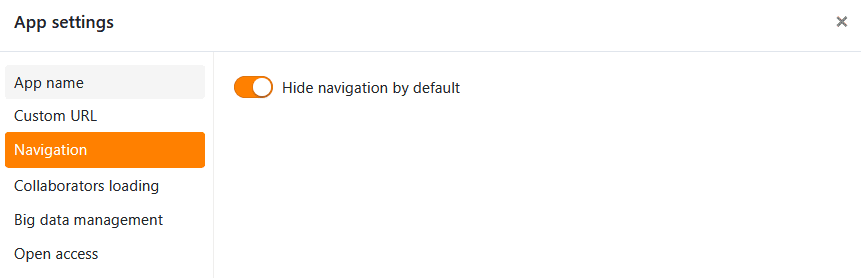
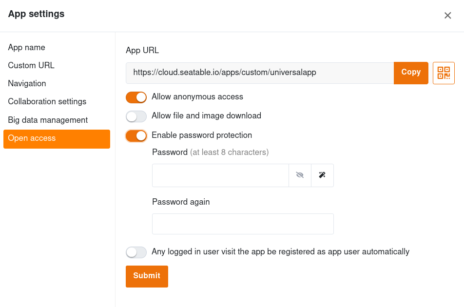

В **универсальном приложении** можно несколькими щелчками мыши задать различные **глобальные настройки**, которые влияют на конфигурацию и внешний вид всего приложения.

## Изменение настроек универсального приложения

1. Откройте **базу**, в которой вы хотите отредактировать существующее приложение.
2. Нажмите **Приложения** в заголовке База.

3. Наведите курсор мыши на приложение и нажмите на **значок карандаша** .

4. Нажмите на **символ шестеренки** в левом верхнем углу страницы.

5. Внесите необходимые изменения в **настройки** универсального приложения.



## Редактирование имени универсального приложения

В первом разделе настроек приложения вы можете настроить **имя** универсального приложения и сохранить его, нажав на кнопку **Отправить**.

## Определяемый пользователем URL

Во втором разделе вы можете настроить часть **URL-адреса**, с помощью которого можно вызывать и ссылаться на ваше универсальное приложение. Просто введите желаемый URL в **текстовое поле** и обратите внимание на **требования,** приведенные ниже при его вводе. Затем вы можете **сохранить** и **скопировать** введенный URL.

**Требования:** Определяемая пользователем часть URL должна иметь длину от 5 до 30 символов и содержать только **буквы (a-z), цифры (0-9) и дефисы**.

## Показать и скрыть навигацию

В третьем разделе вы можете решить, должна ли **панель навигации** отображаться или скрываться по умолчанию при открытии приложения. Панель навигации - это область с левой стороны, которую все пользователи используют для навигации по [страницам и папкам]() приложения.

Эта настройка устанавливается по умолчанию только при первом открытии приложения. Каждый пользователь приложения может показывать и скрывать панель навигации по своему усмотрению, используя соответствующие **значки** или **комбинации клавиш**.

## Настройки для совместной работы

В четвертом разделе вы можете решить, должен ли **список сотрудников** быть виден всем пользователям приложения. Затем вы можете ввести людей в [колонки сотрудников]() или добавить их в [комментарии](). Если Вы хотите, чтобы Ваши сотрудники оставались невидимыми для других, Вам следует отключить эту функцию.

Вы также можете установить, хотите ли Вы загружать **комментарии из базовой базы**. По умолчанию в приложении видны только комментарии, написанные в приложении. Если Вы не хотите, чтобы пользователи приложения видели комментарии из базы, Вам следует отключить эту функцию.



## Управление большими данными

Этот раздел актуален только в том случае, если вы активировали [хранилище больших данных]() в Базе. Приложения могут обращаться к данным в хранилище больших данных и сохранять записи, созданные в приложении, непосредственно там. Однако по умолчанию новые записи сохраняются в базе. Чтобы установить хранилище больших данных в качестве **места хранения новых записей**, просто активируйте ползунок. Как показано на скриншоте, для каждой таблицы можно указать, куда записывать новые строки - в базу (пустое поле) или в хранилище больших данных (отмеченное поле).

## Неограниченный доступ

В последнем разделе вы можете установить **открытый доступ** для своего универсального приложения. С одной стороны, вы можете разрешить **незарегистрированным пользователям доступ** к вашему приложению, чтобы любой, кто обратится по ссылке, мог видеть (но не изменять) данные.

Вы также можете разрешить **Загрузку файлов и изображений**. Однако если Вы не хотите, чтобы все могли пользоваться Вашим приложением без ограничений, Вы также можете активировать **Защиту паролем**. При доступе к URL-адресу приложения пользователи должны ввести правильный пароль, чтобы просмотреть данные.

Однако вы также можете активировать функцию, при которой **каждый вошедший в систему пользователь**, использующий ваше приложение, **автоматически регистрируется как пользователь приложения**. При этом вы определяете, какая **роль** будет назначена пользователям при регистрации. В зависимости от их [полномочий]() на отдельных страницах пользователи с этой ролью могут добавлять, редактировать или удалять строки.

## Редактирование настроек отдельных страниц

Упомянутые до сих пор настройки влияют на **все универсальное приложение**. Если вы хотите изменить настройки **отдельной страницы**, нажмите на **символ шестеренки**  соответствующей страницы в навигации.

