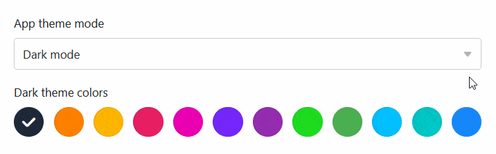

Für jede [Universelle App](https://seatable.io/docs/apps/universelle-app/) können Sie **visuelle Einstellungen** vornehmen, um die App an Ihre persönlichen Wünsche oder das Corporate Design Ihres Unternehmens anzupassen. Zu den Branding-Optionen zählen der **Modus**, die **Farbe** und das **Icon** einer Universellen App.

## Die Design-Einstellungen einer Universellen App ändern

1. Öffnen Sie eine **Base**, in der Sie eine bestehende App bearbeiten möchten.
2. Klicken Sie im Base-Header auf **Apps**.
   4. Fahren Sie mit der Maus über die App und klicken Sie auf das **Stift-Symbol** .
   6. Klicken Sie auf das **Palette-Symbol** am oberen linken Seitenrand.

 8. Nehmen Sie die gewünschten Anpassungen an den **visuellen Einstellungen (Modus, Farbe und Icon)** der Universellen App vor.



## Modus, Farbe und Icon der Universellen App einstellen

Sobald Sie auf das **Palette-Symbol** geklickt haben, öffnet sich ein neues Fenster. Hier können Sie verschiedene Einstellungen vornehmen, die das Aussehen der App betreffen. Wählen Sie zwischen dem **Hell- und Dunkelmodus** und entscheiden Sie sich für ein **Farbschema**.

Bei der Auswahl eines passenden **App-Icons** können Sie neben den bereits in verschiedenen Farben zur Auswahl stehenden **System-Icons** auch ein eigenes **benutzerdefiniertes Icon** hochladen und verwenden.

## Visuelle Einstellungen einzelner Seiten bearbeiten

Die bisher genannten Einstellungen betreffen eine **gesamte Universelle App**. Wenn Sie die Einstellungen einer **einzelnen Seite** ändern möchten, klicken Sie in der Navigation auf das **Zahnrad-Symbol**  der entsprechenden Seite.

Aktuell bietet vor allem die [individuelle Seite](https://seatable.io/docs/seitentypen-in-universellen-apps/individuelle-seiten-in-universellen-apps/) zahlreiche weitere Design-Einstellungen. Beispielsweise können Sie bei den Elementen verschiedene Farben für Hintergründe, Schriften, Linien und Rahmen festlegen. Nutzen Sie dafür den praktischen **Color Picker**.

