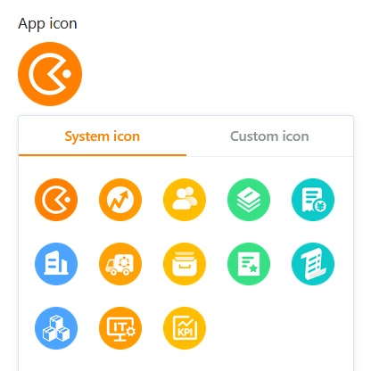

Puedes realizar **ajustes visuales** para cada [aplicación](https://seatable.io/es/docs/apps/universelle-app/) universal con el fin de personalizar la aplicación según tus deseos personales o el diseño corporativo de tu empresa. Las opciones de marca incluyen el **modo**, el **color** y el **icono** de una app universal.

## Cambiar la configuración de diseño de una aplicación universal

1. Abra una **base** en la que desee editar una aplicación existente.
2. Haga clic en **Aplicaciones** en la cabecera Base.

4. Pase el ratón por encima de la aplicación y haga clic en el **icono del lápiz** .

6. Haga clic en el **icono de la paleta** situado en la parte superior izquierda de la página.

8. Realice los ajustes deseados en la **configuración visual (modo, color e icono)** de la aplicación universal.



## Definir el modo, el color y el icono de la aplicación universal

En cuanto pulse sobre el **símbolo de la paleta**, se abrirá una nueva ventana. Aquí puedes hacer varios ajustes que afectan a la apariencia de la aplicación. Elige entre **los modos claro y oscuro** y decide la **combinación de colores**.

Al seleccionar un **icono de aplicación** adecuado, puedes cargar y utilizar tu propio **icono definido por el usuario**, además de **los iconos del sistema** ya disponibles en varios colores.

## Editar la configuración visual de páginas individuales

Los ajustes mencionados hasta ahora afectan a **toda** una **aplicación universal**. Si desea cambiar la configuración de una **página individual**, haga clic en el **símbolo de rueda dentada**  de la página correspondiente en la navegación.

Actualmente, la [página individual](https://seatable.io/es/docs/seitentypen-in-universellen-apps/individuelle-seiten-in-universellen-apps/) en particular ofrece numerosos ajustes de diseño adicionales. Por ejemplo, puede definir distintos colores para los fondos, las fuentes, las líneas y los marcos de los elementos. Utilice para ello el práctico **selector de colores**.

