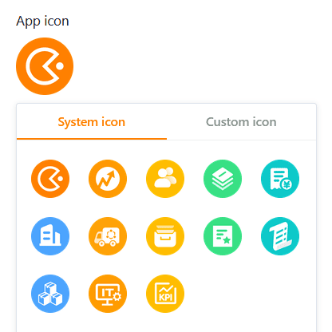
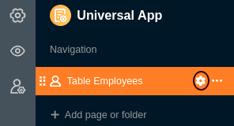

Pour chaque [application universelle](https://seatable.io/fr/docs/apps/universelle-app/), vous pouvez **définir des paramètres visuels** afin d'adapter l'application à vos souhaits personnels ou à l'identité visuelle de votre entreprise. Les options de branding comprennent le **mode**, la **couleur** et l'**icône** d'une appli universelle.

## Modifier les paramètres de conception d'une application universelle

1. Ouvrez une **base** dans laquelle vous souhaitez modifier une application existante.
2. Cliquez sur **Apps** dans l'en-tête de la base.

4. Passez la souris sur l'application et cliquez sur l'**icône du crayon** .

6. Cliquez sur l'**icône de la palette** en haut à gauche de la page.

8. Effectuez les ajustements souhaités sur les **paramètres visuels (mode, couleur et icône)** de l'application universelle.



## Régler le mode, la couleur et l'icône de l'application universelle

Dès que vous avez cliqué sur le **symbole de la palette**, une nouvelle fenêtre s'ouvre. Vous pouvez y effectuer différents réglages concernant l'apparence de l'application. Choisissez entre le **mode clair et le mode foncé** et optez pour un **schéma de couleurs**.

Lors de la sélection d'une **icône d'application** appropriée, vous pouvez télécharger et utiliser votre propre **icône personnalisée en** plus des **icônes système** déjà disponibles en différentes couleurs.

## Modifier les paramètres visuels des pages individuelles

Les paramètres mentionnés jusqu'ici concernent l'**ensemble** d'une **application universelle**. Si vous souhaitez modifier les paramètres d'une **seule page**, cliquez dans la navigation sur le **symbole de la roue dentée**  de la page correspondante.

Actuellement, c'est surtout la [page individuelle](https://seatable.io/fr/docs/seitentypen-in-universellen-apps/individuelle-seiten-in-universellen-apps/) qui offre de nombreux autres paramètres de design. Par exemple, vous pouvez définir différentes couleurs pour les arrière-plans, les polices, les lignes et les cadres des éléments. Utilisez pour cela le **Color Picker** pratique.

