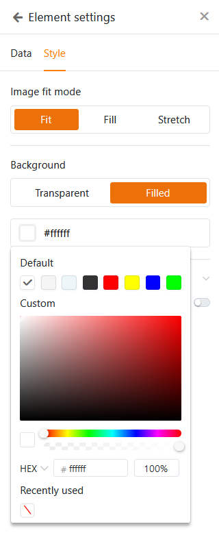

Pode efetuar **definições visuais** para cada [aplicação universal]() para personalizar a aplicação de acordo com os seus desejos pessoais ou com o design corporativo da sua empresa. As opções de marca incluem o **modo**, a **cor** e o **ícone** de uma aplicação universal.

## Alterar as definições de design de uma aplicação universal

1. Abra uma **base** na qual pretende editar uma aplicação existente.
2. Clique em **Apps** no cabeçalho Base.

4. Passe o rato sobre a aplicação e clique no **ícone do lápis** .

6. Clique no **ícone da paleta** no canto superior esquerdo da página.

8. Efetuar os ajustes desejados nas **definições visuais (modo, cor e ícone)** da aplicação universal.



## Definir o modo, a cor e o ícone da aplicação universal

Assim que tiver clicado no **símbolo da paleta**, abre-se uma nova janela. Aqui pode fazer várias definições que afectam o aspeto da aplicação. Escolha entre **o modo claro e escuro** e opte por um **esquema de cores**.

Ao selecionar um **ícone de aplicação** adequado, pode carregar e utilizar o seu próprio **ícone definido pelo utilizador**, para além dos **ícones do sistema** já disponíveis em várias cores.

## Editar definições visuais de páginas individuais

As definições mencionadas até agora afectam **toda** uma **aplicação universal**. Se pretender alterar as definições de uma **página individual**, clique no **símbolo da roda dentada**  da página correspondente na navegação.

Atualmente, a [página individual](https://seatable.io/pt/docs/seitentypen-in-universellen-apps/individuelle-seiten-in-universellen-apps/), em particular, oferece inúmeras definições de design adicionais. Por exemplo, pode definir cores diferentes para fundos, tipos de letra, linhas e molduras para os elementos. Para tal, utilize o prático **seletor de cores**.

