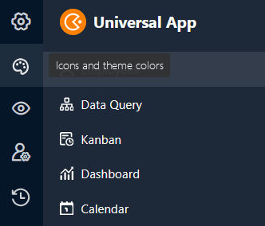
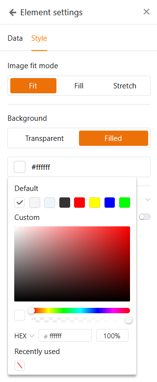

Для каждого [универсального приложения]() можно **задать визуальные настройки**, чтобы привести его в соответствие с вашими личными пожеланиями или корпоративным дизайном вашей компании. Параметры брендинга включают **режим**, **цвет** и **иконку** универсального приложения.

## Изменение настроек дизайна универсального приложения

1. Откройте **базу**, в которой вы хотите отредактировать существующее приложение.
2. Нажмите **Приложения** в заголовке База.

4. Наведите курсор мыши на приложение и нажмите на **значок карандаша** .

6. Нажмите на **значок палитры** в левом верхнем углу страницы.

8. Внесите необходимые изменения в **визуальные настройки (режим, цвет и значок)** универсального приложения.



## Установите режим, цвет и значок универсального приложения

После нажатия на **символ палитры** откроется новое окно. Здесь вы можете задать различные настройки, влияющие на внешний вид приложения. Выберите **светлый или темный режим** и определитесь с **цветовой гаммой**.

При выборе подходящего **значка приложения** вы можете загрузить и использовать свой собственный **пользовательский значок** в дополнение к **системным значкам**, которые уже доступны в различных цветах.

## Редактирование визуальных настроек отдельных страниц

Упомянутые до сих пор настройки влияют на **все универсальное приложение**. Если вы хотите изменить настройки **отдельной страницы**, нажмите на **символ шестеренки**  соответствующей страницы в навигации.

В настоящее время [отдельная страница]() предлагает множество дополнительных настроек дизайна. Например, вы можете задать разные цвета для фона, шрифтов, линий и рамок для элементов. Для этого воспользуйтесь практичным **выбором цвета**.

